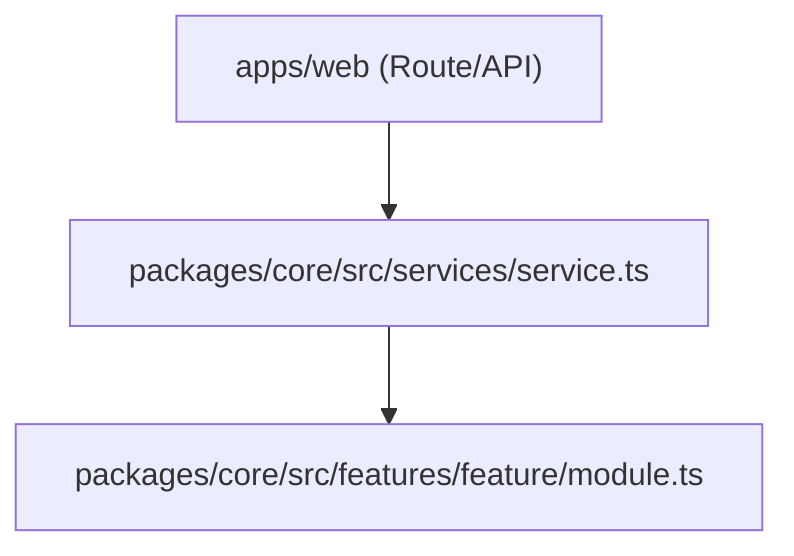

# Implementation Plan: [Feature Title]

- **Status**: Draft | Approved | In Progress | Completed
- **Target Branch**: `plan-[short-description]-[slug]`
- **PRD Reference**: [PRD Title](file:///specs/prds/NN-slug.md) (or N/A)
- **ADR Reference**: [ADR Title](file:///specs/adrs/00X-slug.md) (or N/A)
- **Affected Domain / Packages**: `packages/core`, `apps/web`

---

## 1. Executive Summary & Scope Boundaries

### Executive Summary
A concise 2-3 sentence summary of the feature, refactoring, or infrastructure update being planned.

### In-Scope
- [ ] Deliverable 1: ...
- [ ] Deliverable 2: ...

### Non-Goals (Out of Scope)
- Explicit exclusion 1 to prevent scope creep...
- Explicit exclusion 2...

---

## 2. Architectural Invariants & Rule Compliance Check

Verify compliance with active project invariants in [rules/project-rules.md](file:///workspaces/secure-ai-learning-support/rules/project-rules.md) and monorepo structure in [specs/architecture-index.md](file:///workspaces/secure-ai-learning-support/specs/architecture-index.md):

- [ ] **Unidirectional Orchestration**: Orchestration logic resides in `packages/core/src/services/`. UI API routes in `apps/web/` are thin handlers.
- [ ] **Feature Isolation**: Modules in `packages/core/src/features/*` do not cross-import.
- [ ] **Adapter Pattern**: Storage, database drivers, and external providers operate behind pluggable interfaces.
- [ ] **No Infrastructure in Features**: Features process pure data in/out without direct DB/disk side-effects.



---

## 3. File Impact Map

| Action | File Path | Responsibility / Description |
| :--- | :--- | :--- |
| `Create` | `packages/core/src/features/[feature]/[module].ts` | Core domain/processing logic |
| `Create` | `packages/core/src/features/[feature]/[module].test.ts` | Co-located unit test suite |
| `Modify` | `packages/core/src/services/[service].ts` | Service orchestration update |
| `Modify` | `packages/core/src/index.ts` | Public export boundary |

---

## 4. Ordered Atomic Task Breakdown

> **Task Sizing Rule**: Each task must represent roughly one logical commit ($\le$ 1 unit of work), touch 1–4 files max, and include explicit TDD verification steps.

### Task 1: [Task Title]

- **Goal & Rationale**: What problem this task solves and why.
- **Target Files**:
  - `packages/core/src/features/[feature]/[module].ts` (Source)
  - `packages/core/src/features/[feature]/[module].test.ts` (Test)
- **Interface & Data Contracts**:
  ```typescript
  export interface ModuleInput {
    readonly id: string;
    readonly payload: Record<string, unknown>;
  }

  export function processModule(input: ModuleInput): Promise<ModuleResult>;
  ```
- **TDD Steps**:
  1. Write failing test in `[module].test.ts` verifying normal processing and edge case (e.g. empty payload).
  2. Execute test command: `pnpm vitest related packages/core/src/features/[feature]/[module].test.ts --run` (Expect FAIL).
  3. Implement minimal functional code in `[module].ts`.
  4. Re-run test command (Expect PASS).
  5. Refactor for readability and performance.
- **Acceptance Criteria**:
  - [ ] Function correctly handles valid `ModuleInput`.
  - [ ] Explicit error thrown for invalid payload (no silent failures).
  - [ ] Test coverage exceeds 95% for this module.
- **Git Commit Command**: `git commit -m "feat(core): implement [module] data processor"`

---

### Task 2: [Task Title]

- **Goal & Rationale**: ...
- **Target Files**:
  - `packages/core/src/services/[service].ts`
  - `packages/core/src/services/[service].test.ts`
- **Interface & Data Contracts**:
  ```typescript
  // Interface/type signatures...
  ```
- **TDD Steps**:
  1. Write failing orchestration test in `[service].test.ts`.
  2. Execute test command: `pnpm vitest related packages/core/src/services/[service].test.ts --run` (Expect FAIL).
  3. Implement orchestration logic calling feature module.
  4. Re-run test command (Expect PASS).
- **Acceptance Criteria**:
  - [ ] Orchestration coordinates feature processing cleanly.
  - [ ] All integration assertions pass.
- **Git Commit Command**: `git commit -m "feat(core): integrate [module] into [service] orchestrator"`

---

## 5. Risk Assessment & Fallback Plan

| Risk | Impact | Likelihood | Mitigation Strategy |
| :--- | :--- | :--- | :--- |
| Database schema lock | High | Low | Run tests against isolated SQLite `DATABASE_PATH`. |
| Unhandled edge case | Medium | Medium | Add guard clauses and explicit custom error types. |

---

## 6. Definition of Done & Verification Pipeline

Before marking this plan as complete or submitting PR, verify against active project rules:

- [ ] All atomic tasks executed in TDD order with green tests.
- [ ] Targeted test run succeeds per [rules/testing.md](file:///workspaces/secure-ai-learning-support/rules/testing.md): `pnpm vitest related <affected-files> --run`
- [ ] Monorepo check succeeds with zero type or lint errors: `pnpm check`
- [ ] Coding style & typing rules respected per [rules/coding-style.md](file:///workspaces/secure-ai-learning-support/rules/coding-style.md).
- [ ] Architectural invariants & feature isolation preserved per [rules/project-rules.md](file:///workspaces/secure-ai-learning-support/rules/project-rules.md) and [specs/architecture-index.md](file:///workspaces/secure-ai-learning-support/specs/architecture-index.md).
- [ ] Git branch naming & commit history adhere to [rules/git-workflow.md](file:///workspaces/secure-ai-learning-support/rules/git-workflow.md).
