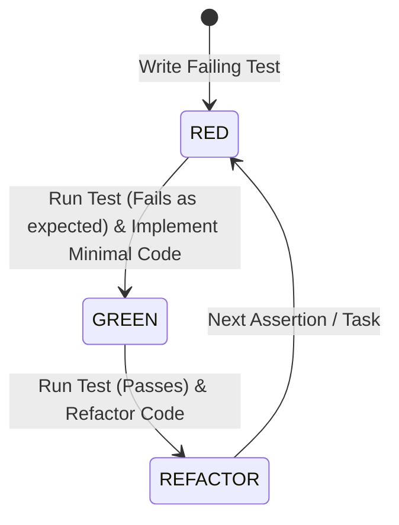

# Test-Driven Development (TDD) Workflow Guide

This reference document outlines the strict Test-Driven Development (TDD) mechanics, rules, and best practices required when implementing features or bug fixes using the `tdd-implement` skill.

---

## 1. Core Principles of TDD

1. **Test-First Discipline**: You MUST write a failing test before writing any production implementation code.
2. **Minimal Implementation**: Write only enough production code to make the failing test pass. Avoid speculative over-engineering or unrequested capabilities.
3. **Continuous Safety Net**: Refactor with confidence only when tests are green.
4. **Co-location**: Keep tests immediately adjacent to the source code being tested (`foo.ts` $\rightarrow$ `foo.test.ts`).

---

## 2. The 3-Phase TDD Cycle



### Phase 1: RED (Write the Failing Test)

- **Target Location**: Place the test file adjacent to the module under test:
  - Source: `packages/core/src/features/parser/pdf-parser.ts`
  - Test: `packages/core/src/features/parser/pdf-parser.test.ts`
- **Focus**:
  - Test public exported interface contracts, inputs, outputs, and edge cases.
  - Do NOT test private implementation details or framework boilerplate.
- **Execution Command**:
  ```bash
  pnpm vitest related packages/core/src/features/parser/pdf-parser.test.ts --run
  ```
- **Verification Rule**:
  - The test **MUST FAIL** on the first run.
  - Verify that it fails for the **expected reason** (e.g., missing function, thrown domain exception, or unhandled input state).
  - *If the test passes before implementation, your test is invalid or already satisfied.*

### Phase 2: GREEN (Make the Test Pass)

- **Focus**:
  - Write the minimal code required to satisfy the test contract.
  - Adhere strictly to [rules/coding-style.md](file:///workspaces/secure-ai-learning-support/rules/coding-style.md) (explicit parameter and return types, no `any`, `camelCase` identifiers).
  - Adhere to [rules/project-rules.md](file:///workspaces/secure-ai-learning-support/rules/project-rules.md) (pure feature logic, zero cross-feature imports, zero database client imports inside features).
- **Execution Command**:
  ```bash
  pnpm vitest related packages/core/src/features/parser/pdf-parser.test.ts --run
  ```
- **Verification Rule**:
  - The test **MUST PASS** cleanly without warnings or unhandled promise rejections.

### Phase 3: REFACTOR (Improve Code Quality under Green Safety)

- **Focus**:
  - Simplify logic, replace nested conditionals with early return guard clauses.
  - Remove duplicate code (DRY principle).
  - Format code via Biome (`pnpm biome check --write <file>`).
- **Execution Command**:
  ```bash
  pnpm vitest related packages/core/src/features/parser/pdf-parser.test.ts --run
  ```
- **Verification Rule**:
  - All tests must remain **GREEN**.

---

## 3. Pure Functions vs Integration & Database Testing

### Feature Logic (`packages/core/src/features/*`)
- Features MUST be designed as **pure data processors** (inputs in $\rightarrow$ outputs out).
- Do NOT import database instances (`drizzle`), filesystem modules (`fs/promises`), or external network clients inside feature modules. Pass dependencies as arguments or callbacks (Dependency Injection).
- Unit tests for pure features should execute blazingly fast in Vitest without requiring mocking or database setups.

### Orchestrators & Adapters (`packages/core/src/services/*`, `packages/core/src/database/*`)
- Orchestrators manage database calls and storage operations.
- When testing database logic, use SQLite test database path isolation to prevent race conditions during parallel Vitest runs:
  ```bash
  DATABASE_PATH=":memory:" pnpm vitest related packages/core/src/database/schema.test.ts --run
  ```
- Keep mocks minimal. Prefer real pure helpers or in-memory fakes.

---

## 4. TDD Anti-Patterns & Forbidden Practices

| Anti-Pattern | Why it fails | Correct Behavior |
| :--- | :--- | :--- |
| **Test-After Coding** | Tests written after code tend to mirror implementation bias, missing real edge cases. | Always write test assertions first and observe RED phase failure. |
| **`any` Type Escape Hatches** | Using `any` or `as unknown as T` bypasses TypeScript strict checks. | Define explicit domain types/interfaces in `packages/core/src/types/`. |
| **Cross-Feature Imports** | Importing across features (`features/graphrag` importing `features/scheduler`) creates tight coupling. | Coordinate feature communication inside `services/` orchestrators. |
| **Testing Internal Implementation** | Testing private functions makes code brittle during refactoring. | Test public exported contracts and behavior. |
| **Over-Mocking** | Mocking everything results in tests that pass even when real code breaks. | Use real pure functions or lightweight fakes. |
