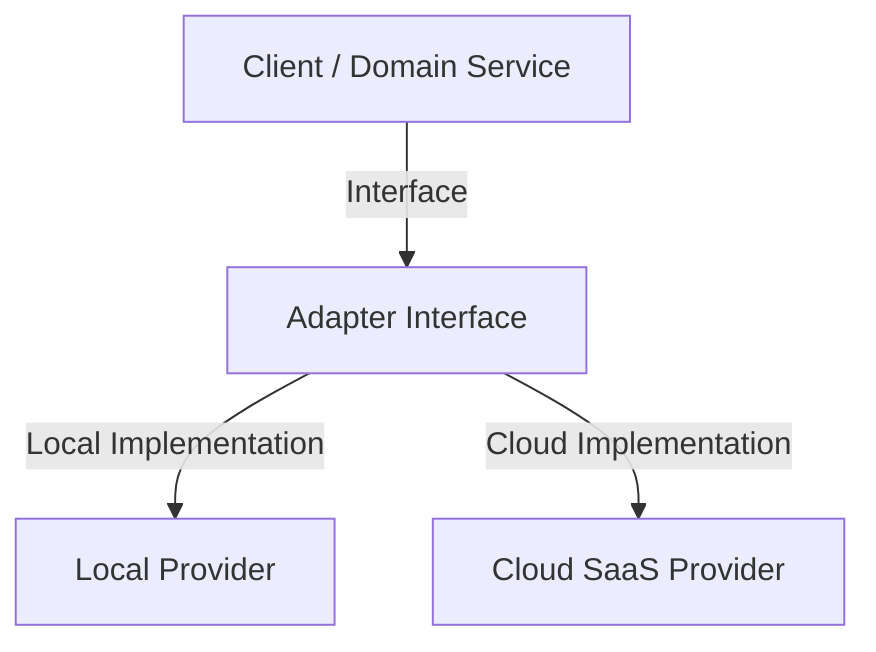

# ADR [NNN]: [Title]

**Status:** [Proposed | Accepted | Deprecated | Superseded by [ADR XXX](../adrs/XXX-slug.md)]  
**Date:** [YYYY-MM-DD]  
**Deciders:** [Names / Roles]  
**Target Domains / Packages:** [`packages/core`, `apps/web`, etc.]  

---

## Context & Problem Statement
[What is the problem we are solving? What context, technical constraints, user needs, or business requirements lead to this decision?]

## Decision Drivers
- [Driver 1: e.g. Local-first privacy and offline execution]
- [Driver 2: e.g. Zero runtime dependency bloat]
- [Driver 3: e.g. Dual-mode compatibility (Local SQLite vs SaaS PostgreSQL)]

## Decision
[What is the decision? Detail the technical solution, architectural patterns, adapter contracts, data flow, or package boundary rules.]

### Architectural Spec & Component Interaction
[Provide concrete details on interfaces, abstraction layers, or configuration flags. Add a Mermaid diagram if visualizing component boundaries or data flows.]

## Consequences

### What Becomes Easier
- [Positive consequence 1]
- [Positive consequence 2]

### What Becomes Harder
- [Negative consequence / Trade-off 1]
- [Negative consequence / Trade-off 2]

### Risks & Mitigations
- **Risk:** [Potential technical or operational risk]
  - **Mitigation:** [Action taken to reduce risk]

## Alternatives Considered

### 1. [Alternative Option Name]
- **Overview:** [Brief summary of the alternative]
- **Pros:** [Key benefits]
- **Cons:** [Key drawbacks]
- **Rejection Rationale:** [Why was this option rejected?]

### 2. [Alternative Option Name]
- **Overview:** [Brief summary of the alternative]
- **Pros:** [Key benefits]
- **Cons:** [Key drawbacks]
- **Rejection Rationale:** [Why was this option rejected?]

## Compliance, Security & Data Boundaries
- **Data Privacy & Storage:** [Where is data stored? Local disk vs cloud bucket?]
- **Security & Sandboxing:** [Any API key handling, proxying, or isolation boundary?]

## Related Specifications & Links
- [PRD Title](../prds/NN-slug.md)
- [Architecture Spec](../architecture/spec-name.md)
- [Prior ADR Title](../adrs/NNN-slug.md)
