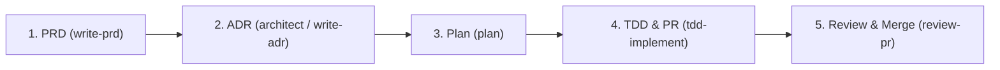

# Contributing Guidelines

Welcome to **AI Learning Support**. This project is engineered to the highest professional standards, optimized for seamless collaboration between human developers and autonomous AI agents. 

Our core philosophy is **Simplicity > Complexity**. We build software that is robust, heavily verified, and strictly organized.

To ensure consistency and eliminate rule duplication, all engineering standards, code styles, and workflow specifications are maintained in canonical rule files under [`rules/`](rules/):

---

## 1. Single Source of Truth Rules

Please refer directly to the designated rule files:

- **Package Architecture & Layer Boundaries**: Read [rules/package-architecture.md](rules/package-architecture.md) for package layer boundaries, feature isolation, and adapter patterns.
- **Coding Style & Type Safety**: Read [rules/coding-style.md](rules/coding-style.md) for TypeScript strictness, naming conventions, and code structure.
- **Testing Standards**: Read [rules/testing.md](rules/testing.md) for Vitest guidelines, test co-location, and database isolation.
- **Git Workflow & Branching**: Read [rules/git-workflow.md](rules/git-workflow.md) for branch naming (`plan-*`, `fix-issue-*`), Conventional Commits, and PR review processes.
- **Documentation & TSDoc**: Read [rules/documentation-standards.md](rules/documentation-standards.md) for JSDoc/TSDoc standards and Changesets.
- **Frontend & Styling**: Read [rules/styling.md](rules/styling.md) when working in web/frontend applications.

---

## 2. Quick Reference Commands

| Action | Command |
| :--- | :--- |
| **Install Dependencies** | `pnpm install` |
| **Development Server** | `pnpm dev` |
| **Linting & Formatting** | `pnpm lint` / `pnpm format` |
| **Type Checking** | `pnpm typecheck` |
| **Unit Testing** | `pnpm test` |
| **Full Validation Pipeline** | `pnpm check` |

---

## 3. Agent Skills & Capabilities

Our development environment equips AI agents with specialized skills under `.agents/skills/`:

| Skill | Purpose & Output |
| :--- | :--- |
| **`write-prd`** | Transforms high-level product ideas into structured PRDs (`specs/prds/<slug>.md`). |
| **`architect`** | Critical discussion on system design, technical trade-offs, and architectural choices. |
| **`write-adr`** | Documents Architectural Decision Records (`specs/adrs/<slug>.md`). |
| **`plan`** | Creates detailed implementation plan artifacts with task breakdowns and file impact maps. |
| **`tdd-implement`** | Primary coding skill. Implements plans task-by-task using TDD, runs checks, and opens PRs. |
| **`review-pr`** | Reviews GitHub Pull Requests strictly against code quality and architectural standards. |
| **`debug`** | Investigates bugs, reproduces failures, isolates root causes, and adds regression tests. |
| **`cleanup`** | Refactors existing code to remove dead logic, fix DRY violations, and reduce debt. |
| **`audit`** | Audits repository for meta-quality, missing tests, broken skill paths, and stale dependencies. |

---

## 4. Feature Development Lifecycle

### For Large / Complex Features
For significant additions or architectural changes, follow the full lifecycle:

1. **Product Requirements (`write-prd`)**: Write a Product Requirements Document (PRD) saved to `specs/prds/` to establish user goals, non-goals, and scope boundaries.
2. **Architecture & Decisions (`architect` / `write-adr`)**: When architectural changes or technical trade-offs are involved, hold a design review and capture the final choice as an Architectural Decision Record (ADR) in `specs/adrs/`.
3. **Implementation Planning (`plan`)**: Generate a detailed implementation plan artifact outlining atomic tasks, file impact maps, testing strategy, and definition of done.
4. **TDD Implementation & PR (`tdd-implement`)**: Execute implementation in TDD steps (test → code → refactor), verify locally (`pnpm check`), and submit a Pull Request (`gh pr create`).
5. **Code Review & Merge (`review-pr`)**: Review the PR against standards, request changes or approve, and merge into `main` via Squash and Merge.

### For Smaller Features / Bug Fixes / Refactoring
> [!NOTE]
> For minor features, standalone bug fixes, or refactoring tasks, formal PRDs and ADRs can be skipped.

Workflow for lightweight changes:
- **Small Features**: Start directly at **Implementation Planning (`plan`)** or move straight to **`tdd-implement`**.
- **Bug Fixes**: Use **`debug`** directly to reproduce, fix, add regression tests, and open a PR.
- **Code Refactoring**: Use **`cleanup`** to audit code debt, propose changes, and execute after confirmation.

---

## 5. Guidelines for Autonomous AI Agents

If you are an AI agent working in this repository:
1. **Follow Agent Routing**: Always consult root [AGENTS.md](AGENTS.md) and specific rules in [rules/](rules/).
2. **Never Bypass Checks**: Do not force commits or push code that fails `pnpm check`.
3. **Be Atomic**: Limit edits strictly to files relevant to the active issue/task.
4. **Use Pluggable Adapters**: Adhere to the core service interface layer defined in `packages/core/src/`.
