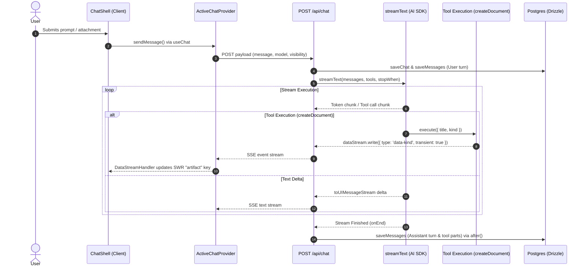

# chatbot: Official Vercel AI Chatbot template demonstrating multi-modal conversational AI, streamed tool execution, and interactive artifacts

## Why this repo
The user requested a **Full Comprehensive Architecture Survey** of `/workspaces/chatbot` (`vercel/ai-chatbot`). The objective is to understand how Vercel structures a production-grade AI application end-to-end: from Next.js App Router API route handlers, Vercel AI SDK stream composition, custom data stream protocol design, client-side React hooks state management (`useChat` + SWR), tool execution workflows, and side-by-side artifact rendering.

---

## TL;DR
1. **Stream Protocol Architecture**: Uses Vercel AI SDK's `createUIMessageStream` and `createUIMessageStreamResponse` ([route.ts:L205-L425](file:///workspaces/chatbot/app/%28chat%29/api/chat/route.ts#L205-L425)) to construct a unified Server-Sent Events (SSE) stream combining model token deltas, multi-step tool calls, and custom transient UI events (health warnings, title updates, artifact signals).
2. **Asynchronous Non-Blocking Operations**: Uses Next.js 16's `after()` function ([route.ts:L62](file:///workspaces/chatbot/app/%28chat%29/api/chat/route.ts#L62)) alongside `createResumableStreamContext` to perform post-response work (saving chat history to PostgreSQL via Drizzle, background title generation, Redis SSE stream recording) without blocking or delaying HTTP stream headers.
3. **Structured Single-Column Schema**: Operates on a flexible schema (`Message_v2` in [schema.ts:L42-L51](file:///workspaces/chatbot/lib/db/schema.ts#L42-L51)) where message contents, tool execution steps, and multi-modal attachments are stored as a JSON array (`parts: json("parts")`), eliminating rigid database join tables for tool outputs.
4. **Client State via Context & SWR**: Centralizes chat state using an `ActiveChatProvider` context ([use-active-chat.tsx:L59-L303](file:///workspaces/chatbot/hooks/use-active-chat.tsx#L59-L303)) wrapping `@ai-sdk/react`'s `useChat`, combined with SWR local key mutation (`"artifact"`) for instant side-by-side canvas transitions without triggering parent React re-renders.

---

## Stack & Structure Snapshot

### Directory Organization
- **`app/`**: Next.js 16 App Router shell with route groups `(auth)` and `(chat)` ([app/(chat)/api/chat/route.ts](file:///workspaces/chatbot/app/%28chat%29/api/chat/route.ts)).
- **`artifacts/`**: Domain implementations for live interactive documents (`code`, `text`, `sheet`, `image`).
- **`components/chat/`**: Rich chat UI components including [shell.tsx](file:///workspaces/chatbot/components/chat/shell.tsx), [messages.tsx](file:///workspaces/chatbot/components/chat/messages.tsx), [multimodal-input.tsx](file:///workspaces/chatbot/components/chat/multimodal-input.tsx), and [data-stream-handler.tsx](file:///workspaces/chatbot/components/chat/data-stream-handler.tsx).
- **`hooks/`**: Custom React hooks: [use-active-chat.tsx](file:///workspaces/chatbot/hooks/use-active-chat.tsx), [use-artifact.ts](file:///workspaces/chatbot/hooks/use-artifact.ts), [use-auto-resume.ts](file:///workspaces/chatbot/hooks/use-auto-resume.ts).
- **`lib/ai/`**: Provider factories ([providers.ts](file:///workspaces/chatbot/lib/ai/providers.ts)), system prompt builders ([prompts.ts](file:///workspaces/chatbot/lib/ai/prompts.ts)), and server tools ([tools/](file:///workspaces/chatbot/lib/ai/tools/)).
- **`lib/db/`**: Drizzle ORM PostgreSQL definitions ([schema.ts](file:///workspaces/chatbot/lib/db/schema.ts)) and query functions ([queries.ts](file:///workspaces/chatbot/lib/db/queries.ts)).

---

## General Findings

### 1. Zero-Blocking Background Persistence with Next.js `after()`
Instead of blocking the client stream or performing database persistence inside synchronous HTTP lifecycle handlers, the chat route passes background persistence callbacks into `onEnd` ([route.ts:L348-L389](file:///workspaces/chatbot/app/%28chat%29/api/chat/route.ts#L348-L389)). When combined with `createResumableStreamContext({ waitUntil: after })` ([route.ts:L60-L66](file:///workspaces/chatbot/app/%28chat%29/api/chat/route.ts#L60-L66)), Next.js handles database commits asynchronously after stream completion, preventing stream timeouts on slow DB connections.

### 2. Schema Evolution via JSON Column Versioning
The database schema evolved from relational tables to `Message_v2` ([schema.ts:L42-L51](file:///workspaces/chatbot/lib/db/schema.ts#L42-L51)). Rather than creating relational tables for `MessageParts`, `ToolInvocations`, and `Attachments`, the schema uses PostgreSQL `json("parts")` and `json("attachments")`. This matches Vercel AI SDK's internal `UIMessage` interface directly, making JSON deserialization trivial.

---

## Focus Area Deep Dive: Full Architecture Survey



### 1. Stream Protocol & Data Merging Engine
The backend endpoint `app/(chat)/api/chat/route.ts` orchestrates model execution and data streaming using a layered pipeline:

```typescript
// app/(chat)/api/chat/route.ts (L205-L336)
const stream = createUIMessageStream({
  execute: async ({ writer: dataStream }) => {
    // 1. Transient status reporting
    writeWaitingStatus("waiting", "Waiting...");

    // 2. Core AI SDK stream setup
    const result = streamText({
      model: getLanguageModel(chatModel),
      messages: modelMessages,
      stopWhen: isStepCount(5),
      tools: {
        createDocument: createDocument({ dataStream, modelId: chatModel, session }),
        // ...
      },
    });

    // 3. Merge model stream chunks into custom data stream
    dataStream.merge(
      toUIMessageStream({
        sendReasoning: isReasoningModel,
        stream: result.stream,
      })
    );
  },
  onEnd: async ({ messages: finishedMessages }) => {
    // Persist final assistant turn to DB
    await saveMessages({ messages: finishedMessages });
  }
});
```
- **Custom Data Injection**: The `dataStream` writer allows server-side tools (`createDocument`) and timers (`healthCheckTimer`) to emit custom transient data events (such as `data-waiting-status` or `data-kind`) into the exact same SSE stream as model tokens ([route.ts:L224-L233](file:///workspaces/chatbot/app/%28chat%29/api/chat/route.ts#L224-L233)).
- **Multi-Step Execution**: Setting `stopWhen: isStepCount(5)` allows LLMs to call tools, receive tool responses, and continue generating text across up to 5 loop iterations without client round-trips.

### 2. Client-Side State & Transport Strategy
Client state is governed by `hooks/use-active-chat.tsx`, which configures `@ai-sdk/react`'s `useChat`:

```typescript
// hooks/use-active-chat.tsx (L147-L175)
transport: new DefaultChatTransport({
  api: `/api/chat`,
  fetch: fetchWithErrorHandlers,
  prepareSendMessagesRequest(request) {
    const lastMessage = request.messages.at(-1);
    const isToolApprovalContinuation = ...;
    return {
      body: {
        id: request.id,
        ...(isToolApprovalContinuation
          ? { messages: request.messages }
          : { message: lastMessage }),
        selectedChatModel: currentModelIdRef.current,
        selectedVisibilityType: visibility,
      },
    };
  },
})
```
- **Bandwidth Optimization**: Instead of resending the full chat history on every turn, `prepareSendMessagesRequest` sends only the latest user `message` for normal turns, while sending full `messages` only during interactive tool approval continuations ([use-active-chat.tsx:L166-L169](file:///workspaces/chatbot/hooks/use-active-chat.tsx#L166-L169)).

### 3. Interactive Artifact System (Side-by-Side Canvas)
The live canvas UI is driven by server tools streaming progress signals:

```typescript
// lib/ai/tools/create-document.ts (L28-L50)
dataStream.write({ data: kind, transient: true, type: "data-kind" });
dataStream.write({ data: id, transient: true, type: "data-id" });
dataStream.write({ data: title, transient: true, type: "data-title" });
```
1. When `createDocument` fires on the server, it writes transient events into `dataStream`.
2. The client `DataStreamHandler` component ([data-stream-handler.tsx](file:///workspaces/chatbot/components/chat/data-stream-handler.tsx)) listens to stream events via `onData` ([use-active-chat.tsx:L113-L118](file:///workspaces/chatbot/hooks/use-active-chat.tsx#L113-L118)).
3. SWR's local memory store (`useArtifact()`) updates the `"artifact"` state key ([use-artifact.ts:L40-L68](file:///workspaces/chatbot/hooks/use-artifact.ts#L40-L68)).
4. `ChatShell` ([shell.tsx:L117-L121](file:///workspaces/chatbot/components/chat/shell.tsx#L117-L121)) smoothly animates the chat pane from `w-full` to `w-[40%]`, sliding out the artifact canvas in a split view.

---

### Trade-Offs & Friction

| Pattern / Choice | Benefits | Friction & Costs |
| :--- | :--- | :--- |
| **JSON Column Storage (`parts: json`)** | Unifies frontend `UIMessage` types with DB records without complex SQL join logic. | Harder to write relational queries or index specific tool parameters inside PostgreSQL. |
| **Direct Stream Coupling (`dataStream.write`)** | Real-time UI updates for artifacts & health alerts over single SSE stream. | Couples server domain tools directly to Vercel AI SDK's `UIMessageStreamWriter` transport type. |
| **SWR Key Local State (`"artifact"`)** | Fast client updates without context re-rendering. | Requires manual ref sync (`currentModelIdRef`, `stopRef`) to prevent stale closures in callbacks. |

---

## Caveats
- **Public Repo / Demo Guardrails**: Contains Vercel-specific billing checks ([route.ts:L392-L399](file:///workspaces/chatbot/app/%28chat%29/api/chat/route.ts#L392-L399)) and rate limits ([route.ts:L110](file:///workspaces/chatbot/app/%28chat%29/api/chat/route.ts#L110)) built specifically for Vercel template hosting.
- **Resumable Stream Dependency**: Relies on Redis (`process.env.REDIS_URL`) and `resumable-stream` for stream persistence ([route.ts:L407-L423](file:///workspaces/chatbot/app/%28chat%29/api/chat/route.ts#L407-L423)); without Redis configured, connection drops cannot resume.

---

## Relevance to Your Project (`secure-ai-learning-support`)

### Monorepo Layering vs. Next.js Monolith
- **`vercel/ai-chatbot`**: Monolithic Next.js application where server route handlers, database queries, and AI tools are placed directly within `app/` and `lib/`.
- **`secure-ai-learning-support`**: Decoupled 4-tier monorepo (`apps/web`, `@core`, `@infrastructure`, `@shared`). 
- **Architectural Alignment (ADR 004)**: In `secure-ai-learning-support`, ADR 004 dictates that Vercel AI SDK drivers must be isolated in `packages/infrastructure/src/llm/`. Unlike `vercel/ai-chatbot`, domain orchestrators in `@core` should consume abstract ports rather than importing `ai` tools directly.

### Recommended Adaptations for `secure-ai-learning-support`
1. **Asynchronous Non-Blocking Ingestion**: Adopt Next.js `after()` in `apps/web/app/api/*` for long-running GraphRAG or FSRS processing tasks without holding HTTP headers open.
2. **Transient Stream Events for Active Learning**: Use `createUIMessageStream` and transient stream events (`dataStream.write`) when streaming Feynman explanation audits or active-learning hints to `apps/web`.

---

## If You Adopt Something From This

```markdown
> Adopted stream protocol pattern (createUIMessageStream + transient data events) from vercel/ai-chatbot, see report 2026-07-24. Rationale: Enables non-blocking streaming of pedagogical feedback and artifact updates alongside LLM tokens.
```
