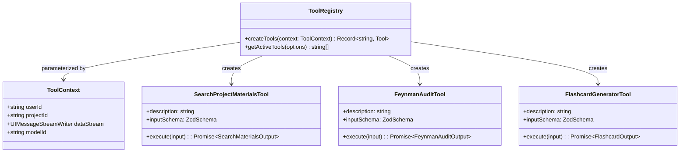

# Research: Extensible Agent Tool Calling and Generative UI Patterns

**Document ID:** `docs/research/agent-tool-calling-patterns.md`  
**Status:** Approved / Recommended Architecture  
**Author:** AI Agent Pair  
**Date:** 2026-08-20  
**Related Tickets:** [#60](https://github.com/69420pm/ai-learning-support-test/issues/60) (Wayfinder Map), [#62](https://github.com/69420pm/ai-learning-support-test/issues/62) (This Research), [#66](https://github.com/69420pm/ai-learning-support-test/issues/66) (Specify searchProjectMaterials AI SDK Tool and Chat Agent Controller)  
**Related Decisions:** [ADR 0001](file:///workspaces/secure-ai-learning-support/docs/adr/0001-single-app-architecture.md), [ADR 0002](file:///workspaces/secure-ai-learning-support/docs/adr/0002-postgresql-pgvector-drizzle.md), [ADR 0004](file:///workspaces/secure-ai-learning-support/docs/adr/0004-vercel-ai-sdk-byok.md), [ADR 0006](file:///workspaces/secure-ai-learning-support/docs/adr/0006-project-domain-container-and-scoped-routing.md)

---

## Executive Summary

The **AI Learning Support** platform requires an agentic conversational runtime capable of executing multi-step reasoning, grounding study responses in ingested **materials** via vector similarity search (`searchProjectMaterials`), and rendering interactive, generative learning UI widgets in the chat stream.

This research resolves the core design question for Ticket #62:
> **How should we structure the Vercel AI SDK v7 agent tool registry and UI stream components in `app/api/chat/route.ts` and `components/chat/` to provide a solid, extensible foundation for current vector search and future agentic tools?**

To establish a production-grade, extensible architecture, we conducted an exhaustive investigation of two sibling reference codebases:
1. [`/workspaces/chatbot`](file:///workspaces/chatbot): The official Vercel Next.js AI Chatbot template utilizing Vercel AI SDK (`ai` v7, `@ai-sdk/react`), App Router streaming endpoints (`createUIMessageStream`, `toUIMessageStream`), multi-step agent loops (`stopWhen: isStepCount(5)`), and client-side discriminated part rendering for generative UI (`tool-*` message parts).
2. [`/workspaces/opencode`](file:///workspaces/opencode): Anomaly Co.'s production AI development engine built on TypeScript and Effect TS, featuring dynamic tool registries, strict parameter validation with schema error feedback loops, execution sandboxing, timeout enforcement, and context window output protection (`ToolOutputStore`).

### The Core Architectural Recommendation

```mermaid
flowchart TD
    subgraph Client ["Client Layer (components/chat/)"]
        ChatHook["useChat (ai v7)"]
        StreamHandler["DataStreamHandler (custom events)"]
        ChatMessageComp["ChatMessage (Discriminated Parts)"]
        ToolWidgets["Generative UI: MaterialSearchWidget, CitationsCard, FeynmanAuditCard"]
    end

    subgraph Controller ["API Controller (app/api/chat/route.ts)"]
        AuthCheck["Supabase Auth & Project Scope Verification"]
        PrepState["prepareChatState (DB + Project ID)"]
        StreamInit["createUIMessageStream + dataStream writer"]
        AgentLoop["streamText (stopWhen: isStepCount(5))"]
        ToUI["toUIMessageStream & dataStream.merge"]
    end

    subgraph ToolRegistry ["Tool Registry (lib/ai/tools/)"]
        Factory["createTools({ userId, projectId, dataStream })"]
        Tool1["searchProjectMaterials (pgvector 768d Cosine)"]
        Tool2["auditFeynmanExplanation (Pedagogical Evaluation)"]
        Tool3["generateFlashcards (FSRS Spaced Repetition)"]
        Tool4["queryKnowledgeGraph (GraphRAG Multi-Hop)"]
    end

    subgraph DataLayer ["Data & Database Layer (lib/db/)"]
        PGVector["PostgreSQL chunks table (vector(768))"]
        Drizzle["Drizzle ORM Queries"]
    end

    ChatHook -->|POST /api/chat { id, message, projectId }| AuthCheck
    AuthCheck --> PrepState --> StreamInit --> AgentLoop
    AgentLoop -->|Invokes Tool with Scope| Factory
    Factory --> Tool1 & Tool2 & Tool3 & Tool4
    Tool1 -->|Cosine Similarity Query| Drizzle --> PGVector
    AgentLoop -->|Stream UI Parts & Tool Invocations| ToUI
    StreamInit -->|Write data-tool-status, data-chat-title| StreamHandler
    ToUI -->|UIMessage SSE Stream| ChatHook
    ChatHook --> ChatMessageComp
    ChatMessageComp -->|Renders tool-searchProjectMaterials| ToolWidgets
```

1. **Context-Injected Tool Factory Registry (`lib/ai/tools/`)**:
   Tools are defined as factory functions parameterized by execution context (`userId`, `projectId`, `dataStream`, `modelId`). This ensures strict security boundary isolation (every database query is strictly scoped to the active user and project) while giving tools access to transient UI event streaming.
2. **Multi-Step Agent Controller (`app/api/chat/route.ts`)**:
   Use AI SDK v7 `createUIMessageStream` and `streamText` configured with `stopWhen: isStepCount(5)` to allow the LLM to autonomously inspect search results, evaluate gaps, and refine queries or synthesize final grounded answers across multi-step execution turns.
3. **Discriminated Stream Part Generative UI (`components/chat/chat-message.tsx`)**:
   Client message components render tool calls natively via discriminated part types (`part.type === 'tool-searchProjectMaterials'`). Real-time tool states (`input-available`, `output-available`, `error`) dynamically render interactive citation cards with expandable source chunks and confidence metrics.
4. **Defensive Bounds & Self-Correcting Error Contracts (`lib/ai/tools/`)**:
   Adopt OpenCode's defensive output bounding (capping vector chunk payloads to 8,000 characters to prevent prompt blowup) and return structured error objects (`{ error: string, retryable: boolean }`) so the LLM can self-correct without crashing the SSE connection.

---

## 1. Primary Source Analysis: `/workspaces/chatbot`

The [`/workspaces/chatbot`](file:///workspaces/chatbot) codebase is the canonical reference implementation for Next.js App Router and Vercel AI SDK v7 (`ai@7.x`).

### A. Agent Controller & `streamText` Configuration

In [`/workspaces/chatbot/app/(chat)/api/chat/route.ts`](file:///workspaces/chatbot/app/%28chat%29/api/chat/route.ts), the chat endpoint uses the new AI SDK v7 streaming protocol:

```typescript
// /workspaces/chatbot/app/(chat)/api/chat/route.ts
const stream = createUIMessageStream({
  execute: async ({ writer: dataStream }) => {
    // ...
    const result = streamText({
      model: getLanguageModel(chatModel),
      instructions: systemPrompt({ requestHints, supportsTools }),
      messages: modelMessages,
      stopWhen: isStepCount(5), // Multi-step tool execution loop limit
      tools: {
        createDocument: createDocument({
          dataStream,
          modelId: chatModel,
          session,
        }),
        editDocument: editDocument({ dataStream, session }),
        getWeather,
        requestSuggestions: requestSuggestions({
          dataStream,
          modelId: chatModel,
          session,
        }),
        updateDocument: updateDocument({
          dataStream,
          modelId: chatModel,
          session,
        }),
      },
      onChunk({ chunk }) {
        if (isModelStreamActivity(chunk)) {
          markModelActive();
        }
      },
    });

    dataStream.merge(
      toUIMessageStream({
        sendReasoning: isReasoningModel,
        stream: result.stream,
      })
    );
  },
  generateId: generateUUID,
  onEnd: async ({ messages: finishedMessages }) => {
    // Persist finished messages to database
  },
});

return createUIMessageStreamResponse({ stream });
```

#### Key Findings from `chatbot/app/(chat)/api/chat/route.ts`:
1. **`createUIMessageStream` with `dataStream.merge`**: Decouples the raw model stream from custom server-sent data events. `toUIMessageStream({ stream: result.stream })` converts the LLM token/tool deltas into UI message parts, which are merged directly into `dataStream`.
2. **Transient vs. Persistent Data Events**: `dataStream.write({ type: 'data-waiting-status', data: ..., transient: true })` emits real-time status pulses (e.g. "Thinking...", "Waiting...") that update the UI without polluting the persisted database chat history.
3. **Multi-Step Execution Loop (`stopWhen: isStepCount(5)`)**: In AI SDK v7, `stopWhen: isStepCount(5)` replaces legacy `maxSteps`. It instructs `streamText` to automatically execute server-side tools and re-prompt the model with the tool outputs until the model completes its answer or reaches 5 iterations.
4. **Context Injection via Factory Closures**: Tools that need access to the HTTP request context (such as the active user `session`, `dataStream` writer, or `modelId`) are wrapped in higher-order factory functions (e.g. `createDocument({ dataStream, modelId, session })`).

### B. Tool Definitions & Zod Schemas

Inspecting [`/workspaces/chatbot/lib/ai/tools/get-weather.ts`](file:///workspaces/chatbot/lib/ai/tools/get-weather.ts) and [`/workspaces/chatbot/lib/ai/tools/create-document.ts`](file:///workspaces/chatbot/lib/ai/tools/create-document.ts):

```typescript
// /workspaces/chatbot/lib/ai/tools/get-weather.ts
import { tool } from "ai";
import { z } from "zod";

export const getWeather = tool({
  description: "Get the current weather at a location. You can provide either coordinates or a city name.",
  inputSchema: z.object({
    city: z.string().describe("City name (e.g., 'San Francisco', 'New York')").optional(),
    latitude: z.number().optional(),
    longitude: z.number().optional(),
  }),
  execute: async (input) => {
    // Tool execution logic
    return weatherData;
  },
});
```

```typescript
// /workspaces/chatbot/lib/ai/tools/create-document.ts
export const createDocument = ({ session, dataStream, modelId }: CreateDocumentProps) =>
  tool({
    description: "Create an artifact. You MUST specify kind: use 'code' for programming, 'text' for essays...",
    inputSchema: z.object({
      kind: z.enum(artifactKinds).describe("REQUIRED. 'code' for programming, 'text' for essays"),
      title: z.string().describe("The title of the artifact"),
    }),
    execute: async ({ title, kind }) => {
      const id = generateUUID();
      // Write custom stream events to notify UI to open an artifact pane
      dataStream.write({ data: kind, transient: true, type: "data-kind" });
      dataStream.write({ data: id, transient: true, type: "data-id" });
      // Execute document generation...
      return { id, kind, title, content: "Document created successfully." };
    },
  });
```

#### Key Findings from `chatbot/lib/ai/tools/`:
- **`inputSchema` vs `parameters`**: In AI SDK v7, `inputSchema` is the standard property name for Zod schemas.
- **Detailed `.describe()` Annotations**: Clear parameter descriptions guide LLM tool calling accuracy and prevent invalid type coercion.
- **Side-Channel Streaming via `dataStream`**: Tools can write intermediate progress updates directly to the client while background async work executes.

### C. Generative UI & Stream Rendering

In [`/workspaces/chatbot/components/chat/message.tsx`](file:///workspaces/chatbot/components/chat/message.tsx):

```typescript
// /workspaces/chatbot/components/chat/message.tsx
const parts = message.parts?.map((part, index) => {
  const { type } = part;
  const key = `message-${message.id}-part-${index}`;

  if (type === "text") {
    return <MessageContent key={key}><MessageResponse>{part.text}</MessageResponse></MessageContent>;
  }

  if (type === "tool-getWeather") {
    const { toolCallId, state } = part;
    if (state === "output-available") {
      return (
        <div className="w-[min(100%,450px)]" key={toolCallId}>
          <Weather weatherAtLocation={part.output} />
        </div>
      );
    }
    return (
      <Tool defaultOpen={true} key={toolCallId}>
        <ToolHeader state={state} type="tool-getWeather" />
        <ToolContent>
          {state === "input-available" && <ToolInput input={part.input} />}
        </ToolContent>
      </Tool>
    );
  }

  if (type === "tool-createDocument") {
    return <DocumentPreview key={part.toolCallId} result={part.output} />;
  }

  return null;
});
```

#### Key Findings from `chatbot/components/chat/`:
1. **Discriminated Tool Parts (`part.type === 'tool-<name>'`)**: In AI SDK v7 `UIMessage`, tool calls are serialized as first-class parts named `tool-<toolName>`.
2. **Explicit Tool Lifecycle States**:
   - `input-available`: The tool call arguments have streamed in, and execution is actively running on the server.
   - `output-available`: Tool execution completed successfully; `part.output` contains the JSON result payload.
   - `output-denied` / `approval-requested`: Human-in-the-loop approval workflows.
3. **Seamless Generative UI Replacement**: When `state === 'output-available'`, the raw tool parameters are replaced or augmented with a rich interactive React component (e.g. `<Weather />`, `<DocumentPreview />`).

---

## 2. Primary Source Analysis: `/workspaces/opencode`

The [`/workspaces/opencode`](file:///workspaces/opencode) codebase is a production AI coding assistant engine written in TypeScript with Effect TS. It provides enterprise patterns for tool registry management, execution sandboxing, and output safety.

### A. Dynamic Tool Registry Architecture

In [`/workspaces/opencode/packages/core/src/tool/registry.ts`](file:///workspaces/opencode/packages/core/src/tool/registry.ts) and [`/workspaces/opencode/packages/llm/src/tool.ts`](file:///workspaces/opencode/packages/llm/src/tool.ts):

- **Central Registry Map**: Tools are indexed in a registry service that manages both statically typed tools (defined with runtime schemas) and dynamic tools (e.g. Model Context Protocol / MCP servers).
- **Permission-Filtered Materialization**:
  ```typescript
  // /workspaces/opencode/packages/core/src/tool/registry.ts
  materialize(permissions: PermissionV2.Ruleset): Effect.Effect<ToolDefinition[]>
  ```
  Before passing tool definitions to the LLM turn, the registry evaluates active user/project permissions and strips out any unauthorized tools.

### B. Parameter Validation & Actionable Error Loops

In [`/workspaces/opencode/packages/core/src/tool/tool.ts`](file:///workspaces/opencode/packages/core/src/tool/tool.ts):

- **Pre-Execution Schema Decoding**: Input arguments streamed from the LLM are validated against the schema before invoking the tool body:
  ```typescript
  Schema.decodeUnknownEffect(config.input)(rawArguments)
  ```
- **Self-Correcting Error Payloads**: When parameter validation fails, OpenCode does not throw an unhandled exception or abort the session. Instead, it catches the error and formats a descriptive `ToolFailure` response:
  ```typescript
  Effect.mapError((error) => new ToolFailure({ message: `Invalid tool input: ${error.message}` }))
  ```
  The LLM receives this validation error in the next turn of the `maxSteps` loop and automatically adjusts its parameters.

### C. Execution Safety & Context Window Protection

In [`/workspaces/opencode/packages/core/src/tool-output-store.ts`](file:///workspaces/opencode/packages/core/src/tool-output-store.ts):

- **`ToolOutputStore` Guardrails**: Large tool outputs (e.g. multi-megabyte log files or large code snippets) can quickly overwhelm the LLM's context window. OpenCode enforces strict guardrails:
  - Max Lines: `2,000`
  - Max Size: `50 KB`
- **Bounded Preview Fallback**: If an output exceeds these thresholds, the full output is saved to an external store, and the model receives a truncated summary:
  ```
  ... output truncated (52,430 bytes exceeded 50KB limit); full content saved to disk ...
  ```
- **Timeouts and Abort Signal Propagation**: Every tool execution is bounded by an explicit timeout (`DEFAULT_TIMEOUT_MS`) and listens to the session's cancellation signal.

---

## 3. Architectural Synthesis for AI Learning Support

Synthesizing the best practices from `chatbot` (AI SDK v7 idiomatic streaming, generative UI) and `opencode` (defensive bounds, typed tool failures, strict scoping), we define the production architecture for **AI Learning Support**.



---

### A. Modular Tool Registry Pattern (`lib/ai/tools/`)

#### 1. Context Interface & Registry Contract

Create a unified tool registry in `lib/ai/tools/` where every tool is a factory function accepting `ToolContext`.

```typescript
// lib/ai/tools/types.ts
import type { UIMessageStreamWriter } from 'ai';
import type { ChatMessage } from '@/lib/types';

export type ToolContext = {
  userId: string;
  projectId: string;
  dataStream?: UIMessageStreamWriter<ChatMessage>;
  modelId?: string;
};
```

#### 2. Vector Search Tool: `searchProjectMaterials`

This tool enables the agent to search ingested course **materials** using cosine similarity over the PostgreSQL `chunks` table (`vector(768)`).

**Strict Invariant:** Every query must include `WHERE c.project_id = ${projectId} AND m.user_id = ${userId}` to guarantee zero cross-tenant or cross-subject context leakage.

```typescript
// lib/ai/tools/search-project-materials.ts
import { tool } from 'ai';
import { z } from 'zod';
import { getEmbeddingModel } from '@/lib/ai/providers';
import { db } from '@/lib/db';
import { chunks, materials } from '@/lib/db/schema';
import { and, cosineDistance, desc, eq, gt, sql } from 'drizzle-orm';
import { embed } from 'ai';
import type { ToolContext } from './types';

const MAX_OUTPUT_CHARS = 8000; // OpenCode-inspired context protection (~2000 tokens)

export const searchProjectMaterialsInputSchema = z.object({
  query: z
    .string()
    .min(1)
    .describe('The search query or concept to look up in the project study materials.'),
  topK: z
    .number()
    .int()
    .min(1)
    .max(8)
    .default(4)
    .describe('Number of top relevant chunks to retrieve (default: 4, max: 8).'),
  materialIds: z
    .array(z.string().uuid())
    .optional()
    .describe('Optional array of specific material UUIDs to restrict the search within.'),
  similarityThreshold: z
    .number()
    .min(0)
    .max(1)
    .default(0.5)
    .describe('Minimum cosine similarity threshold (0.0 to 1.0, default: 0.5).'),
});

export type SearchProjectMaterialsInput = z.infer<typeof searchProjectMaterialsInputSchema>;

export type SearchMaterialMatch = {
  chunkId: string;
  materialId: string;
  materialTitle: string;
  pageNumber: number | null;
  similarity: number;
  content: string;
};

export type SearchProjectMaterialsOutput = {
  query: string;
  totalMatches: number;
  matches: SearchMaterialMatch[];
  truncated?: boolean;
  message?: string;
};

export const searchProjectMaterials = (context: ToolContext) =>
  tool({
    description:
      'Search and retrieve relevant text chunks and citations from the ingested study materials for the current project. Use this tool whenever answering questions about course concepts, definitions, formulas, or document specifics.',
    inputSchema: searchProjectMaterialsInputSchema,
    execute: async ({
      query,
      topK,
      materialIds,
      similarityThreshold,
    }): Promise<SearchProjectMaterialsOutput> => {
      const { projectId, userId, dataStream } = context;

      // 1. Emit real-time status update to client stream
      dataStream?.write({
        type: 'data-tool-status',
        data: {
          tool: 'searchProjectMaterials',
          message: `Searching materials for "${query}"...`,
          state: 'running',
        },
        transient: true,
      });

      try {
        // 2. Generate 768d query embedding (ADR 0007 invariant)
        const { embedding } = await embed({
          model: getEmbeddingModel(),
          value: query,
        });

        // 3. Query PostgreSQL pgvector with strict project and user isolation
        const similarity = sql<number>`1 - (${cosineDistance(chunks.embedding, embedding)})`;

        const queryBuilder = db
          .select({
            chunkId: chunks.id,
            materialId: chunks.materialId,
            materialTitle: materials.title,
            pageNumber: chunks.pageNumber,
            content: chunks.content,
            similarity,
          })
          .from(chunks)
          .innerJoin(materials, eq(chunks.materialId, materials.id))
          .where(
            and(
              eq(materials.projectId, projectId),
              eq(materials.userId, userId),
              gt(similarity, similarityThreshold),
              materialIds && materialIds.length > 0
                ? sql`${chunks.materialId} IN ${materialIds}`
                : undefined
            )
          )
          .orderBy(desc(similarity))
          .limit(topK);

        const rawMatches = await queryBuilder;

        if (rawMatches.length === 0) {
          return {
            query,
            totalMatches: 0,
            matches: [],
            message: `No material chunks found matching "${query}" above similarity threshold ${similarityThreshold}.`,
          };
        }

        // 4. Enforce Token Bounding on Chunks
        let totalChars = 0;
        let isTruncated = false;
        const matches: SearchMaterialMatch[] = [];

        for (const match of rawMatches) {
          const contentChars = match.content.length;
          if (totalChars + contentChars > MAX_OUTPUT_CHARS && matches.length > 0) {
            isTruncated = true;
            break;
          }
          totalChars += contentChars;
          matches.push({
            chunkId: match.chunkId,
            materialId: match.materialId,
            materialTitle: match.materialTitle,
            pageNumber: match.pageNumber,
            similarity: Number(match.similarity.toFixed(4)),
            content: match.content,
          });
        }

        return {
          query,
          totalMatches: matches.length,
          matches,
          truncated: isTruncated,
        };
      } catch (error) {
        console.error('Error executing searchProjectMaterials:', error);
        return {
          query,
          totalMatches: 0,
          matches: [],
          message: `Failed to search materials: ${error instanceof Error ? error.message : 'Unknown database error'}. Proceed with general knowledge if acceptable, or notify user.`,
        };
      }
    },
  });
```

#### 3. Registry Assembly (`lib/ai/tools/index.ts`)

```typescript
// lib/ai/tools/index.ts
import { searchProjectMaterials } from './search-project-materials';
import type { ToolContext } from './types';

export function createTools(context: ToolContext) {
  return {
    searchProjectMaterials: searchProjectMaterials(context),
    // Future tool extensions:
    // auditFeynmanExplanation: auditFeynmanExplanation(context),
    // generateFlashcards: generateFlashcards(context),
    // queryKnowledgeGraph: queryKnowledgeGraph(context),
  };
}

export type AppTools = ReturnType<typeof createTools>;
export * from './types';
export * from './search-project-materials';
```

---

### B. Agent Controller Stream Pipeline (`app/api/chat/route.ts`)

Update `app/api/chat/route.ts` to instantiate the tool registry, execute the multi-step agent loop, and merge streams:

```typescript
// app/api/chat/route.ts
import {
  convertToModelMessages,
  createUIMessageStream,
  createUIMessageStreamResponse,
  generateText,
  isStepCount,
  streamText,
  toUIMessageStream,
} from 'ai';
import { systemPrompt, titlePrompt } from '@/lib/ai/prompts';
import { getLanguageModel, getTitleModel } from '@/lib/ai/providers';
import { createTools } from '@/lib/ai/tools';
import {
  getChatById,
  getMessagesByChatId,
  saveChat,
  saveMessages,
  updateChatTitleById,
} from '@/lib/db/queries/chat';
import { getProjectById } from '@/lib/db/queries/project';
import { ChatbotError } from '@/lib/errors';
import { createClient } from '@/lib/supabase/server';
import type { ChatMessage } from '@/lib/types';
import { convertToUIMessages, generateUUID, getTextFromMessage } from '@/lib/utils';
import { type PostRequestBody, postRequestBodySchema } from './schema';

export const maxDuration = 60;

export async function POST(request: Request) {
  let requestBody: PostRequestBody;

  try {
    const json = await request.json();
    requestBody = postRequestBodySchema.parse(json);
  } catch {
    return new ChatbotError('bad_request:api').toResponse();
  }

  try {
    const { id, message, messages, model, selectedChatModel, provider, apiKey, projectId } =
      requestBody;

    const supabase = await createClient();
    const {
      data: { user },
    } = await supabase.auth.getUser();

    if (!user) {
      return new ChatbotError('unauthorized:chat').toResponse();
    }

    // Verify chat & project ownership
    const chat = await getChatById({ id, userId: user.id });
    const targetProjectId = chat ? chat.projectId : projectId;

    if (!targetProjectId) {
      return new ChatbotError('bad_request:api', 'projectId is required for chat sessions').toResponse();
    }

    const project = await getProjectById({ id: targetProjectId, userId: user.id });
    if (!project) {
      return new ChatbotError('not_found:chat', 'Project not found or inaccessible').toResponse();
    }

    let titlePromise: Promise<string> | null = null;
    let messagesFromDb: Awaited<ReturnType<typeof getMessagesByChatId>> = [];

    if (chat) {
      messagesFromDb = await getMessagesByChatId({ chatId: id });
    } else {
      await saveChat({ id, title: 'New chat', userId: user.id, projectId: targetProjectId });
      if (message) {
        titlePromise = generateText({
          model: getTitleModel({ provider, apiKey }),
          instructions: titlePrompt,
          prompt: getTextFromMessage(message as ChatMessage),
        }).then(({ text }) => text.replace(/^[#*"\s]+/, '').replace(/["]+$/, '').trim());
      }
    }

    const userMessage =
      message ?? (messages && messages.length > 0 ? messages[messages.length - 1] : undefined);

    if (userMessage && userMessage.role === 'user') {
      await saveMessages({
        messages: [
          {
            id: userMessage.id,
            chatId: id,
            role: 'user',
            parts: userMessage.parts,
            createdAt: new Date(),
          },
        ],
      });
    }

    const uiMessages: ChatMessage[] = userMessage
      ? [...convertToUIMessages(messagesFromDb), userMessage as ChatMessage]
      : convertToUIMessages(messagesFromDb);

    const modelMessages = await convertToModelMessages(uiMessages);

    const stream = createUIMessageStream({
      execute: async ({ writer: dataStream }) => {
        const languageModel = getLanguageModel({
          provider,
          modelId: model ?? selectedChatModel,
          apiKey,
        });

        // Initialize scoped tool registry
        const tools = createTools({
          userId: user.id,
          projectId: targetProjectId,
          dataStream,
          modelId: model ?? selectedChatModel,
        });

        const result = streamText({
          model: languageModel,
          instructions: systemPrompt,
          messages: modelMessages,
          tools,
          stopWhen: isStepCount(5), // Enables multi-step tool calling loop
        });

        dataStream.merge(
          toUIMessageStream({
            stream: result.stream,
          })
        );

        if (titlePromise) {
          try {
            const title = await titlePromise;
            dataStream.write({ data: title, type: 'data-chat-title' });
            await updateChatTitleById({ chatId: id, title });
          } catch {
            /* non-fatal title generation error */
          }
        }
      },
      onEnd: async ({ messages: finishedMessages }) => {
        if (finishedMessages.length > 0) {
          await saveMessages({
            messages: finishedMessages.map((msg) => ({
              id: msg.id,
              chatId: id,
              role: msg.role as 'user' | 'assistant' | 'system',
              parts: msg.parts,
              createdAt: new Date(),
            })),
          });
        }
      },
    });

    return createUIMessageStreamResponse({ stream });
  } catch (error) {
    if (error instanceof ChatbotError) {
      return error.toResponse();
    }
    console.error('Unhandled error in POST /api/chat:', error);
    return new ChatbotError('bad_request:api').toResponse();
  }
}
```

---

### C. Client Stream & Generative UI Architecture (`components/chat/`)

#### 1. Real-Time Tool Event Handler (`components/chat/data-stream-handler.tsx`)

Enhance `DataStreamHandler` to process tool execution pulses (`data-tool-status`):

```typescript
// components/chat/data-stream-handler.tsx
'use client';

import { useEffect, useRef } from 'react';

export type ToolStatusPayload = {
  tool: string;
  message: string;
  state: 'running' | 'completed' | 'error';
};

export type CustomStreamPart =
  | { type: 'data-chat-title'; data: string }
  | { type: 'data-tool-status'; data: ToolStatusPayload }
  | { type: string; data: unknown };

export type DataStreamHandlerProps = {
  dataStream?: CustomStreamPart[];
  onChatTitle?: (title: string) => void;
  onToolStatus?: (status: ToolStatusPayload) => void;
};

export function DataStreamHandler({ dataStream, onChatTitle, onToolStatus }: DataStreamHandlerProps) {
  const processedIndexRef = useRef(0);

  useEffect(() => {
    if (!dataStream || dataStream.length === 0) return;

    for (let i = processedIndexRef.current; i < dataStream.length; i++) {
      const part = dataStream[i];
      if (!part) continue;

      if (part.type === 'data-chat-title' && typeof part.data === 'string') {
        onChatTitle?.(part.data);
      } else if (part.type === 'data-tool-status' && typeof part.data === 'object' && part.data !== null) {
        onToolStatus?.(part.data as ToolStatusPayload);
      }
    }
    processedIndexRef.current = dataStream.length;
  }, [dataStream, onChatTitle, onToolStatus]);

  return null;
}
```

#### 2. Generative UI Tool Component (`components/chat/material-search-widget.tsx`)

Render interactive citations with collapsible source snippets and similarity scores:

```typescript
// components/chat/material-search-widget.tsx
'use client';

import { useState } from 'react';
import { BookOpen, ChevronDown, ChevronUp, FileText, Loader2, Sparkles } from 'lucide-react';
import type { SearchProjectMaterialsOutput } from '@/lib/ai/tools/search-project-materials';

export type MaterialSearchWidgetProps = {
  state: 'input-available' | 'output-available' | 'output-denied' | string;
  input?: { query?: string; topK?: number };
  output?: SearchProjectMaterialsOutput;
};

export function MaterialSearchWidget({ state, input, output }: MaterialSearchWidgetProps) {
  const [expandedChunkId, setExpandedChunkId] = useState<string | null>(null);

  if (state === 'input-available' || !output) {
    return (
      <div className="my-2 flex items-center gap-2 rounded-xl border border-primary/20 bg-primary/5 px-3.5 py-2.5 text-xs text-primary">
        <Loader2 className="size-3.5 animate-spin" />
        <span>Searching course materials for <strong className="font-semibold">&ldquo;{input?.query}&rdquo;</strong>...</span>
      </div>
    );
  }

  const { matches, totalMatches, query } = output;

  if (totalMatches === 0) {
    return (
      <div className="my-2 rounded-xl border border-muted-foreground/20 bg-muted/30 px-3.5 py-2.5 text-xs text-muted-foreground">
        <p>No direct material matches found for &ldquo;{query}&rdquo;.</p>
      </div>
    );
  }

  return (
    <div className="my-3 overflow-hidden rounded-xl border border-border bg-card text-card-foreground shadow-sm">
      <div className="flex items-center justify-between border-b border-border/60 bg-muted/40 px-3.5 py-2">
        <div className="flex items-center gap-2 text-xs font-medium text-foreground">
          <BookOpen className="size-3.5 text-primary" />
          <span>Material Citations ({totalMatches} matched {totalMatches === 1 ? 'chunk' : 'chunks'})</span>
        </div>
        <span className="text-[11px] text-muted-foreground font-mono">pgvector: 768d</span>
      </div>

      <div className="divide-y divide-border/40">
        {matches.map((match) => {
          const isExpanded = expandedChunkId === match.chunkId;
          const scorePercent = Math.round(match.similarity * 100);

          return (
            <div key={match.chunkId} className="p-3 text-xs transition-colors hover:bg-muted/20">
              <div
                className="flex cursor-pointer items-center justify-between gap-2 select-none"
                onClick={() => setExpandedChunkId(isExpanded ? null : match.chunkId)}
              >
                <div className="flex items-center gap-2 truncate">
                  <FileText className="size-3.5 shrink-0 text-muted-foreground" />
                  <span className="font-semibold truncate text-foreground">{match.materialTitle}</span>
                  {match.pageNumber && (
                    <span className="rounded bg-muted px-1.5 py-0.5 text-[10px] font-medium text-muted-foreground">
                      Page {match.pageNumber}
                    </span>
                  )}
                </div>

                <div className="flex items-center gap-2 shrink-0">
                  <div className="flex items-center gap-1 rounded-full bg-emerald-500/10 px-2 py-0.5 text-[10px] font-medium text-emerald-600 dark:text-emerald-400">
                    <Sparkles className="size-2.5" />
                    <span>{scorePercent}% match</span>
                  </div>
                  {isExpanded ? <ChevronUp className="size-3.5" /> : <ChevronDown className="size-3.5" />}
                </div>
              </div>

              {isExpanded && (
                <div className="mt-2.5 rounded-lg border border-border/50 bg-background/80 p-2.5 font-mono text-[11px] leading-relaxed text-muted-foreground whitespace-pre-wrap">
                  {match.content}
                </div>
              )}
            </div>
          );
        })}
      </div>
    </div>
  );
}
```

#### 3. Message Rendering in `components/chat/chat-message.tsx`

Update `ChatMessage` to render tool parts:

```typescript
// components/chat/chat-message.tsx
// Inside message parts mapping:
if (part.type === 'tool-searchProjectMaterials') {
  return (
    <MaterialSearchWidget
      key={part.toolCallId}
      state={part.state}
      input={part.input}
      output={part.output}
    />
  );
}
```

---

## 4. Security, Validation, and Robustness Matrix

| Concern | Failure Mode | Mitigation & Architecture Invariant |
| :--- | :--- | :--- |
| **Cross-Tenant Data Leakage** | Learner A queries and receives chunks from Learner B's materials. | **Strict Composite WHERE Clause:** In `searchProjectMaterials`, SQL joins `chunks` and `materials` requiring `materials.project_id = ${projectId} AND materials.user_id = ${userId}`. |
| **Cross-Subject Topic Pollution** | Chemistry chat retrieves Calculus vector chunks. | **Project Scoping Invariant ([ADR 0006](file:///workspaces/secure-ai-learning-support/docs/adr/0006-project-domain-container-and-scoped-routing.md)):** Chats are physically scoped to `projectId`. Queries cannot span across projects. |
| **Context Window Prompt Exhaustion** | 8 chunks of 2,000 words overwhelm model context. | **Output Bounding (`MAX_OUTPUT_CHARS = 8000`):** Inspired by OpenCode, chunk content is truncated at 8,000 characters total across matches before returning to LLM. |
| **Invalid LLM Tool Arguments** | LLM passes non-numeric `topK` or invalid UUIDs. | **Zod Schema Validation:** `searchProjectMaterialsInputSchema` validates input before execution; failures return structured error messages allowing the LLM to self-correct in step 2. |
| **Database Network / Vector Outage** | PostgreSQL pgvector fails or times out. | **Graceful Fallback Result:** Catch database exceptions and return `{ totalMatches: 0, matches: [], message: "Database temporarily unavailable" }` so the stream finishes cleanly. |

---

## 5. Implementation Roadmap for Ticket #66

Following this research report, Ticket #66 ("Specify searchProjectMaterials AI SDK Tool and Chat Agent Controller") can be implemented across the following files:

1. **`lib/ai/tools/types.ts`**: Define `ToolContext` interface.
2. **`lib/ai/tools/search-project-materials.ts`**: Implement `searchProjectMaterials` tool with Zod schema, pgvector query, and context token bounding.
3. **`lib/ai/tools/index.ts`**: Export `createTools` factory and tool types.
4. **`app/api/chat/route.ts`**: Integrate `createTools`, verify `projectId`, add `stopWhen: isStepCount(5)`, and support `data-tool-status` stream events.
5. **`components/chat/material-search-widget.tsx`**: Build the interactive generative UI citation widget.
6. **`components/chat/chat-message.tsx`**: Add `tool-searchProjectMaterials` part rendering branch.
7. **`components/chat/data-stream-handler.tsx`**: Update stream part types to handle `data-tool-status`.
8. **Vitest Unit Tests**: Create unit tests in `lib/ai/tools/search-project-materials.test.ts` and `app/api/chat/route.test.ts` covering tool registration, execution, multi-step looping, and project isolation.
