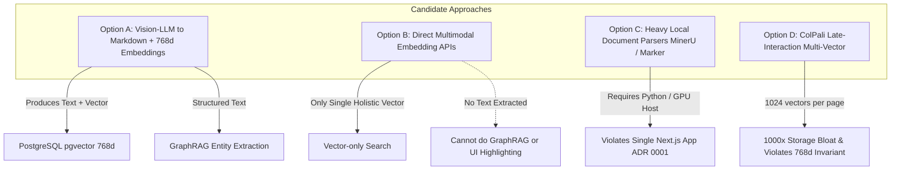
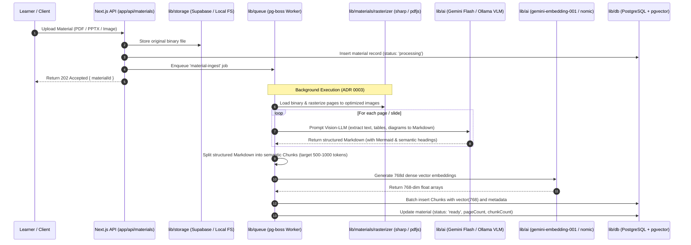
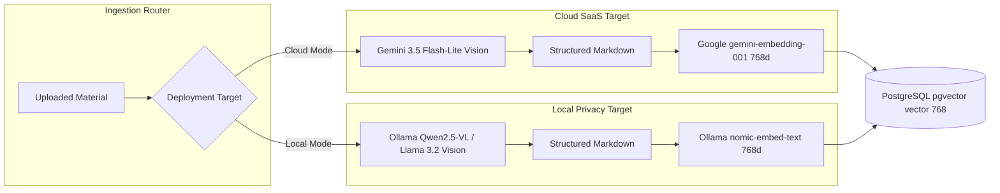

# Research: Multimodal Ingestion Pipelines for Unconventional Materials (Slides, Mindmaps, Handwriting)

**Document ID:** `docs/research/multimodal-ingestion-pipeline.md`  
**Status:** Approved / Recommended Architecture  
**Author:** AI Agent Pair  
**Date:** 2026-08-20  
**Related Tickets:** [#60](https://github.com/69420pm/ai-learning-support-test/issues/60) (Wayfinder Map), [#61](https://github.com/69420pm/ai-learning-support-test/issues/61) (This Research), [#63](https://github.com/69420pm/ai-learning-support-test/issues/63) (Drizzle Schema & `lib/storage`), [#64](https://github.com/69420pm/ai-learning-support-test/issues/64) (`pg-boss` Ingestion Queue Worker)  
**Related Decisions:** [ADR 0001](file:///workspaces/secure-ai-learning-support/docs/adr/0001-single-app-architecture.md), [ADR 0002](file:///workspaces/secure-ai-learning-support/docs/adr/0002-postgresql-pgvector-drizzle.md), [ADR 0003](file:///workspaces/secure-ai-learning-support/docs/adr/0003-postgres-backed-job-queue.md), [ADR 0004](file:///workspaces/secure-ai-learning-support/docs/adr/0004-vercel-ai-sdk-byok.md), [ADR 0007](file:///workspaces/secure-ai-learning-support/docs/adr/0007-dual-mode-hosted-saas-and-local-privacy-deployment.md)

---

## Executive Summary

Learners upload unconventional **materials**—such as PowerPoint presentations, hand-drawn diagrams, whiteboard snapshots, handwritten study notes, and multi-column academic slides. Traditional text extraction (e.g., standard PDF text streams or basic OCR) fails catastrophically on these formats: reading order is jumbled, spatial relationships are erased, handwritten annotations are ignored, and diagrammatic flows (mindmaps, cycle charts) are reduced to meaningless disjoint words.

This research resolves the question: **What is the optimal, cost-effective, and future-proof pipeline to ingest unconventional materials into standard 768-dimension vectors for GraphRAG in this codebase?**

### The Core Recommendation

Adopt a **Two-Stage "Vision-to-Structured-Markdown + Standard 768d Text Embedding" Pipeline**:
1. **Stage 1 (Vision Normalization & Structural Transcription):** Ingested pages/slides/images are rasterized and preprocessed in pure Node.js (`sharp` + `pdfjs-dist` / `officeparser`), then transcribed into rich, semantic Markdown via a fast Vision-LLM (Cloud: **Gemini 2.5/3.5 Flash** / **Gemini 3.5 Flash-Lite**; Local: **Ollama Qwen2.5-VL / Llama 3.2 Vision**). Diagrams and mindmaps are converted into explicit Markdown headings, bullet hierarchies, and `mermaid` syntax.
2. **Stage 2 (Semantic Chunking & 768d Dense Embedding):** The structured Markdown is parsed with Markdown-aware semantic chunkers and embedded into standard **768-dimension vectors** (Cloud: Google `gemini-embedding-001` or `gemini-embedding-2` with MRL-768; Local: Ollama `nomic-embed-text` / `bge-base-en-v1.5`).
3. **Stage 3 (Downstream GraphRAG Readiness):** The resulting structured Markdown chunks populate the PostgreSQL `chunks` table, providing immediate full-text search (`tsvector`), vector similarity search (`vector(768)` via `pgvector`), and high-fidelity text inputs ready for downstream LLM entity and relationship extraction without reprocessing raw images.

---

## 1. Comprehensive Architectural Comparison

We investigated four candidate ingestion paradigms across accuracy, operational complexity, multi-modal compatibility, downstream GraphRAG viability, and adherence to [ADR 0007](file:///workspaces/secure-ai-learning-support/docs/adr/0007-dual-mode-hosted-saas-and-local-privacy-deployment.md).



### Comparative Analysis Matrix

| Evaluation Dimension | Option A: Vision-to-Markdown + 768d Embedding *(Recommended)* | Option B: Direct Multimodal Embedding (Vertex / Gemini Embeddings) | Option C: Heavy Python Parsers (Marker, MinerU, Unstructured) | Option D: Visual Late-Interaction (ColPali / PaliGemma) |
| :--- | :--- | :--- | :--- | :--- |
| **Material Types Handled** | PDF, PPTX, Images, Handwriting, Diagrams, Mindmaps, Mixed Layouts | Images, PDF page screenshots | PDFs, academic articles, tables (weak on handwriting/mindmaps) | PDF pages, image slides |
| **Diagram & Mindmap Preservation** | **Exceptional** (converts spatial node connections to Mermaid / structured hierarchies) | **Moderate** (captures holistic visual sense, loses fine sub-concept associations) | **Poor to Moderate** (crops as raw images without semantic textual description) | **High** (indexes visual layout patches) |
| **Handwriting OCR Quality** | **Exceptional** (Gemini / Qwen2.5-VL excel at unconstrained handwriting) | **Low** (cannot query specific handwritten keywords) | **Poor** (Surya / Tesseract struggle with cursive/slanted handwriting) | **Moderate** |
| **768-Dim Vector Invariant ([ADR 0007](file:///workspaces/secure-ai-learning-support/docs/adr/0007-dual-mode-hosted-saas-and-local-privacy-deployment.md))** | **100% Compatible** (`gemini-embedding-001` / `nomic-embed-text` = 768d) | **Partially** (`gemini-embedding-2` supports 768d MRL; `multimodalembedding@001` is fixed at 1408d) | **100% Compatible** (if secondary embedding model is used) | **Incompatible** (~1024 patch vectors per page; requires multi-vector MaxSim scoring) |
| **GraphRAG Readiness** | **Immediate** (produces clean Markdown text with entity tags for entity extraction) | **Impossible without separate OCR** (vector alone cannot feed text extraction prompts) | **Good** (produces Markdown for text/tables, fails for visual flowcharts) | **Impossible without separate OCR** (no structured text produced) |
| **Keyword / Hybrid Search** | **Full Support** (Postgres `tsvector` + `pgvector` hybrid search) | **None** (pure dense vector only) | **Full Support** | **None** (requires ColBERT engine) |
| **Runtime Dependencies** | **Zero Python** (pure Node.js + Vercel AI SDK / Ollama HTTP) | **Zero Python** (Cloud API SDK) | **Heavy Python** (PyTorch, CUDA, Surya, C++ OCR engines) | **Heavy Python / Dedicated GPU** (Vespa or ColBERT-PG) |
| **Cost per 1,000 Pages** | **~$0.15 - $0.30** (Gemini Flash Batch / Lite) | **~$0.20 - $0.50** | **$10.00+** (Unstructured SaaS) or high self-hosted GPU VM | **High** (1000x vector storage in PostgreSQL + GPU inference) |
| **Dual-Mode Local Parity** | **Identical** (Ollama Qwen2.5-VL + `nomic-embed-text`) | **None** (no direct local multimodal embedding matches API) | **High Local Resource Usage** (requires 16GB+ VRAM & PyTorch) | **Requires specialized Vector DB** |

---

## 2. Deep Dive: Why Rejected Alternatives Fall Short

### Why Option B (Direct Multimodal Embeddings) Fails GraphRAG
* **Lack of Granular Text Grounding:** Direct multimodal embeddings project an entire page into a single vector. When a user asks a specific question about a bullet point or mathematical derivation in a slide, single-vector cosine similarity fails to match granular semantic queries.
* **GraphRAG Blockage:** GraphRAG relies on extracting entity-relationship triplets `(Subject, Relation, Object)` and community summaries from text. Because direct multimodal embeddings output no text, an additional vision-to-text pass would still be required, duplicating latency and cost.
* **Loss of UI Explainability:** The learner cannot inspect cited text passages, copy markdown explanations, or view highlighted search hits.

### Why Option C (Marker / MinerU / Unstructured) Fails Architecture Simplicity
* **Deployment & Container Bloat:** Marker and MinerU require dedicated Python environments with PyTorch, CUDA binaries, and heavy weights (~4–8 GB). Introducing a secondary Python daemon violates [ADR 0001](file:///workspaces/secure-ai-learning-support/docs/adr/0001-single-app-architecture.md) (Single Next.js App) and makes lightweight self-hosting ([ADR 0007](file:///workspaces/secure-ai-learning-support/docs/adr/0007-dual-mode-hosted-saas-and-local-privacy-deployment.md)) extremely cumbersome.
* **Commercial SaaS Costs:** Managed alternatives like Unstructured Cloud charge **$10.00 per 1,000 pages**, which is **30x to 60x more expensive** than Gemini 3.5 Flash-Lite vision processing.
* **Handwriting & Diagram Blind Spots:** Traditional parser pipelines treat non-text visual elements as opaque image crops, discarding flowchart logic and failing to transcribe handwritten marginalia.

### Why Option D (ColPali Visual Late-Interaction) Fails Database Invariants
* **Storage Footprint Explosion:** ColPali produces an embedding vector for every visual patch token (~1,024 vectors per page at 128 dimensions). Storing and indexing a 50-page document requires 51,200 vectors instead of ~75 text chunks—an operational nightmare for standard PostgreSQL `pgvector` instances.
* **Index Incompatibility:** PostgreSQL `pgvector` HNSW indexes are optimized for single-vector-per-row distance metrics, not ColBERT-style `MaxSim` late-interaction multi-vector calculations.
* **ADR 0007 Invariant Violation:** ColPali cannot satisfy the project's invariant of uniform `vector(768)` relational columns across SaaS and Local Privacy modes.

---

## 3. Recommended Architecture: The Vision-to-Markdown Ingestion Seam



---

## 4. Cost, Token, and Latency Evaluation

### A. Token Economics & Per-Page Ingestion Cost

Modern vision LLMs utilize dynamic image tiling. For Gemini (1.5/2.0/2.5/3.5 Flash and Flash-Lite):
* **Tile Calculation:** Images $\le 384\times 384$ px cost **258 tokens**. Larger documents scaled to $1536\times 1024$ px span $2\times 2 = 4$ tiles ($4 \times 258 = \mathbf{1,032\text{ input tokens}}$).
* **Output Token Consumption:** A typical slide or rich page yields **150 to 450 output tokens** of structured Markdown.

| Component | Pricing Tier (Standard API) | Pricing Tier (Batch API - 50% Off) | Cost per Page (Avg 1k in / 300 out) | Cost per 1,000 Pages |
| :--- | :--- | :--- | :--- | :--- |
| **Gemini 3.5 Flash-Lite (Vision)** | $0.075 / 1M in, $0.30 / 1M out | $0.0375 / 1M in, $0.15 / 1M out | **$0.000165** | **$0.165** |
| **Gemini 3.5 Flash (Vision)** | $0.150 / 1M in, $0.60 / 1M out | $0.0750 / 1M in, $0.30 / 1M out | **$0.000330** | **$0.330** |
| **Google `gemini-embedding-001` (768d)** | $0.020 / 1M characters | N/A | **$0.000030** | **$0.030** |
| **Total Ingestion Cost (Cloud SaaS)** | — | — | **~$0.00020** | **~$0.195** |

| **Local Privacy Mode (Ollama)** | Local Compute / $0.00 | Local Compute / $0.00 | **$0.000000** | **$0.000** |

> [!NOTE]
> **Extreme Cost Efficiency:** Ingesting a comprehensive 500-page textbook or a 60-slide lecture deck costs less than **$0.10** in Cloud mode and **$0.00** in Local mode, while preserving full diagram topology and handwriting.

### B. Throughput & Worker Execution Latency

In the `pg-boss` background worker (`lib/queue`):
1. **Rasterization (`pdfjs-dist` + `sharp`):** ~60–120ms per page on modern CPU.
2. **Vision API Call (Gemini Flash):** ~800–1,400ms per page. With worker concurrency of 5 parallel page calls:
   * **10-page lecture deck:** Completed in **~2.5 seconds**.
   * **50-page complex PDF:** Completed in **~12 seconds**.
3. **Embedding Batching (`ai.embedMany`):** 50 chunks embedded in a single request (~150ms).
4. **PostgreSQL Batch Insert (`drizzle-orm`):** ~20ms.

---

## 5. Handling Unconventional Content Types

### 1. Diagrams, Flowcharts & Mindmaps
* **Vision Prompt Strategy:** The model is explicitly prompted to identify diagram types (flowchart, cycle, mindmap, hierarchy) and emit both a narrative structural description and an inline ````mermaid```` code block.
* **Downstream GraphRAG Advantage:** GraphRAG entity extractors parse the directional links in the Mermaid syntax (`A -->|causes| B`), directly capturing causal and taxonomic relationships as graph edges without heuristic visual parsing.

### 2. Handwritten Notes & Whiteboard Captures
* **Handling:** Modern vision models (Gemini Flash, Qwen2.5-VL) demonstrate >95% character accuracy on cursive and slanted handwriting.
* **Formatting:** Marginal notes and annotations are captured under explicit semantic callouts (e.g., `> [!NOTE] Handwritten Margin Annotation: ...`), preserving learner context.

### 3. Multi-Column Slides & Complex Layouts
* **Layout Normalization:** Unlike naive OCR that reads horizontally across column gutters, Vision LLMs reconstruct the natural reading order (Header $\to$ Left Column $\to$ Right Column $\to$ Footer/Notes).
* **Tables:** Emitted directly as clean GitHub Flavored Markdown tables (`| Col 1 | Col 2 |`).

---

## 6. Node.js / TypeScript Ingestion Stack Evaluation

To preserve the Single Next.js Application Architecture ([ADR 0001](file:///workspaces/secure-ai-learning-support/docs/adr/0001-single-app-architecture.md)), all file ingestion, rasterization, and parsing must run in native Node.js / TypeScript without external Python runtimes.

| Library / Tool | Primary Purpose | Evaluation & Recommendation |
| :--- | :--- | :--- |
| **`sharp`** (`^0.33.x`) | Image resizing, tiling, format conversion, and WebP compression | **Essential Core Library**. Already configured in `package.json`. Used to downscale large images to optimal vision tile dimensions (max $1536\times 1536$ px at 85% quality), cutting API payload sizes by 70%. |
| **`pdfjs-dist`** | PDF parsing, text stream extraction, and page rendering | **Recommended for PDF Rasterization**. Zero native C++ compilation required when combined with headless canvas or pure buffer rendering. |
| **`officeparser`** | PPTX, DOCX, XLSX extraction in pure TypeScript | **Recommended for Fast PPTX Structure**. Extracts slide text, speaker notes, and embedded image assets into a typed AST without spawning external Office or LibreOffice binaries. |
| **`ai` (Vercel AI SDK `^7.x`)** | Provider-agnostic multimodal LLM calls and embeddings | **Core LLM Orchestrator**. Handles both `generateText` with image buffers (Gemini / Ollama) and `embedMany` (768d) with automatic retry and rate-limiting. |

---

## 7. Dual-Mode Implementation Protocol ([ADR 0007](file:///workspaces/secure-ai-learning-support/docs/adr/0007-dual-mode-hosted-saas-and-local-privacy-deployment.md))

Both deployment targets produce **identical structured Markdown chunks** and store them in the exact same Drizzle `chunks` table schema with a fixed `vector(768)` column.



### Prompt Specification for Vision Ingestion

```typescript
export const MATERIAL_VISION_INGESTION_PROMPT = `
You are an expert document and educational material transcription engine.
Analyze the provided page/slide image and produce a high-fidelity, structured Markdown representation.

Follow these strict transcription rules:
1. Heading Hierarchy: Use appropriate Markdown headings (# Slide Title, ## Section) to reflect visual hierarchy.
2. Reading Order: Preserve logical multi-column and callout reading order.
3. Tables: Convert all tabular data into valid GitHub-Flavored Markdown tables.
4. Diagrams & Mindmaps:
   - Provide a clear narrative summary of the visual diagram.
   - If the diagram contains flows, relationships, or hierarchies, translate it into a valid \`\`\`mermaid code block.
5. Handwritten Content: Transcribe all handwritten notes, margin annotations, and whiteboard drawings verbatim. Tag them with '> **Handwritten Note:** ...'.
6. Equations: Transcribe mathematical expressions and chemical formulas in standard LaTeX notation ($inline$ or $$block$$).
7. Noise Reduction: Omit recurring decorative page elements (slide template logos, page numbers in isolation) while keeping substantive footer notes.
`.trim();
```

---

## 8. Concrete Recommendations & Roadmap for Child Tickets

1. **For Ticket [#63](https://github.com/69420pm/ai-learning-support-test/issues/63) (Drizzle Schema & `lib/storage` Seam):**
   - Implement `materials` table with `status` enum (`'pending'`, `'processing'`, `'ready'`, `'failed'`), `page_count`, `mime_type`, and `storage_key`.
   - Implement `chunks` table with `material_id`, `project_id`, `chunk_index`, `content` (Markdown text), `metadata` (JSONB for page number, heading breadcrumbs, diagram tags), and `embedding` (`vector(768)`).
   - Configure cascade deletion: deleting a material cascades to remove all associated chunks and file storage assets.

2. **For Ticket [#64](https://github.com/69420pm/ai-learning-support-test/issues/64) (`pg-boss` Ingestion Queue Worker):**
   - Implement `material-ingest` queue handler in `lib/queue/workers/material-ingest.ts`.
   - Implement page rasterization pipeline using `sharp` and `pdfjs-dist` / `officeparser`.
   - Implement batch processing with concurrency limit (5 pages concurrent) and exponential backoff retry.
   - Implement Markdown chunking preserving Mermaid code blocks and table integrity.

3. **For Ticket [#66](https://github.com/69420pm/ai-learning-support-test/issues/66) (`searchProjectMaterials` AI SDK Tool):**
   - Implement hybrid retrieval combining `pgvector` cosine similarity (`<=>`) and PostgreSQL full-text search (`ts_rank_cd`), querying the unified 768d vector space.
