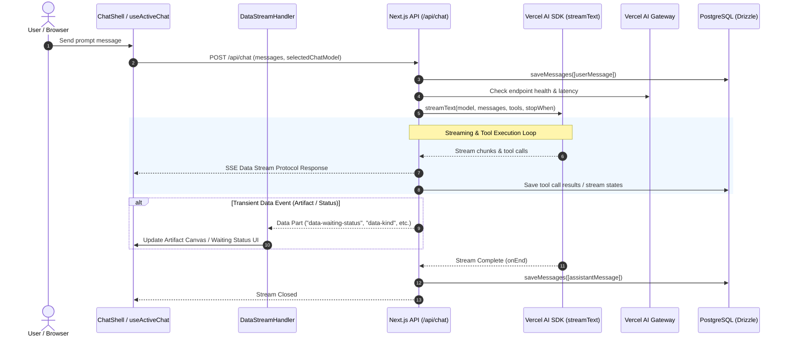

# Architectural Analysis & Learning Report: Vercel AI SDK Chatbot Template

> **Target Repository:** Vercel AI SDK Chatbot (`/workspaces/chatbot`)  
> **Analysis Date:** July 2026  
> **Purpose:** Extract architectural patterns, state management strategies, Vercel AI SDK paradigms, and developer experience (DX) best practices to inform the implementation of the LLM Chat Engine in `secure-ai-learning-support`.

---

## 1. Executive Summary

Vercel's official Chatbot template represents the state-of-the-art in modern, production-grade Web AI application design. It showcases Next.js 16 (App Router + Turbopack), React 19, Vercel AI SDK 7 (`@ai-sdk/react` 4), Drizzle ORM, NextAuth v5, Biome/Ultracite, and Pyodide WebAssembly execution.

While Vercel's template is optimized as a tightly-coupled monolithic starter kit for small-to-medium SaaS applications, its patterns for **Resumable Streaming**, **Multi-Step Tool Approvals**, **Side-by-Side Artifact Versioning**, and **AI Gateway Endpoint Monitoring** provide invaluable architectural blueprints for our larger monorepo architecture.

---

## 2. Directory & File Structure

```
/workspaces/chatbot
├── app/                        # Next.js App Router Shell
│   ├── (auth)/                 # Authentication routes (Login, Register, Guest session)
│   │   ├── actions.ts          # Auth Server Actions
│   │   ├── auth.ts             # NextAuth v5 configuration & JWT providers
│   │   └── layout.tsx          # Auth layout wrapper
│   ├── (chat)/                 # Main Chat Application Shell
│   │   ├── actions.ts          # Title generation & chat management server actions
│   │   ├── layout.tsx          # Master layout with ActiveChatProvider & AppSidebar
│   │   ├── page.tsx            # Root chat entry point
│   │   ├── chat/[id]/page.tsx  # Route parameter page (renders null; layout owns UI)
│   │   └── api/                # HTTP API Controllers
│   │       ├── chat/route.ts   # Core AI streaming endpoint (POST / DELETE)
│   │       ├── document/       # Artifact fetching & saving
│   │       ├── files/          # File upload & retrieval
│   │       ├── history/        # Paginated chat history (SWR infinite)
│   │       ├── messages/       # Chat message loading
│   │       ├── models/         # Dynamic model list & capabilities
│   │       ├── suggestions/    # AI document suggestions
│   │       └── vote/           # Message feedback (upvote/downvote)
│   ├── globals.css             # Tailwind v4 configuration & design system CSS
│   └── layout.tsx              # Root HTML document wrapper
│
├── artifacts/                  # Type-specific Artifact Implementations
│   ├── actions.ts              # Artifact server actions
│   ├── code/                   # Code artifact client & server handlers (Pyodide execution)
│   ├── text/                   # Text/Markdown document artifact (ProseMirror rich editor)
│   ├── sheet/                  # Spreadsheet artifact (React Data Grid)
│   └── image/                  # Image artifact viewer
│
├── components/                 # React Components
│   ├── ai-elements/            # Low-level AI UI primitives (code-block, reasoning, tool, etc.)
│   ├── chat/                   # High-level chat feature components
│   │   ├── shell.tsx           # Main chat layout manager (split-screen chat/artifact)
│   │   ├── messages.tsx        # Virtualized/scrolled message stream container
│   │   ├── multimodal-input.tsx# Rich prompt input with attachments & slash commands
│   │   ├── artifact.tsx        # Side-by-side artifact panel container
│   │   ├── data-stream-handler.tsx # Client-side stream listener for custom data parts
│   │   └── app-sidebar.tsx     # Navigation sidebar with chat history
│   └── ui/                     # Base UI components (Radix / Shadcn primitives)
│
├── hooks/                      # Custom React Hooks
│   ├── use-active-chat.tsx     # Core hook wrapping `@ai-sdk/react` useChat
│   ├── use-artifact.ts         # Shared state hook for active artifact canvas
│   ├── use-auto-resume.ts      # Automatic stream resumption after network drops
│   └── use-scroll-to-bottom.tsx# Auto-scrolling viewport controller
│
├── lib/                        # Core Domain Logic & Infrastructure
│   ├── ai/                     # AI SDK Configuration & Orchestration
│   │   ├── models.ts           # Model definitions & Vercel AI Gateway availability checks
│   │   ├── providers.ts        # Language model provider resolver (real vs. test mock)
│   │   ├── prompts.ts          # System prompt builders (geo-aware)
│   │   └── tools/              # AI Tool implementations
│   │       ├── create-document.ts  # Tool for spawning new artifacts
│   │       ├── edit-document.ts    # Tool for inline artifact diff edits
│   │       ├── update-document.ts  # Tool for full artifact replacement
│   │       ├── request-suggestions.ts # Tool for AI document inline feedback
│   │       └── get-weather.ts      # Example external API tool
│   ├── artifacts/              # Server-side artifact registry & handler factories
│   │   └── server.ts           # `createDocumentHandler` implementation
│   ├── db/                     # Database Persistence Layer (Drizzle ORM)
│   │   ├── schema.ts           # PostgreSQL database schema tables
│   │   ├── queries.ts          # Database access queries
│   │   └── migrate.ts          # DB migration runner
│   ├── errors.ts               # Custom application error classes (`ChatbotError`)
│   ├── ratelimit.ts            # Upstash Redis rate limiter
│   └── types.ts                # TypeScript DTOs & state interfaces
│
├── public/                     # Static Assets
│   └── pyodide/                # Pyodide WebAssembly runtime for browser Python execution
│
├── tests/                      # Automated Test Suite
│   ├── e2e/                    # Playwright end-to-end user journey tests
│   ├── pages/                  # Page Object Models (POM) for test clean abstraction
│   └── fixtures.ts             # Test environment fixtures & setup
│
├── proxy.ts                    # Middleware edge proxy (guest session routing)
├── biome.jsonc                 # Biome linter & formatter configuration
├── drizzle.config.ts           # Drizzle ORM configuration
├── next.config.ts              # Next.js 16 configuration
└── package.json                # Project dependencies & npm scripts
```

---

## 3. High-Level Architecture & Data Flow



### Key Architectural Responsibilities

1. **Presentation Layer (`app/(chat)/layout.tsx` & `components/chat/shell.tsx`):**
   - Implements a **Persistent Shell Architecture**. Navigation between `/` and `/chat/[id]` does not trigger a full layout re-render.
   - Route `app/(chat)/chat/[id]/page.tsx` returns `null`; `Layout` extracts the `chatId` from the URL parameters via `usePathname()` inside `ActiveChatProvider` and swaps the active thread context instantly.

2. **Client State & Streaming Engine (`hooks/use-active-chat.tsx`):**
   - Direct integration with Vercel AI SDK's `useChat` hook using `DefaultChatTransport`.
   - Captures non-text streaming events (waiting statuses, artifact IDs, title updates) via `onData` callback and forwards them to `DataStreamProvider`.

3. **Backend Controller (`app/(chat)/api/chat/route.ts`):**
   - Serves as the central pipeline: performs input validation (Zod), Bot protection (`botid`), authentication checking (`NextAuth`), IP rate limiting, database loading, and invokes `streamText`.
   - Utilizes Next.js `after()` API to perform non-blocking asynchronous tasks (such as chat title generation and stream state persistence) after the response headers are sent.

4. **Artifact Versioning System (`lib/artifacts/server.ts` & `lib/db/schema.ts`):**
   - Implements an **Append-Only Document Versioning Store**. Documents are indexed by composite key `(id, createdAt)`.
   - Edits or creations do not overwrite old document versions; they insert new timestamped snapshots, enabling full time-travel, undo/redo, and inline diffing using `diff-match-patch`.

---

## 4. Development Tools & DX Analysis

Vercel's template leverages modern developer tooling choices:

| Tooling | Technology | Purpose & Strategic Benefit |
| :--- | :--- | :--- |
| **Linter & Formatter** | `@biomejs/biome` + `ultracite` | Replaces ESLint and Prettier. Provides sub-millisecond linting and formatting with unified rule presets (`ultracite/biome/core`). |
| **ORM & Database** | `drizzle-orm` + `drizzle-kit` | Ultra-lightweight TypeScript ORM with compile-time type safety. Migration scripts (`lib/db/migrate.ts`) run automatically before production build (`tsx lib/db/migrate && next build`). |
| **Testing Framework** | `@playwright/test` | End-to-end testing across Chrome and mobile viewports. Includes Page Object Models (`tests/pages/chat.ts`) and automatic server orchestration (`webServer.command: "pnpm dev"`). |
| **Git Hooks** | `husky` + `lint-staged` | Automatically formats and lints modified files on `git commit` via `corepack pnpm run fix --`. |
| **Compiler & Runtime** | Next.js 16 (`--turbo`) + React 19 | Uses Next.js Turbopack dev server and `babel-plugin-react-compiler` for automatic memoization without manual `useMemo`/`useCallback` boilerplate. |
| **Client-Side Sandbox**| `Pyodide` (WebAssembly) | Runs Python code artifacts inside the user's browser without requiring remote sandboxed container infrastructure. |

---

## 5. Architectural Comparison: Vercel Template vs. Our Monorepo

| Feature | Vercel Chatbot (`/workspaces/chatbot`) | Our Monorepo (`secure-ai-learning-support`) | Architectural Guidance |
| :--- | :--- | :--- | :--- |
| **Architecture Pattern** | Monolithic Next.js Application Structure | Monolithic Monorepo (`pnpm` + `Turborepo`) | Adapt Vercel's patterns into our decoupled package layers (`@shared`, `@infrastructure`, `@core`, `apps/web`). |
| **Package Separation** | Single package (`app/`, `lib/`, `components/`) | 4-Tier Decoupled Monorepo (`packages/*`, `apps/web`) | **Rule Violation in Vercel Repo:** Vercel places DB queries directly in `lib/db/queries.ts` and imports them into API routes. In our codebase, DB implementations belong strictly in `@infrastructure`. |
| **Database Abstraction** | PostgreSQL only (`pgTable`) | Dual-Mode Persistence (SQLite for local, PostgreSQL for cloud) | Implement repository interfaces in `@shared` and concrete Drizzle drivers in `@infrastructure`. |
| **LLM Provider Strategy**| Vercel AI Gateway (`ai-gateway.vercel.sh`) | Pluggable Provider Adapters (OpenWebUI, Gemini, Anthropic, Ollama) | Use Vercel AI SDK's agnostic `LanguageModel` interface wrapped in our `LlmProviderFactory`. |
| **Scope & Complexity** | General-purpose AI Chatbot with generic artifacts | Document-grounded Active Learning System (FSRS, Feynman Audits, GraphRAG) | Keep chat interface lightweight while grounding responses in `@core` pedagogical engines. |

---

## 6. Detailed Analysis of Vercel AI SDK Integration

Vercel AI SDK 7 (`@ai-sdk/react` 4) is utilized in this repository.

### A. Server-Side Orchestration (`streamText`, `createUIMessageStream`)
In `app/(chat)/api/chat/route.ts`:
- **`streamText`**: Executes the primary LLM stream, supplying dynamic tools, geo-location system prompts, and multi-step turn limits (`stopWhen: isStepCount(5)`).
- **`createUIMessageStream` & `createUIMessageStreamResponse`**: Converts low-level LLM output into standardized SSE UI data streams, allowing custom transient payload injection (`writer.write({ type, data, transient: true })`).

### B. Client-Side Transport & Hook (`useChat`, `DefaultChatTransport`)
In `hooks/use-active-chat.tsx`:
```typescript
const { messages, sendMessage, status, stop, regenerate } = useChat<ChatMessage>({
  id: chatId,
  messages: initialMessages,
  transport: new DefaultChatTransport({
    api: "/api/chat",
    prepareSendMessagesRequest(request) {
      return {
        body: {
          id: request.id,
          message: request.messages.at(-1),
          selectedChatModel: currentModelId,
        },
      };
    },
  }),
  onData: (dataPart) => {
    // Intercept custom stream events (status, artifacts, titles)
  },
});
```

### C. Human-in-the-Loop & Tool Approvals
Vercel's SDK handles tool call confirmation flows gracefully:
1. When a tool requires user permission (e.g. updating a document or making external API calls), the tool message part state changes to `"approval-required"`.
2. The user accepts or declines via UI buttons, updating the part to `"approval-responded"` or `"output-denied"`.
3. `sendAutomaticallyWhen` detects the approval response and automatically re-triggers `sendMessage()` to resume the LLM workflow with the user's decision.

### D. Network Resilience & Stream Resumption
Using `resumable-stream` and Redis:
- If a client's network drops during a stream, Next.js `after()` keeps the background stream active in Redis.
- When the client reconnects, `useAutoResume` invokes `resumeStream()`, fetching missed chunks without restarting LLM generation from scratch.

---

## 7. Key Takeaways & Best Practices to Adopt

1. **Transient UI Status Streaming (`data-waiting-status`):**
   - *Problem:* LLM response latency or cold starts cause users to think the application is frozen.
   - *Solution:* Stream transient data events during generation ("Waiting...", "Model may be slow...", "Thinking...") that update UI indicators without polluting the final message history.

2. **Persistent Shell Layout with URL Synchronization:**
   - *Pattern:* Keep the main layout mounted (`ChatShell`) and decode `chatId` directly from `usePathname()`. Returning `null` from `/chat/[id]/page.tsx` prevents layout shifts and unnecessary component re-mounts during thread switching.

3. **Append-Only Canvas Versioning (`(id, createdAt)`):**
   - *Pattern:* Storing document iterations as timestamped rows allows instant side-by-side diff previews (`diff-match-patch`) and zero data loss during document editing.

4. **Multi-Model Capability Detection & Health Monitoring:**
   - *Pattern:* Fetch model features (`reasoning`, `tools`, `vision`) and health metrics dynamically from the gateway endpoint (`/v1/models/[id]/endpoints`) to disable unsupported tools (e.g. tools for non-tool reasoning models) before sending requests.

5. **Mock Provider Testing Infrastructure:**
   - *Pattern:* Using `customProvider` with `models.mock.ts` enables full unit and E2E testing without calling external LLM APIs or incurring token costs.

---

## 8. Strategic Roadmap for `secure-ai-learning-support`

When implementing our upcoming Chat Epic (`chat-interface-openwebui.md`), we should adopt these specific patterns while adhering to our project rules:

1. **Adopt `@ai-sdk/react` v4 `useChat` & `DefaultChatTransport`** in `apps/web` for message state management and streaming.
2. **Encapsulate AI SDK backend streaming inside `@core/src/chat` (`ChatOrchestrator`)** to preserve our 4-tier layer boundaries (API routes in `apps/web` remain thin controllers).
3. **Use Vercel's Transient Data Stream Pattern** to stream GraphRAG retrieval state, pedagogical evaluation steps, and FSRS updates alongside standard text.
4. **Enforce Dual-Mode Storage for Chat & Messages** in `@infrastructure` (SQLite for local offline execution, PostgreSQL for cloud).
5. **Implement Mock Provider Adapter** in `@infrastructure/src/llm` following Vercel's `customProvider` pattern to guarantee lightning-fast, offline-friendly unit and integration tests.

---
*Report compiled for secure-ai-learning-support architecture design.*
