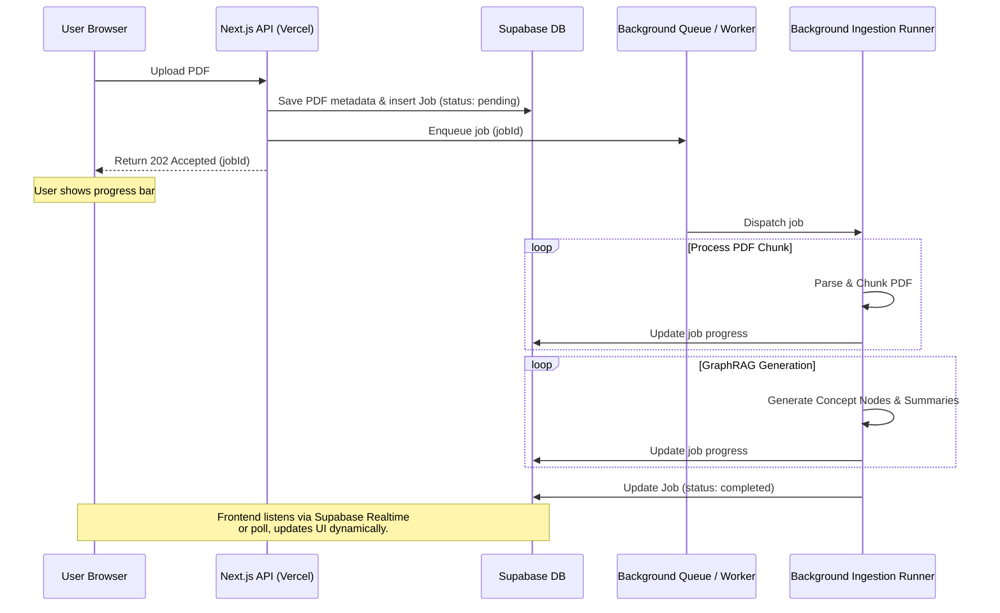

# Core Application Package

This package is framework-agnostic and contains the core orchestrators, database schemas, and feature logic.

## Background Ingestion & Agent Execution

Since PDF text extraction and GraphRAG compilation can exceed 10 seconds, execution must be asynchronous on any hosted version.

### Queue & Worker Setup (Current)
- **Local Mode & MVP Phase:** For zero dependencies, the local/development Next.js server triggers an in-memory background promise or simple local worker thread that processes the PDF in the background without requiring a distributed queue. This runs entirely on the host machine for free.
*(For future scaling options, see ADR 001 in `specs/adrs/001-cloud-scale-up-strategy.md`)*

### Cost Management
- **Bring Your Own Key (BYOK):** Under Settings, users can input their own Gemini or OpenAI API keys. The app's workers use the provided credentials, ensuring zero LLM API expenses for the developer.
