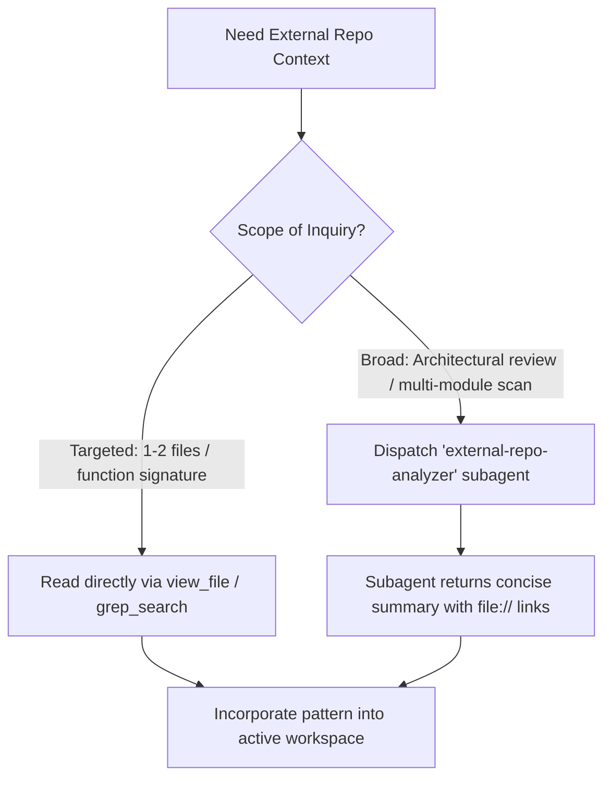

# External Repositories Rule (`rules/external-repos.md`)

Reference catalog and operating protocol for public sibling repositories located in the parent workspace directory (`../` or `/workspaces/`).

---

## 1. Sibling Directory & Acquisition Protocol

1. **Location & Isolation:**
   - External reference repositories reside exclusively as sibling directories under `/workspaces/<repo-name>` (or `../<repo-name>`).
   - Never clone or extract external repositories inside the active project directory (`/workspaces/secure-ai-learning-support/`).
2. **Access Model:**
   - Treat all sibling repositories as **read-only primary sources**.
   - Use them to study reference implementations, type signatures, and design patterns. Adapt and implement clean code in the active project; do not edit sibling repositories.
3. **Auto-Pull / Cloning Protocol:**
   - Before attempting to clone, verify whether the repository or pattern already exists in `/workspaces/`.
   - If an external public repository is needed to complete a task, shallow-clone it into `/workspaces/`:
     ```bash
     git clone --depth 1 https://github.com/<owner>/<repo>.git /workspaces/<repo-name>
     ```
   - **Self-Maintenance:** After pulling a new reference repository, record its path, origin, and key entrypoints in Section 3 of this file.

---

## 2. Context Hygiene & Exploration Strategy

Reading extensive external codebases can quickly saturate the active session's smart zone (~150k tokens). Choose the lookup mechanism based on scope:



- **Targeted Lookup (Direct):** Use `view_file` or `grep_search` directly when checking a single API endpoint, utility function, or configuration schema.
- **Deep Investigation (Subagent):** Dispatch the `external-repo-analyzer` subagent (or the `/research` skill) for multi-file surveys, architectural comparisons, or deep pattern tracing. The subagent performs the reading legwork in an isolated context and returns synthesized findings with clickable `file://` links.

---

## 3. Available Public Repositories Catalog

### A. `../chatbot` (Official Vercel AI Chatbot)
- **Path:** [`/workspaces/chatbot`](file:///workspaces/chatbot) (also mirrored at [`/workspaces/external-repos/ai-chatbot`](file:///workspaces/external-repos/ai-chatbot))
- **Origin:** Official Vercel Next.js AI Chatbot template (`vercel/ai-chatbot`)
- **Core Tech Stack:** Next.js 16 (App Router with Turbopack), React 19, TypeScript, Vercel AI SDK (`ai` v7, `@ai-sdk/react`), Drizzle ORM (PostgreSQL), NextAuth v5 (beta), TailwindCSS v4, Radix UI, Framer Motion.
- **Key Modules & Entrypoints:**
  - [`app/(chat)/api/chat/route.ts`](file:///workspaces/chatbot/app/\(chat\)/api/chat/route.ts): AI SDK `streamText` endpoint with tools and artifact handling.
  - [`lib/ai/`](file:///workspaces/chatbot/lib/ai): AI provider wrappers, model configurations, and tool declarations.
  - [`components/`](file:///workspaces/chatbot/components): Chat UI components, streaming message bubble rendering, prompt inputs, and artifact preview windows.
  - [`lib/db/schema.ts`](file:///workspaces/chatbot/lib/db/schema.ts): Drizzle PostgreSQL schema definitions for chats, messages, and artifacts.
- **Consult When:**
  - Implementing Vercel AI SDK streaming endpoints (`streamText`, tool calling, structured outputs, streaming data).
  - Designing generative UI components and live preview artifacts.
  - Configuring NextAuth v5 authentication flows in App Router.
  - Structuring Drizzle ORM schemas for chat conversations and messages.

---

### B. `../opencode` (OpenCode AI Development Engine)
- **Path:** [`/workspaces/opencode`](file:///workspaces/opencode)
- **Origin:** Anomaly Co (`anomalyco/opencode`) AI-powered development tool and coding assistant engine.
- **Core Tech Stack:** Bun monorepo (`bun@1.3.x`), Turborepo, TypeScript, Effect TS (`effect`), Hono, Drizzle SQLite, OpenTUI (`@opentui/core`, `@opentui/solid`), SolidJS, Electron, MCP (`@modelcontextprotocol/sdk`).
- **Key Packages & Entrypoints:**
  - [`packages/core/`](file:///workspaces/opencode/packages/core): Core domain logic, agent execution loops, tool registries, file context indexing, and session stores.
  - [`packages/llm/`](file:///workspaces/opencode/packages/llm): LLM provider abstractions, model streaming, and tool execution layer.
  - [`packages/tui/`](file:///workspaces/opencode/packages/tui): Terminal User Interface built with OpenTUI and SolidJS.
  - [`packages/app/`](file:///workspaces/opencode/packages/app) & [`packages/desktop/`](file:///workspaces/opencode/packages/desktop): Web and desktop frontend applications.
  - [`packages/cli/`](file:///workspaces/opencode/packages/cli): CLI entrypoint and command argument parser.
- **Consult When:**
  - Building multi-step agentic execution loops and tool calling engines.
  - Referencing real-world production TypeScript agent architectures.
  - Applying functional domain modeling with Effect TS.
  - Implementing Model Context Protocol (MCP) integrations.
  - Constructing terminal interfaces with OpenTUI or managing Node-PTY shell sessions.
