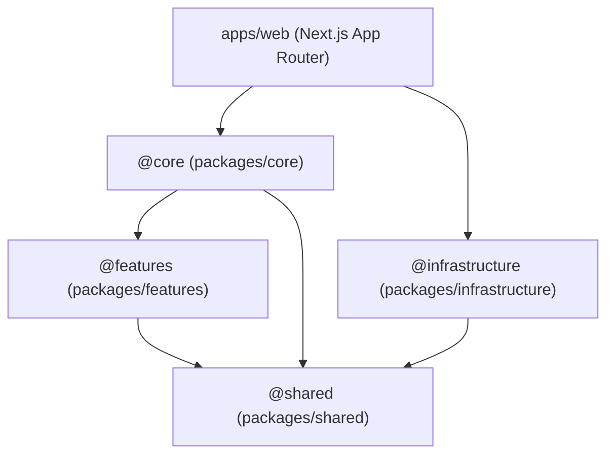

# Package Architecture & Layer Boundaries Rule

This document is the **single source of truth** for the 4-tier package architecture, system blueprints, and boundary enforcement rules for the **AI Learning Support** monorepo. All developers and AI agents MUST follow these architectural constraints.

> **Alias Mapping:** Throughout this document, `@core` refers to `@ai-learning-support/core`, `@infrastructure` refers to `@ai-learning-support/infrastructure`, `@shared` refers to `@ai-learning-support/shared`, and `@features` refers to any `@ai-learning-support/features-*` package.

---

## 1. Core Mental Model: Decoupled 4-Tier Monolith

The codebase separates **Presentation** (`apps/web`), **Orchestration** (`packages/core`), **Infrastructure & Drivers** (`packages/infrastructure`), and **Shared Domain Types** (`packages/shared`). Optional self-contained domain modules reside in `packages/features/`.

The primary purpose of this architecture is to decouple business logic, pedagogical engines, and learning algorithms from:
1. UI frameworks like Next.js / React.
2. Low-level database drivers (Drizzle, Supabase, PostgreSQL) and storage providers (Local disk, S3).

This follows the **Dependency Inversion Principle**: high-level modules (`@core`, `@features`) depend on abstractions defined in `@shared`, never on low-level infrastructure details. `@infrastructure` implements those abstractions.

```text
┌─────────────────────────────────────────────────────────┐
│                      apps/web                           │
│   Next.js UI, App Router pages, API routes              │
│   Composition root: wires concrete impls to interfaces  │
└──────────┬───────────────────────────────┬──────────────┘
           │ (calls orchestrators)         │ (imports concrete impls
           │                              │  for wiring only)
           ▼                              ▼
┌─────────────────────┐        ┌───────────────────────────┐
│    packages/core    │        │   packages/infrastructure  │
│  Orchestrators,     │        │  Concrete implementations  │
│  workflows, engines │        │  of repository & storage   │
│                     │        │  interfaces from @shared   │
└──────────┬──────────┘        └──────────┬────────────────┘
           │                              │
           └──────────┬───────────────────┘
                      │ (both depend on abstractions)
                      ▼
┌─────────────────────────────────────────────────────────┐
│                    packages/shared                      │
│   Domain entities, repository & storage INTERFACES,     │
│   DTO types, and domain error classes                   │
└─────────────────────────────────────────────────────────┘

                  ┌───────────────────────┐
                  │   packages/features   │
                  │ Pure computation      │
                  │ modules (Parser,      │
                  │ GraphRAG, FSRS)       │
                  │ Depend on @shared     │
                  │ only                  │
                  └───────────┬───────────┘
                              │ (imports domain types)
                              ▼
                        packages/shared
```

---

## 2. Package Layers & Dependency Flow



**Key arrows to note:**
- `Core → Shared` (for interfaces and types — NOT infrastructure)
- `Infrastructure → Shared` (implements the interfaces defined in shared)
- `Core` does NOT depend on `Infrastructure` for type definitions. The only infra imports in core are in **composition root factory files** that wire concrete implementations.
- `Features → Shared` only. Features never touch infrastructure or core.

---

## 3. Layer Deep-Dive & Responsibilities

### Tier 1: Applications (`apps/web`) — Presentation Shell
* **Role:** Thin presentation and HTTP delivery shell. Also serves as the top-level **composition root** where concrete implementations are wired to interfaces.
* **What belongs here:**
  - Next.js App Router (`app/` pages, UI components, CSS styling).
  - Client-side interactivity, state management, and form handlers.
  - Thin API route handlers (`app/api/*`) that parse incoming requests, authorize sessions, and delegate to `@core` orchestrators.
* **What DOES NOT belong here:**
  - Raw SQL queries or direct Drizzle ORM schema usage (outside of test fixtures).
  - Core business logic, pedagogical scheduling (FSRS), or Feynman scoring algorithms.
  - PDF parsing or document graph-building pipelines.

### Tier 2: Core Orchestration (`packages/core` / `@core`) — Business Engine
* **Role:** Orchestrates application workflows, pipeline execution, pedagogical engines, and state machines.
* **What belongs here:**
  - Learning plan synthesis, active recall workflows, FSRS spaced repetition scheduling.
  - Workflow state machines, document processing pipelines, and session management.
  - Service orchestrators that depend on **interface contracts from `@shared`** (e.g., `DocumentRepository`, `StorageService`).
  - **Composition root factory files** (e.g., `factory.ts`) that wire concrete `@infrastructure` implementations to `@shared` interfaces. These are the ONLY files in core that may import from `@infrastructure`.
* **What DOES NOT belong here:**
  - Next.js, React, or DOM dependencies.
  - Direct database driver usage (e.g., `drizzle-orm` queries, `pg` connections). Core services receive repository instances via constructor injection.
  - Hardcoded local file path operations (must use storage adapter interfaces from `@shared`).

### Tier 3: Infrastructure (`packages/infrastructure` / `@infrastructure`) — Drivers & Adapters
* **Role:** Provides concrete implementations of the repository and storage interfaces defined in `@shared`.
* **What belongs here:**
  - Database table schema definitions (Drizzle ORM tables, migrations).
  - Concrete Repository implementations (e.g., `SqliteDocumentRepository implements DocumentRepository`).
  - Storage adapters (Local disk file adapter, S3/Cloudflare R2 storage adapter).
  - Database client initialization and connection management.
* **What DOES NOT belong here:**
  - Application UI components or HTTP routes.
  - Business rules or pedagogical scheduling logic.
  - Interface definitions (these belong in `@shared`).

### Tier 4: Shared (`packages/shared` / `@shared`) — Zero-Dependency Foundation
* **Role:** Central domain models, interface contracts, DTO types, and shared type definitions.
* **What belongs here:**
  - Pure domain entity definitions (`User`, `Document`, `Chunk`, `Flashcard`).
  - **Repository interface definitions** (contracts implemented by `@infrastructure`).
  - **Storage interface definitions** (contracts implemented by `@infrastructure`).
  - Shared DTO types and custom domain error classes.
* **What DOES NOT belong here:**
  - Imports from `@core`, `@infrastructure`, `@features`, or `apps/web`.
  - Runtime npm dependencies (must remain zero-dependency / pure types). No Zod, no validation libraries.

### Optional: Feature Modules (`packages/features/*` / `@features`) — Pure Computation
* **Role:** Self-contained, isolated domain computation modules.
* **What belongs here:**
  - PDF/document parsing engines.
  - GraphRAG knowledge graph construction.
  - FSRS spaced repetition calculation algorithms.
  - Any pure computation that takes data in, processes it, and returns results.
* **What DOES NOT belong here:**
  - Database access or repository usage. Features receive data from `@core` orchestrators.
  - Imports from `@core`, `@infrastructure`, other `@features/*` modules, or `apps/web`.
* **Dependency rule:** `@shared` only.

---

## 4. Dependency & Import Rules Matrix

| Source Layer | Allowed Imports | Forbidden Imports |
| :--- | :--- | :--- |
| `apps/web` | `@core`, `@shared`, `@infrastructure` | Direct ORM queries in production code, internal `@core` private modules |
| `packages/core` | `@shared`, `@infrastructure` *(factory files only — for concrete class wiring)*, `@features` | `apps/web`, Next.js, React, `drizzle-orm`, direct DB drivers |
| `packages/features/*` | `@shared` | `@infrastructure`, `@core`, other `@features/*`, `apps/web` |
| `packages/infrastructure` | `@shared` | `@core`, `apps/web`, `@features` |
| `packages/shared` | None (zero internal monorepo imports, zero runtime npm dependencies) | Everything |

> **Composition Root Rule:** Core service files (e.g., `document-service.ts`) import interfaces from `@shared` via constructor injection. Only dedicated factory files (e.g., `factory.ts`) in `@core` may import concrete classes from `@infrastructure` to wire implementations. This is the sole exception to the "core does not import infrastructure" rule.

---

## 5. "Where Does My Code Go?" Decision Checklist

Follow this checklist when introducing new functionality:

1. **Creating a new UI page, button, or dashboard tab?**
   → Put it in `apps/web/app/` or `apps/web/components/`.
2. **Writing a new API endpoint?**
   → Put a thin HTTP controller in `apps/web/app/api/`, which validates inputs and calls a service in `packages/core`.
3. **Implementing a core business workflow (e.g., FSRS calculation, learning plan synthesis)?**
   → Put it in `packages/core/src/services/`.
4. **Building a pure computation module (e.g., PDF parser, graph builder)?**
   → Put it in `packages/features/<module-name>/`. It must depend only on `@shared`.
5. **Defining a database table or writing a SQL query?**
   → Define the schema in `packages/infrastructure/src/db/schema/` and the repository implementation in `packages/infrastructure/src/db/`.
6. **Adding a new domain type, entity model, or DTO?**
   → Place it in `packages/shared/src/types/`.
7. **Creating a new repository or storage interface?**
   → Define the interface in `packages/shared/src/types/`. Implement it in `packages/infrastructure/`.
8. **Wiring a new concrete implementation to an interface?**
   → Add it to a factory file in `packages/core/src/` (e.g., `factory.ts`).

---

## 6. Architectural Landmines & Gotchas

1. ❌ **Do NOT place database logic in Next.js API routes:** Always delegate database operations to `@core` orchestrators which use repository interfaces.
2. ❌ **Do NOT define interfaces in `@infrastructure`:** Repository and storage interfaces MUST be defined in `@shared`. Infrastructure only provides concrete implementations.
3. ❌ **Do NOT import `@infrastructure` in core service files:** Core services depend on `@shared` interfaces via constructor injection. Only factory files may import concrete classes from `@infrastructure`.
4. ❌ **Do NOT re-export other packages from core's barrel:** `core/index.ts` must only export core's own API. Never `export * from '@infrastructure'` or `export * from '@shared'`.
5. ❌ **Do NOT add runtime dependencies to `@shared`:** It must remain zero-dependency (pure TypeScript types and interfaces only).
6. ❌ **Do NOT create circular package dependencies:** `@shared` MUST NOT import `@core`, and `@infrastructure` MUST NOT import `apps/web` or `@core`.
7. ❌ **Respect Dual-Mode Architecture:** Always write file/database operations against interface contracts so the app can switch seamlessly between **Local Mode** (local disk + SQLite/embedded DB) and **Cloud Mode** (S3 + Supabase).
8. ❌ **Feature Isolation:** Feature modules under `packages/features/*` MUST NOT cross-import from other feature modules. Each feature receives data from `@core` and returns results — it never fetches or persists data itself.
