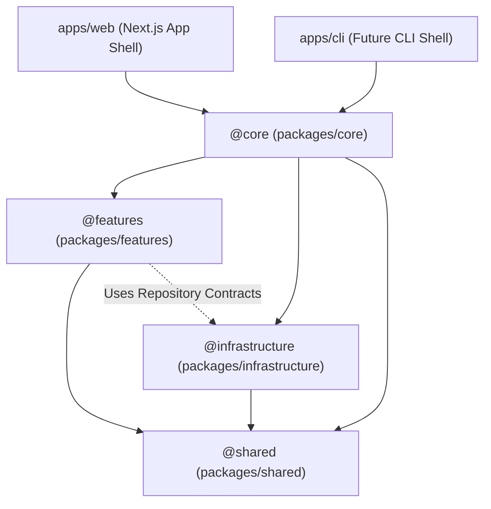

# ADR 003: Modular Monolith ("Virtual Package") Architecture & Layering

**Status:** Accepted  
**Date:** 2026-07-03 (Updated: 2026-07-04)  
**Deciders:** Staff Architect, Engineering Lead  
**Target Domains / Packages:** `packages/core`, `packages/infrastructure`, `packages/shared`, `packages/features`, `apps/web`  

---

## Context & Problem Statement

As the application grew, features and agent capabilities (e.g., pedagogical engines, LLM provider adapters, document parsers, memory subsystems) required strict encapsulation, clean separation of concerns, and defined input/output boundaries.

Creating separate published `pnpm` workspace packages with heavy individual build pipelines, versioning configs, and publishing scripts for every tiny sub-feature introduced unnecessary build overhead and hot-reload latency.

Conversely, dumping all infrastructure drivers (Drizzle ORM, SQLite/Supabase, local file storage) and domain features flatly inside `packages/core/src/` turned `core` into a bloated "God Package" with `packages/core/src/core/` path duplication, leaky abstractions, and unclear data access boundaries.

## Decision Drivers
- **Intuitive Top-Level Monorepo Boundaries:** Eliminate awkward nested folder duplication (`packages/core/src/core/`).
- **Lean Core Orchestration:** Keep `packages/core` lean, acting strictly as the workflow engine, state machine executor, and service wire-up layer.
- **Infrastructure Adapter Isolation:** Isolate specific database providers (Supabase, Drizzle) and storage drivers (S3, local disk) inside `packages/infrastructure/` behind strict repository interfaces.
- **Strict Module Boundaries:** Prevent feature modules inside `packages/features/` from cross-importing private internals or raw database drivers.
- **Clean 3-Tier Governance:** Decouple Decision History (ADRs), System Diagrams (Specs), and Active Guidelines (Rules).

---

## Decision

We adopt a **Modular Monolith ("Virtual Package") Architecture**. Internal features, infrastructure adapters, shared domain entities, and core orchestrators are structured into clean, package-level directories under `packages/` using TypeScript path aliases (`@shared/*`, `@infrastructure/*`, `@features/*`, `@core/*`).

### 1. Monorepo Package Directory Boundaries

```text
packages/
├── shared/          # (@shared/*)       Pure domain entities, interfaces, & zero-dependency types
├── infrastructure/  # (@infrastructure/*) DB Repositories, Drizzle/Supabase schemas, Storage Adapters
├── features/        # (@features/*)     Self-contained business modules (parser, graphrag, scheduler)
├── core/            # (@core/*)         LEAN Orchestrators, state machines, and workflow pipelines
└── tsconfig/        # Shared TypeScript configurations
```



### 2. Package Layer Rules

1. **`packages/shared` (`@shared/*`):** Zero internal dependencies. Defines core domain entities (`Document`, `User`), branded types, error classes, and shared interfaces.
2. **`packages/infrastructure` (`@infrastructure/*`):** External driver implementations. Contains Drizzle ORM schemas, SQLite/Supabase clients, and StorageAdapters (local disk, S3, Cloudflare R2). Exposes typed Repository interfaces to features and core.
3. **`packages/features` (`@features/*`):** Independent business logic modules (e.g., `document-parser`, `graphrag`, `scheduler`). Modules export a strict public API via `index.ts` and MUST NOT cross-import other feature modules.
4. **`packages/core` (`@core/*`):** Lean orchestrator package. Manages application state, execution loops, state machines, and pipeline composition. Core orchestrates features and infrastructure without absorbing their domain responsibilities.

### 3. Feature Data Access via Repository Contracts

Feature modules (`packages/features/*`) MUST NOT import raw database drivers (Drizzle instance, Supabase client) or SQL table schemas directly. Data access is restricted to:
* **Repository Pattern:** Features import typed Repository interfaces (e.g., `DocumentRepository.findById(id)`) exposed cleanly by `packages/infrastructure/db`.
* **Ports & Adapters (Dependency Injection):** Features accept pure data inputs or callback functions supplied by `packages/core` at runtime.

### 4. Clean 3-Tier Documentation Governance Model

Documentation responsibility is cleanly separated across three distinct tiers:

1. **ADRs (`specs/adrs/`) — Decision History:** Immutable records detailing *WHY* technical decisions were made, alternatives considered, and trade-offs accepted.
2. **Architecture Spec (`specs/architecture-index.md`) — System Blueprint:** Living document mapping *WHAT* the system layout and data flows look like today. Must remain a clean visual blueprint free of preachy rule lists.
3. **Active Rules (`rules/project-rules.md`) — Active Enforcement:** Actionable DOs and DO NOTs referenced by `AGENTS.md` specifying *HOW* developers and AI agents must construct code.

---

## Consequences

### What Becomes Easier
* **Intuitive Directory Structure:** Eliminates awkward `packages/core/src/core/` nesting in favor of top-level `packages/core`, `packages/infrastructure`, `packages/shared`, `packages/features`.
* **Fast Developer Loop:** Instant hot-reloading across workspace packages without heavy publishing/compilation steps.
* **Un-bloated Core:** `packages/core` remains lean as a pure orchestrator.
* **Infrastructure Swappability:** Swapping SQLite for Supabase PostgreSQL or local disk for Cloudflare R2 only impacts `packages/infrastructure/`, leaving `packages/features/` completely untouched.
* **Unit Testing:** Feature modules are pure data processors that do not require running database instances during unit tests.

### What Becomes Harder
* **Path Mapping Governance:** TypeScript path aliases (`@shared/*`, `@infrastructure/*`, `@features/*`, `@core/*`) must be configured across workspace packages and enforced via linter rules.

### Risks & Mitigations
- **Risk:** Developers bypass Repository abstractions and import Drizzle schemas into features.
  - **Mitigation:** Enforce Biome/ESLint path boundaries blocking imports from `@infrastructure/db/schema/*` inside `@features/*`.

---

## Alternatives Considered

### 1. Nested `packages/core/src/core/` Layering
- **Overview:** Putting `shared`, `infrastructure`, `features`, and `core` inside `packages/core/src/`.
- **Pros:** Keeps all logic inside a single package folder initially.
- **Cons:** Results in awkward `packages/core/src/core/` nesting and makes `packages/core` a dumping ground.
- **Rejection Rationale:** Top-level package directories (`packages/core`, `packages/infrastructure`, `packages/shared`, `packages/features`) are far cleaner and more intuitive.

---

## Compliance & Related Specifications
- [ADR 002: Dual-Mode Architecture](002-dual-mode-architecture.md)
- [System Architecture Index](../architecture-index.md)
- [Project Philosophy & Rules](../../rules/project-rules.md)
