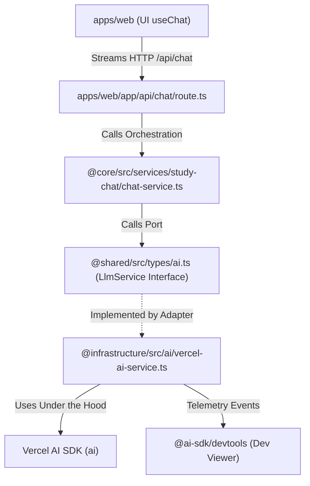

# ADR 004: LLM Provider Abstraction & Dev Environment Setup

**Status:** Accepted  
**Date:** 2026-07-10  
**Deciders:** Antigravity (AI Coding Agent), Principal Engineer  
**Target Domains / Packages:** `packages/shared`, `packages/infrastructure`, `packages/core`, `apps/web`  

---

## Context & Problem Statement

The AI Learning Support system requires interfacing with Large Language Models (LLMs) to perform tasks such as active study guidance, Feynman explanations scoring, ingestion summarization, and concept extraction. 

The system must support:
1. **Multi-Provider Swappability:** Easily switching between Gemini, OpenAI, Anthropic, and local Ollama instances.
2. **Advanced Capabilities:** Standardized support for streaming completions (SSE), structured JSON outputs (via Zod schemas), multimodal inputs (e.g., uploading images or document contexts), and tool/function calling.
3. **Strict Layer Decoupling:** Ensuring neither the frontend user interface (`apps/web`) nor core business domain services (`packages/core`) are hard-coded to any specific model provider or third-party SDK syntax.
4. **Developer Productivity & Inspection:** Providing clean local dev environments that allow inspecting raw LLM payloads, token consumption, and latencies.

## Decision Drivers

- **Domain/Infrastructure Boundaries:** Comply with [ADR 003](../adrs/003-modular-monolith-package-structure.md) package layered layout. External APIs must live strictly under `@infrastructure`.
- **Minimal Abstraction Overhead:** Avoid re-writing HTTP streaming parsers, retry logic, and tool schemas from scratch.
- **Reversibility:** Make it easy to completely replace the LLM client wrapper engine without modifying core orchestrator services or Next.js components.
- **Local-First Capabilities:** Respect local execution mode and API key privacy, supporting local models (Ollama) when offline.

## Decision

We will use the **Vercel AI SDK (`ai`)** as the internal library engine inside `packages/infrastructure`, wrapped strictly behind a custom **Ports and Adapters architecture** defined in `packages/shared`.

### 1. The Port Interface (Shared)
Define standard, zero-dependency Types and Port contracts in a new file [packages/shared/src/types/ai.ts](../shared/src/types/ai.ts):
- `LlmMessage`: System-agnostic message shape `{ role: 'system' | 'user' | 'assistant'; content: string }`.
- `LlmStreamResponse`: Yields raw text chunks as an `AsyncIterable<string>` standard iterable.
- `LlmService`: Defines standard `stream(messages, modelId)` capability.

This ensures that the rest of the monorepo has **zero package dependencies** on `ai`, `@ai-sdk/google`, or other provider SDKs.

### 2. The Adapter Implementation (Infrastructure)
Implement the `LlmService` contract inside `packages/infrastructure/src/ai/vercel-ai-service.ts`.
- It will load the appropriate AI SDK provider (`@ai-sdk/google`, `@ai-sdk/openai`, or `@ai-sdk/anthropic`) depending on the `modelId` string.
- Registers **AI SDK DevTools** telemetry conditionally in dev mode.

### 3. Dev Environment Package Distribution
- **`packages/infrastructure/package.json`**:
  - production: `ai`, `@ai-sdk/google`, `@ai-sdk/openai`, `@ai-sdk/anthropic`
  - dev: `@ai-sdk/devtools`
- **`apps/web/package.json`**:
  - production: `@ai-sdk/react` (allows using `useChat` on the frontend for streaming SSE responses cleanly)

---

### Architectural Spec & Component Interaction

#### Standard Stream Sequence:
1. The Next.js API route instantiates the core `StudyChatService`.
2. The service calls `LlmService.stream(messages, modelId)`.
3. The adapter calls Vercel's `streamText()`, which manages the SSE connection and yields chunks.
4. The adapter wraps `result.textStream` as `AsyncIterable<string>` and returns it.
5. The API route returns a standard web stream (`ReadableStream`) back to the browser.
6. The frontend UI maps the chunks to the chat thread.

---

## Consequences

### What Becomes Easier
- **Hot-swapping Models:** Changing from Gemini (development) to Claude 3.5 Sonnet (production) is a simple config/env change.
- **Multimodal & JSON Generation:** Standard features like schema-backed structured outputs and uploading PDF images are supported out of the box.
- **Full Traceability:** We get a visual dev server (`npx @ai-sdk/devtools`) showing exact model inputs, outputs, tokens, and duration.
- **Clean Interfaces:** Domain code in `@core` remains 100% focused on active learning workflows, not raw HTTP chunk parsing.

### What Becomes Harder
- **SDK Upgrades:** We must track Vercel AI SDK updates (major releases may have breaking syntax changes).
- **Global Telemetry Registration:** Ensuring telemetry is registered correctly across hot-reloaded Next.js backend workers without triggering warning logs.

### Risks & Mitigations
- **Risk: Dependency Lock-in.** If the Vercel AI SDK gets deprecated or licensing changes, we are stuck.
  - *Mitigation:* Because `@core` and `apps/web` codebases strictly reference the `LlmService` Port in `@shared` and never touch the Vercel AI SDK types directly, switching away from the SDK only requires rewriting the single file `packages/infrastructure/src/ai/vercel-ai-service.ts`.
- **Risk: Leakage of API Keys.**
  - *Mitigation:* API keys are never passed to the browser. They are loaded exclusively on the server (Deno/Node server) by the infrastructure client reading environment variables.

---

## Alternatives Considered

### 1. Raw Custom API Clients
- **Overview:** Write custom fetch wrappers for Google's Gemini API, OpenAI API, and Claude API.
- **Pros:** Zero third-party packages, ultimate low-level control.
- **Cons:** High code footprint. We must write custom logic to support function calling, structured outputs, image extraction, and chunk stitching for multiple vendors.
- **Rejection Rationale:** Re-inventing tool-calling state loops and parsing schemas manually adds huge tech debt for no product gain.

### 2. LangChain JS
- **Overview:** Use the official LangChain JavaScript integration.
- **Pros:** Ecosystem features for agent memory, routing, and chains.
- **Cons:** High cognitive overhead, deep class inheritance trees, very hard to customize raw stream outputs or debug internals.
- **Rejection Rationale:** LangChain is too heavyweight and over-engineered for our clean, service-oriented modular monorepo.

---

## Compliance, Security & Data Boundaries
- **Data Privacy & Storage:** All interactions with LLM APIs occur server-side. Payloads sent to API endpoints will request zero-data-retention headers where supported.
- **Credential Storage:** Keys (`GEMINI_API_KEY`, `OPENAI_API_KEY`, etc.) are read strictly from local environment variables or env secrets, and must never be exposed to frontend code.

---

## Related Specifications & Links
- [PRD 01: Product Vision & Learning Strategy](../prds/01-product-vision.md)
- [System Architecture Index](../architecture-index.md)
- [ADR 002: Dual-Mode Architecture](../adrs/002-dual-mode-architecture.md)
- [ADR 003: Modular Monolith Architecture & Layering](../adrs/003-modular-monolith-package-structure.md)
