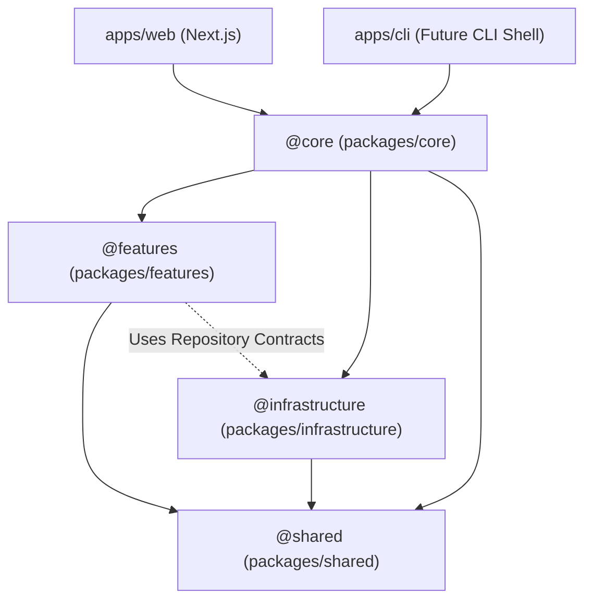

# AI Learning Support — System Architecture Index

---

## 1. Document Control

| Attribute | Value |
| :--- | :--- |
| **Document Type** | Technical Design Document (TDD) / Architecture Spec |
| **Version** | 1.3.0 |
| **Status** | Living Document |
| **Last Updated** | 2026-07-04 |

---

This document outlines the architecture and blueprint of the AI Learning Support system. It describes the **current state** of system layout, layer boundaries, and component interaction. For decision context and trade-offs, refer to the [ADR directory](./adrs/). For active code enforcement rules, refer to [rules/project-rules.md](../rules/project-rules.md).

---

## 2. Monorepo Structure & Package Layers

To decouple product logic from UI frameworks and enable seamless execution across multiple app shells (Next.js web app, CLI, background workers), code is partitioned into clean package-level directories under `packages/`.

```text
├── apps/
│   └── web/                   # Next.js web application (Frontend UI & API routes)
├── packages/
│   ├── shared/                # (@shared/*) Pure domain entities & zero-dependency types
│   ├── infrastructure/        # (@infrastructure/*) DB Repositories & Storage Adapters
│   ├── features/              # (@features/*) Isolated domain modules (parser, graphrag)
│   ├── core/                  # (@core/*) Lean Orchestrators & workflow pipelines
│   └── tsconfig/              # Shared TypeScript configurations
├── package.json
└── pnpm-workspace.yaml
```

---

## 2.1 Package Layers & Dependency Flow



### Layer Responsibilities

1. **`apps/web` (App Shell):** Thin HTTP/UI wrapper. Parses requests, invokes `@core` orchestrators, and renders views. Contains no business logic.
2. **`packages/core` (`@core/*`):** Lean orchestrator package. Coordinates complex workflows, pipeline execution, state machines, and cross-feature workflows.
3. **`packages/features` (`@features/*`):** Self-contained, pure business logic modules (e.g., `document-parser`, `graphrag`, `scheduler`). Modules export a strict public API via `index.ts` and do not cross-import.
4. **`packages/infrastructure` (`@infrastructure/*`):** Low-level driver implementations (Drizzle ORM, Supabase client, local disk storage, Cloudflare R2 / S3 storage). Exposes typed Repository interfaces to feature modules.
5. **`packages/shared` (`@shared/*`):** Common domain models (`Document`, `Chunk`, `User`), interfaces, and error definitions imported across all layers.

---

## 3. Architecture Deep Dives & Governance

For domain-specific architecture and decision records:

* [**Adapters & Storage**](./architecture/adapters_and_storage.md): Pluggable database and storage interfaces (Local vs Cloud Mode).
* [**Data Models**](./architecture/data_models.md): Database schemas and Drizzle setup.
* [**ADR Directory**](./adrs/): Historical decision records ([ADR 002](./adrs/002-dual-mode-architecture.md), [ADR 003](./adrs/003-modular-monolith-package-structure.md)).
* [**Project Philosophy & Rules**](../rules/project-rules.md): Actionable coding guidelines and boundary rules.
