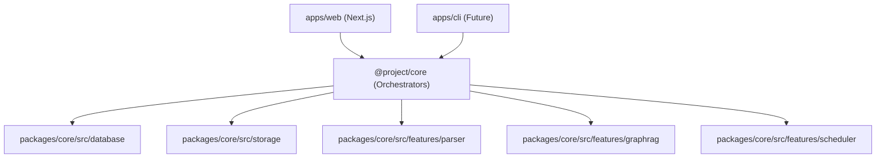

# AI Learning Support — System Architecture Index

---

## 1. Document Control

| Attribute | Value |
| :--- | :--- |
| **Document Type** | Technical Design Document (TDD) / Architecture Spec |
| **Version** | 1.1.0 |
| **Status** | Living Document |
| **Last Updated** | 2026-07-02 |

---

## 2. Directory Structure (Monorepo)

To decouple product logic from the UI framework and allow multiple packages (e.g., core, web app, CLI), we use a TypeScript monorepo managed via **pnpm workspaces** (or npm workspaces).

```text
├── apps/
│   └── web/                   # Next.js web application (Frontend UI & API routes)
├── packages/
│   ├── core/                  # Core Application Package (Framework agnostic)
│   └── tsconfig/              # Shared TypeScript configurations
├── package.json
└── pnpm-workspace.yaml
```

### 2.1 Architectural Rules & Dependency Flow

To maintain absolute modularity and allow future apps to inherit all capabilities with zero duplication, code must strictly adhere to the following dependency flow rules.



#### **Rule 1: Unidirectional Orchestration (How to orchestrate)**
* **DO:** Keep all coordination, database calls, external API fetches, and file storage read/writes inside the high-level orchestrators (e.g., `packages/core/src/services/*`).
* **DO NOT:** Put API endpoints, HTTP-specific handlers, or route parameters inside the core orchestrator. The app shell (Next.js API routes) is a thin wrapper that parses inputs, runs the orchestrator, and responds.

#### **Rule 2: Feature Isolation (No Cross-Imports)**
* **DO:** Make features in `features/` self-contained and modular. Each feature should expose a clean public API via an `index.ts` file in its root.
* **DO NOT:** Cross-import files between features (e.g., `features/graphrag` importing from `features/scheduler`). If they need to communicate, it must be coordinated by an orchestrator service in the `services/` directory.

#### **Rule 3: No Infrastructure in Features (How to keep features testable)**
* **DO:** Design feature modules as **pure data processors** (data-in, data-out). If a feature needs external inputs, pass them as arguments or functions (callbacks / dependency injection).
* **DO NOT:** Import database schemas, clients (`drizzle` instance), or storage drivers inside features. Features should not perform side-effects like writing directly to disk or DB.

#### **Rule 4: Shared Entities**
* **DO:** Place common types, shared domain definitions, and cross-cutting interfaces in `packages/core/src/types/`. Features and database tables can import freely from this directory to align data structures.

---

## 3. Architecture Deep Dives

For specific domains, please refer to the following documents:

* [**Adapters & Storage**](./architecture/adapters_and_storage.md): Pluggable database and storage interfaces (Local vs Cloud Mode).
* [**Data Models**](./architecture/data_models.md): Database schemas and Drizzle setup.
* [**Document Upload Flow**](../apps/web/README.md): Next.js API routes and upload strategies.
* [**Background Ingestion & Execution**](../packages/core/README.md): Background queues, workers, and orchestration.

### Future Plans & Decisions
Future architectural plans are documented as ADRs (Architecture Decision Records).
* [**ADR 001: Cloud Scale-Up Strategy**](./adrs/001-cloud-scale-up-strategy.md)
