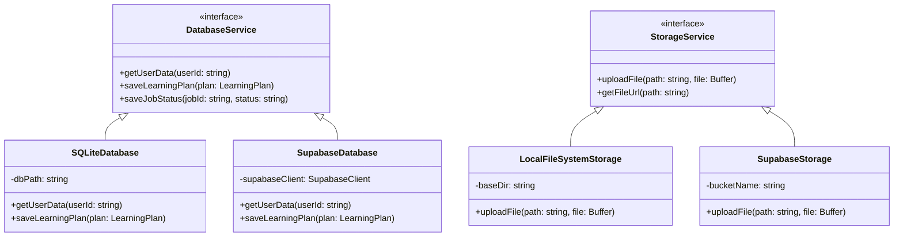

# Pluggable Adapter Pattern

The core application runs in two modes: **Local Mode** (zero-dependency, file-system based, single user) and **Cloud Mode** (hosted, Supabase integrated, multi-tenant). We define clean TypeScript interfaces for database and storage operations.

## Database: Drizzle ORM
- We use **Drizzle ORM** for database mapping.
- Depending on the environment variables (`LOCAL_MODE=true` or `false`), the core engine initializes either a:
  - **SQLite Client** pointing to a local file (`.data/app.db`).
  - **PostgreSQL Client** pointing to the cloud Supabase DB.
- In **Cloud Mode**, we leverage the native **pgvector** extension on Supabase PostgreSQL for high-performance vector search of our GraphRAG concept node embeddings.

## Storage Adapter
- Uploaded PDFs are stored using a `StorageService` interface.
- **Local:** Writes directly to the local disk (`.data/storage/`).
- **Cloud:** Uploads to Supabase S3-compatible Buckets.
