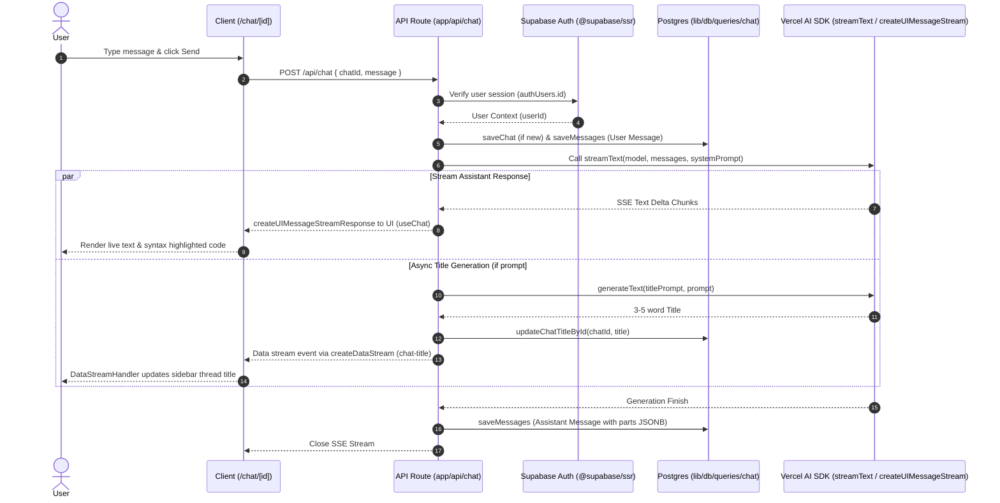
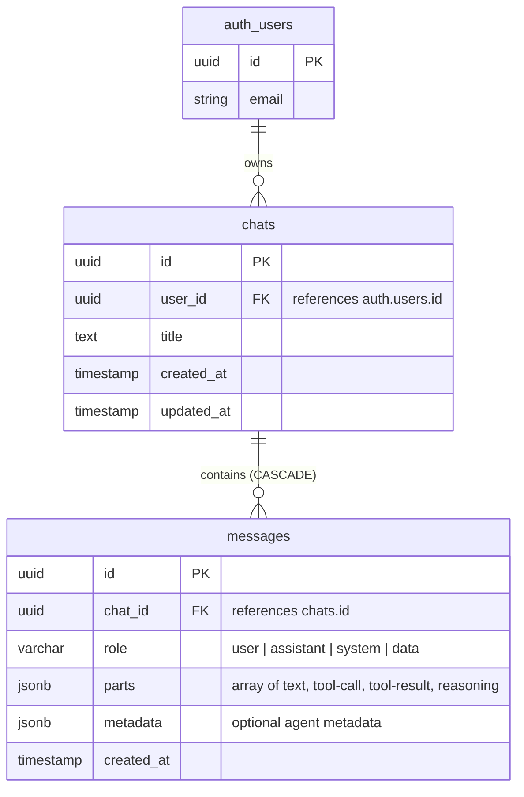
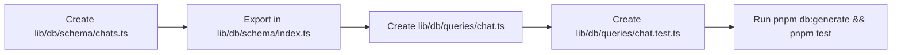
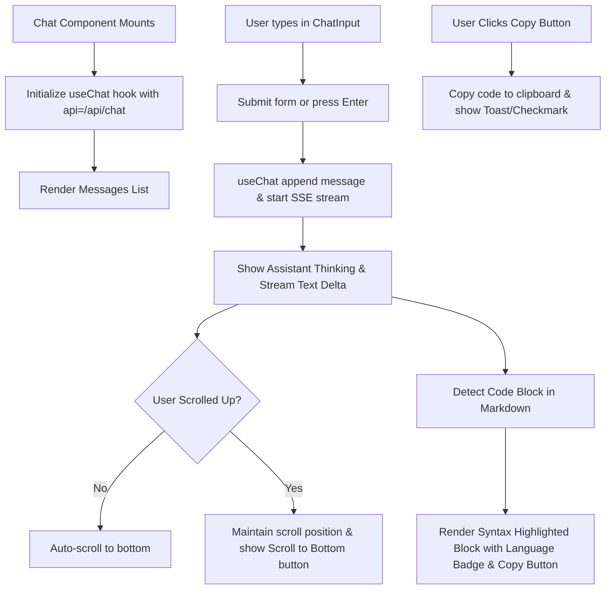

# Epic: Chat Interface & Extensible AI Message Foundation

## 1. Overview & Vision

The goal of this epic is to build a production-grade, real-time LLM chat interface within **AI Learning Support**, establishing the reusable message, streaming, and persistence foundations required for downstream AI features and future AI agents.

### Core User Experience & Functionality
- **Dynamic Thread Routing (`/chat/[id]`)**: Users access chat sessions at `/chat/[id]` (with `/chat` acting as a new session initializer that auto-redirects upon first prompt submission).
- **Real-Time Streaming**: Low-latency Server-Sent Events (SSE) streaming powered by **Vercel AI SDK v7** (`streamText`, `createUIMessageStream`, `createUIMessageStreamResponse`).
- **Sidebar Chat History**: Historical chat threads stored per authenticated user in PostgreSQL, displayed in a responsive sidebar with active thread highlighting, auto-generated titles, and thread deletion.
- **Async Thread Title Generation**: When a user creates a new chat, a background LLM call concisely names the session (3–5 words) and updates the sidebar in real-time without blocking the response stream.
- **Rich Message Rendering & UX Controls**: Markdown formatting, syntax-highlighted code blocks with a one-click "Copy code" button, auto-scrolling with manual override, cancel/stop generation button, and message copy functionality.
- **Agent-Ready Foundation**: Message data model structured around Vercel AI SDK `UIMessage` / `parts` JSONB format, supporting text parts, tool calls, tool results, reasoning streams, and custom metadata for seamless future AI agent integration.

---

## 2. Technical Architecture & Layer Placement

This epic strictly adheres to the **Single Next.js Application Architecture** ([`ADR 001`](file:///workspaces/secure-ai-learning-support/specs/adrs/001-single-app-architecture.md)), **PostgreSQL + Drizzle ORM** ([`ADR 002`](file:///workspaces/secure-ai-learning-support/specs/adrs/002-postgresql-pgvector-drizzle.md)), **Vercel AI SDK Integration & BYOK Strategy** ([`ADR 004`](file:///workspaces/secure-ai-learning-support/specs/adrs/004-vercel-ai-sdk-byok.md)), and **Supabase Auth** ([`ADR 005`](file:///workspaces/secure-ai-learning-support/specs/adrs/005-supabase-auth-integration.md)).

### Framework & Major Library Pinned Versions
- **Next.js**: `^16.3.0` (App Router, Server Actions, Next.js 16 `proxy.ts` session middleware)
- **React**: `^19.2.8` (React 19 Server & Client Components)
- **Vercel AI SDK**: `ai@^7.0.58`, `@ai-sdk/google@^4.0.39`, `@ai-sdk/openai@^4.0.36`
- **Database & ORM**: `drizzle-orm@^0.45.2`, `drizzle-kit@^0.31.10`, `postgres@^3.4.9`, `pg@^8.22.0`
- **Authentication**: `@supabase/ssr@^0.12.4`, `@supabase/supabase-js@^2.112.2`
- **Styling & UI Components**: `tailwindcss@^4.3.3`, `radix-ui@^1.6.7`, `lucide-react@^1.30.0`

### Directory Layer Categorization

```text
secure-ai-learning-support/
├── proxy.ts                       # Next.js 16 proxy route guard (updated to include /chat)
├── app/
│   ├── (auth)/                    # Auth routes (/login, /signup)
│   ├── api/chat/route.ts          # Thin HTTP SSE stream controller
│   └── chat/
│       ├── page.tsx               # Server component rendering client Chat container
│       └── [id]/page.tsx          # Chat viewport page for specified thread ID
├── components/
│   └── chat/                      # Reusable chat React components
│       ├── chat.tsx               # Main chat container wrapper (client component)
│       ├── chat-header.tsx        # Top navigation header (model display, thread title, new chat)
│       ├── chat-input.tsx         # Auto-resizing textarea with stop/send controls
│       ├── chat-message.tsx       # Message bubble with markdown & code syntax copy
│       ├── chat-messages.tsx      # Messages viewport list with auto-scroll logic
│       ├── chat-sidebar.tsx       # Sidebar container with thread navigation
│       ├── data-stream-handler.tsx # Client component consuming custom data stream events
│       └── sidebar-history.tsx    # Paginated/listed chat items with delete action
└── lib/
    ├── ai/
    │   ├── providers.ts           # Multi-provider resolution (Gemini, OpenAI, OpenRouter, BYOK)
    │   ├── prompts.ts             # System prompts and title generation prompts
    │   └── stream.ts              # Vercel AI SDK createUIMessageStream pipeline builder
    └── db/
        ├── queries/chat.ts        # Encapsulated Drizzle queries for chats & messages
        └── schema/chats.ts        # Drizzle schema for chats & messages tables
```

---

## 3. Out of Scope

The following capabilities are explicitly **excluded** from this epic and deferred to subsequent epics:
- **Multi-Step Autonomous AI Agents**: Background tool-calling execution loops, sub-agent spawning, and autonomous task planning (reserved for future Agent Epics).
- **Document & PDF RAG Grounding**: Vector search over uploaded study materials, PDF parsing, or GraphRAG entity retrieval (reserved for Material Ingestion & RAG Epics).
- **Multi-User Real-time Collaboration**: Multi-user shared chat rooms or WebSocket collaborative editing.
- **Voice / Audio Chat Input**: Speech-to-text or real-time audio streaming.

---

## 4. System Architecture & Workflow Diagrams

### Diagram 1: End-to-End Chat Streaming Sequence



### Diagram 2: App State & Page Navigation Flow

```mermaid
flowchart TD
    Start[User navigates to /chat] --> Guard{Authenticated?}
    Guard -- No --> Login[Redirect to /login?redirectTo=/chat]
    Guard -- Yes --> RouteCheck{URL Has ID?}
    
    RouteCheck -- /chat --> NewChatState[Render Blank Chat Container]
    RouteCheck -- /chat/[id] --> LoadThread[Fetch Chat & Messages from DB]
    
    NewChatState --> SubmitPrompt[User Submits First Prompt]
    SubmitPrompt --> CreateID[Client generates Chat UUID]
    CreateID --> RedirectUR[Router replaces URL to /chat/[id]]
    RedirectUR --> StreamResponse[Stream LLM Response]
    
    LoadThread --> StreamResponse
    StreamResponse --> UpdateSidebar[Sidebar history updates thread list & active state]
    
    UpdateSidebar --> DeleteAction{User Clicks Delete?}
    DeleteAction -- Yes --> DeleteDB[Call deleteChatById API]
    DeleteDB --> RedirectNew[Redirect to /chat]
```

### Diagram 3: Database Entity Relationship (ER) Diagram



---

## 5. External Reference Codebase Mapping (`/workspaces/chatbot`)

Implementers should consult Vercel's official Chatbot reference codebase at [`/workspaces/chatbot`](file:///workspaces/chatbot) when implementing components and functions:

| Subsystem / Feature | Reference File in `../chatbot` | Target Path in `secure-ai-learning-support` | Implementation Notes |
| :--- | :--- | :--- | :--- |
| **Drizzle Schema** | [`lib/db/schema.ts`](file:///workspaces/chatbot/lib/db/schema.ts) | [`lib/db/schema/chats.ts`](file:///workspaces/secure-ai-learning-support/lib/db/schema/chats.ts) | Replace NextAuth `user` FK with `authUsers.id` per [`ADR 005`](file:///workspaces/secure-ai-learning-support/specs/adrs/005-supabase-auth-integration.md). Retain `parts` JSONB format for messages. |
| **DB Queries** | [`lib/db/queries.ts`](file:///workspaces/chatbot/lib/db/queries.ts) | [`lib/db/queries/chat.ts`](file:///workspaces/secure-ai-learning-support/lib/db/queries/chat.ts) | Adapt `saveChat`, `getChatById`, `getChatsByUserId`, `saveMessages`, `getMessagesByChatId`, `deleteChatById`, `updateChatTitleById`. |
| **Title Generator & Prompts** | [`lib/ai/prompts.ts`](file:///workspaces/chatbot/lib/ai/prompts.ts)<br>[`lib/ai/models.ts`](file:///workspaces/chatbot/lib/ai/models.ts) | [`lib/ai/prompts.ts`](file:///workspaces/secure-ai-learning-support/lib/ai/prompts.ts)<br>[`lib/ai/providers.ts`](file:///workspaces/secure-ai-learning-support/lib/ai/providers.ts) | Adapt `titlePrompt` and fast model instantiation for async title generation. |
| **Streaming Route Controller** | [`app/(chat)/api/chat/route.ts`](file:///workspaces/chatbot/app/\(chat\)/api/chat/route.ts) | [`app/api/chat/route.ts`](file:///workspaces/secure-ai-learning-support/app/api/chat/route.ts) | Maintain thin controller structure. Authenticate via `@supabase/ssr`. |
| **Messages Viewport** | [`components/chat/messages.tsx`](file:///workspaces/chatbot/components/chat/messages.tsx) | [`components/chat/chat-messages.tsx`](file:///workspaces/secure-ai-learning-support/components/chat/chat-messages.tsx) | Message list viewport with auto-scroll handling. |
| **Message Bubble & Code** | [`components/chat/message.tsx`](file:///workspaces/chatbot/components/chat/message.tsx) | [`components/chat/chat-message.tsx`](file:///workspaces/secure-ai-learning-support/components/chat/chat-message.tsx) | Render message parts, markdown, and code blocks with copy buttons. |
| **Multimodal Input Box** | [`components/chat/multimodal-input.tsx`](file:///workspaces/chatbot/components/chat/multimodal-input.tsx) | [`components/chat/chat-input.tsx`](file:///workspaces/secure-ai-learning-support/components/chat/chat-input.tsx) | Auto-resizing textarea, submit on Enter (Shift+Enter for newline), cancel button. |
| **Sidebar Thread History** | [`components/chat/sidebar-history.tsx`](file:///workspaces/chatbot/components/chat/sidebar-history.tsx)<br>[`components/chat/sidebar-history-item.tsx`](file:///workspaces/chatbot/components/chat/sidebar-history-item.tsx) | [`components/chat/sidebar-history.tsx`](file:///workspaces/secure-ai-learning-support/components/chat/sidebar-history.tsx) | Thread history item listing, active selection styling, and deletion menu. |

---

## 6. Implementation Steps & Definitions of Done (DoD)

### Step 1: Database Schema & Query Encapsulation (`lib/db/schema/chats.ts` & `lib/db/queries/chat.ts`)

- **Objective**: Create the relational database tables for `chats` and `messages` in Drizzle ORM, linked to Supabase Auth (`auth.users.id`). Implement type-safe query functions in `lib/db/queries/chat.ts` and export schema in `lib/db/schema/index.ts`. Generate migrations via `pnpm db:generate`.
- **Key Packages**: `drizzle-orm`, `drizzle-kit`, `postgres`, `pg`, `zod`
- **Required Reading**:
  - Internal: [`rules/single-app-architecture.md`](file:///workspaces/secure-ai-learning-support/rules/single-app-architecture.md), [`specs/adrs/002-postgresql-pgvector-drizzle.md`](file:///workspaces/secure-ai-learning-support/specs/adrs/002-postgresql-pgvector-drizzle.md), [`specs/adrs/005-supabase-auth-integration.md`](file:///workspaces/secure-ai-learning-support/specs/adrs/005-supabase-auth-integration.md), [`lib/db/schema/profiles.ts`](file:///workspaces/secure-ai-learning-support/lib/db/schema/profiles.ts)
  - External Reference: [`/workspaces/chatbot/lib/db/schema.ts`](file:///workspaces/chatbot/lib/db/schema.ts), [`/workspaces/chatbot/lib/db/queries.ts`](file:///workspaces/chatbot/lib/db/queries.ts), [Drizzle PostgreSQL Docs](https://orm.drizzle.team/docs/sql-schema-declaration)
- **Sources**: Verified Drizzle `pgSchema('auth').table('users')` pattern from [`lib/db/schema/profiles.ts`](file:///workspaces/secure-ai-learning-support/lib/db/schema/profiles.ts#L4-L6).



- **Definition of Done (DoD)**:
  1. **Schema Definition**: `lib/db/schema/chats.ts` exports `chats` and `messages` tables. `chats.userId` has a foreign key referencing `authUsers.id` with `onDelete: 'cascade'`. `messages.chatId` has a foreign key referencing `chats.id` with `onDelete: 'cascade'`. `messages.parts` is defined as `jsonb('parts')`.
  2. **Query Functions**: `lib/db/queries/chat.ts` exports:
     - `saveChat({ id, userId, title })`
     - `getChatById({ id })`
     - `getChatsByUserId({ userId })`
     - `deleteChatById({ id, userId })`
     - `saveMessages({ messages })`
     - `getMessagesByChatId({ chatId })`
     - `updateChatTitleById({ chatId, title })`
  3. **Migration Artifact**: Running `pnpm db:generate` successfully outputs a new Drizzle SQL migration file in `lib/db/migrations/` without schema errors.
  4. **Unit Test Pass**: Running `pnpm test lib/db/queries/chat.test.ts` executes unit tests covering all query functions (CRUD on chats and messages) with 100% test pass rate.
  5. **Type Safety & Code Quality**: Running `pnpm check` outputs zero linter warnings and zero TypeScript errors.

---

### Step 2: Multi-LLM Provider & Streaming API Controller (`lib/ai/`, `app/api/chat/route.ts`)

- **Objective**: Implement LLM provider configuration in `lib/ai/providers.ts` supporting Google Gemini, OpenAI, OpenRouter, and custom OpenAI-compatible endpoints with BYOK key management. Build a thin SSE API route in `app/api/chat/route.ts` that verifies Supabase Auth sessions, calls `streamText` via a `createUIMessageStream` + `createUIMessageStreamResponse` pipeline (matching the AI SDK v7 pattern), and triggers non-blocking title generation on prompt #1.
- **Key Packages**: `ai`, `@ai-sdk/google`, `@ai-sdk/openai`, `@supabase/ssr`
- **Required Reading**:
  - Internal: `ai-sdk` skill ([`SKILL.md`](file:///workspaces/secure-ai-learning-support/.agents/skills/ai-sdk/SKILL.md)), [`specs/adrs/004-vercel-ai-sdk-byok.md`](file:///workspaces/secure-ai-learning-support/specs/adrs/004-vercel-ai-sdk-byok.md), [`lib/supabase/server.ts`](file:///workspaces/secure-ai-learning-support/lib/supabase/server.ts)
  - External Reference: [`/workspaces/chatbot/app/(chat)/api/chat/route.ts`](file:///workspaces/chatbot/app/\(chat\)/api/chat/route.ts), [`/workspaces/chatbot/lib/ai/prompts.ts`](file:///workspaces/chatbot/lib/ai/prompts.ts), [Vercel AI SDK streamText Docs](https://sdk.vercel.ai/docs/api-reference/stream-text)
- **Sources**: Verified Vercel AI SDK `streamText` and provider abstractions from `node_modules/ai/docs/` and `node_modules/@ai-sdk/google/docs/15-google.mdx`.

```mermaid
flowchart TD
    POST[POST /api/chat] --> Auth[Check Supabase Auth Session]
    Auth -- Unauthenticated (401) --> Err[Return 401 Unauthorized Response]
    Auth -- Authenticated --> Parse[Validate Body with Zod]
    Parse --> Fetch[Fetch existing chat or save new chat]
    Fetch --> SaveUser[Save User Message to DB]
    SaveUser --> Stream[Call streamText with selected model]
    
    par Stream to Client
        Stream --> SSE[createUIMessageStreamResponse]
    and Non-Blocking Title Gen
        Stream -- First Message? --> GenTitle[Call generateText for Title]
        GenTitle --> UpdateDB[Update Chat Title in DB]
        GenTitle --> StreamTitleChunk[Write chat-title event via createDataStream]
    end
    
    Stream -- On Finish --> SaveAssistant[Save Assistant Message with parts to DB]
```

- **Definition of Done (DoD)**:
  1. **Provider Resolution**: `lib/ai/providers.ts` exports `getLanguageModel({ provider, modelId, apiKey? })` supporting `'google'`, `'openai'`, and `'openrouter'`.
  2. **API Guard & Validation**: `app/api/chat/route.ts` parses incoming request body `{ id, messages, model }` using Zod. Requests without a valid Supabase session return HTTP `401 Unauthorized`.
  3. **Streaming & DB Persistence**: When called by an authenticated user:
     - User message is stored in PostgreSQL via `saveMessages`.
     - `streamText` result is wrapped in `createUIMessageStream` and returned via `createUIMessageStreamResponse` (the AI SDK v7 structured streaming pipeline).
     - Upon stream completion (`onEnd`), assistant message and its full `parts` structure are saved to PostgreSQL.
  4. **Title Generation**: If `id` is a newly created chat, an async background task calls `generateText` with `titlePrompt` and sends a `chat-title` event via the data stream (using `createDataStream` / `writeData`), updating the database record. The client consumes this via a `DataStreamHandler` component (following the chatbot reference pattern).
  5. **API Integration Test**: A Vitest integration test in `app/api/chat/route.test.ts` mocks the LLM provider and verifies that `POST /api/chat` returns a 200 SSE stream response and writes messages to the DB.
  6. **Type Safety & Code Quality**: Running `pnpm check` passes with zero errors.

---

### Step 3: Interactive Chat UI & Code Syntax Highlighting (`components/chat/`)

- **Objective**: Build the modular React UI components for the chat viewport (`chat.tsx`, `chat-messages.tsx`, `chat-message.tsx`, `chat-input.tsx`). Implement streaming response rendering, markdown parsing, syntax-highlighted code blocks with a "Copy code" button, auto-scrolling with manual override, and a stop generation button.
- **Key Packages**: `@ai-sdk/react`, `radix-ui`, `lucide-react`, `clsx`, `tailwind-merge`, `react-markdown`, `remark-gfm`, `shiki` (or `rehype-highlight`)
- **Required Reading**:
  - Internal: `shadcn` skill ([`SKILL.md`](file:///workspaces/secure-ai-learning-support/.agents/skills/shadcn/SKILL.md)), `next-dev-loop` skill ([`SKILL.md`](file:///workspaces/secure-ai-learning-support/.agents/skills/next-dev-loop/SKILL.md)), [`rules/styling.md`](file:///workspaces/secure-ai-learning-support/rules/styling.md)
  - External Reference: [`/workspaces/chatbot/components/chat/messages.tsx`](file:///workspaces/chatbot/components/chat/messages.tsx), [`/workspaces/chatbot/components/chat/message.tsx`](file:///workspaces/chatbot/components/chat/message.tsx), [`/workspaces/chatbot/components/chat/multimodal-input.tsx`](file:///workspaces/chatbot/components/chat/multimodal-input.tsx), [`/workspaces/chatbot/components/chat/data-stream-handler.tsx`](file:///workspaces/chatbot/components/chat/data-stream-handler.tsx)



- **Definition of Done (DoD)**:
  1. **Component Specs**:
     - `components/chat/chat-header.tsx`: Displays the current thread title (or "New Chat"), the active model name, and a "New Chat" button. Renders at the top of the chat viewport.
     - `components/chat/chat-messages.tsx`: Renders message history with smooth auto-scroll to bottom. Shows a floating "Scroll to bottom" button when user scrolls up.
     - `components/chat/chat-message.tsx`: Renders markdown text via `react-markdown` with `remark-gfm`. Code blocks are syntax-highlighted via `shiki` (or `rehype-highlight`) and display a language header badge and an active "Copy code" button that copies raw code to clipboard and shows a visual checkmark.
     - `components/chat/chat-input.tsx`: Textarea auto-expands up to 6 lines. Submits on `Enter` (without `Shift`). Displays a "Stop" button during active streaming that invokes `stop()`.
     - `components/chat/data-stream-handler.tsx`: Client component that consumes custom data stream events (e.g., `chat-title`) from the AI SDK data stream and updates relevant UI state (e.g., sidebar thread title). Follows the pattern from [`/workspaces/chatbot/components/chat/data-stream-handler.tsx`](file:///workspaces/chatbot/components/chat/data-stream-handler.tsx).
  2. **Visual & Interactive Verification (`next-dev-loop`)**:
     - Start dev server (`pnpm dev`).
     - Using `agent-browser` in `next-dev-loop`, navigate to `/chat`, submit a prompt generating code (e.g. "Write a Python quicksort function"), and verify:
       - Streaming response text appears smoothly.
       - Code block renders with Python syntax highlighting and copy button.
       - Clicking "Copy code" successfully populates clipboard.
       - Clicking "Stop" cancels ongoing generation immediately.
  3. **Type & Lint Check**: `pnpm check` passes cleanly.

---

### Step 4: Page Routing, App Proxy Guard & Sidebar Thread History (`app/chat/`, `components/chat/chat-sidebar.tsx`)

- **Objective**: Implement App Router pages for `/chat` (initializer redirect) and `/chat/[id]` (active thread). Update `proxy.ts` to protect `/chat` routes. Build the responsive sidebar (`chat-sidebar.tsx`, `sidebar-history.tsx`) displaying user thread history, active thread selection, dynamic title updates, and thread deletion.
- **Key Packages**: `next`, `@supabase/ssr`, `lucide-react`
- **Required Reading**:
  - Internal: `test-writer` skill ([`SKILL.md`](file:///workspaces/secure-ai-learning-support/.agents/skills/test-writer/SKILL.md)), [`rules/testing.md`](file:///workspaces/secure-ai-learning-support/rules/testing.md), [`proxy.ts`](file:///workspaces/secure-ai-learning-support/proxy.ts)
  - External Reference: [`/workspaces/chatbot/components/chat/sidebar-history.tsx`](file:///workspaces/chatbot/components/chat/sidebar-history.tsx), [`/workspaces/chatbot/components/chat/sidebar-history-item.tsx`](file:///workspaces/chatbot/components/chat/sidebar-history-item.tsx)

```mermaid
flowchart TD
    UserNav[User navigates to /chat] --> ProxyGuard{proxy.ts Check}
    ProxyGuard -- No Session --> RedirectLogin[Redirect to /login?redirectTo=/chat]
    ProxyGuard -- Valid Session --> LoadSidebar[Fetch getChatsByUserId in Server Component]
    
    LoadSidebar --> RenderSidebar[Render Sidebar History List]
    RenderSidebar --> ClickThread[User Clicks Existing Thread]
    ClickThread --> NavThread[Router navigates to /chat/[id]]
    NavThread --> LoadMessages[Server Component fetches getMessagesByChatId]
    LoadMessages --> Hydrate[Hydrate Chat Viewport with historical messages]
    
    RenderSidebar --> ClickDelete[User Clicks Delete Thread]
    ClickDelete --> ConfirmModal[Show Confirmation & call deleteChatById]
    ConfirmModal --> RemoveUI[Remove thread from Sidebar & redirect /chat if current]
```

- **Definition of Done (DoD)**:
  1. **Proxy Route Guard**: `proxy.ts` (at the project root) is updated to include `'/chat'` in the `PROTECTED_ROUTES` array (alongside existing entries `/dashboard`, `/learn`, `/review`, `/settings`). Requests to `/chat` or `/chat/[id]` without a valid Supabase session are automatically redirected to `/login?redirectTo=/chat`.
  2. **Page Routing**:
     - `app/chat/page.tsx`: Server Component that renders the client-side `<Chat>` container component. The `<Chat>` client component handles UUID generation and `router.replace()` to `/chat/[id]` upon first prompt submission.
     - `app/chat/[id]/page.tsx`: Server Component that validates `id` belongs to authenticated user via `getChatById`, pre-fetches `getMessagesByChatId`, and passes historical messages as props to the client-side `<Chat>` component for hydration.
  3. **Sidebar Thread History**: `components/chat/sidebar-history.tsx` lists past user threads ordered by `updatedAt DESC`. Highlights the currently active thread. Offers a delete dropdown action that calls `deleteChatById` and updates sidebar state instantly.
  4. **Playwright E2E Test Suite**: A new Playwright test suite `tests/e2e/chat.spec.ts` automates and asserts the complete user flow:
     - Log in as test user.
     - Navigate to `/chat`.
     - Send prompt "Hello, introduce yourself".
     - Assert URL changes to `/chat/[uuid]`.
     - Assert assistant response streams and finishes.
     - Assert auto-generated title appears in the sidebar.
     - Click "New Chat", send second prompt.
     - Switch back to first chat via sidebar and assert past messages are hydrated correctly.
     - Delete the first chat thread from sidebar and assert it is removed from DOM and DB.
  5. **Full Pipeline Quality Gate**: `pnpm check && pnpm test:e2e` passes with 100% green status.

---

## 7. Security & Data Isolation Architecture

To ensure strict multi-tenant data isolation and prevent unauthorized access to user chat threads:

1. **Proxy Layer Guard**: `proxy.ts` rejects unauthenticated HTTP requests to `/chat*` before reaching App Router page components or API route handlers.
2. **Server-Side Authorization**: `app/api/chat/route.ts` and App Router page components (`app/chat/[id]/page.tsx`) call `@supabase/ssr` `createClient()` to resolve `user.id` from session cookies.
3. **Database Query Boundaries**: All Drizzle ORM query functions in `lib/db/queries/chat.ts` (`getChatById`, `getChatsByUserId`, `deleteChatById`) enforce `where(and(eq(chats.id, chatId), eq(chats.userId, userId)))`. An authenticated user cannot read, stream, or delete another user's chat thread even if they guess or modify the `chatId` URL parameter.
4. **PostgreSQL Foreign Keys**: `chats.userId` references `auth.users.id` with `onDelete: 'cascade'`. Deleting a user automatically purges all associated chat threads and messages at the database level.
