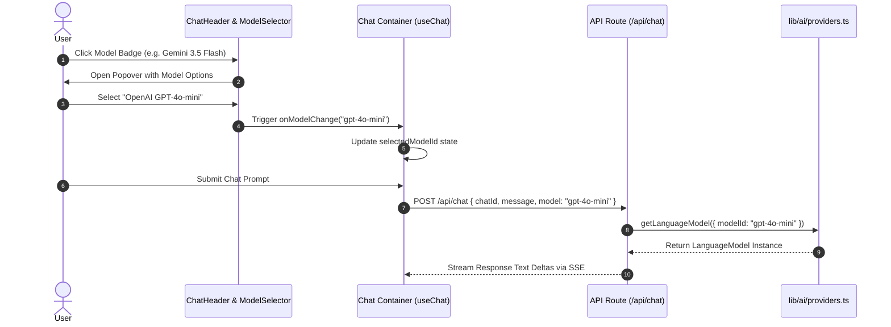

# Epic 002a: Chat UI Refinements, Interactive Model Selection & Unified Dashboard Routing

## 1. Overview & Vision

Epic 002a refines the real-time LLM chat foundation built in Epic 002 by introducing interactive model switching, streamlining application route architecture, eliminating visual UI redundancies, and fixing top bar desktop alignment bugs.

### Core User Experience & Functionality
- **Interactive Model Selection (`ChatHeader` & `ModelSelector`)**: Users can click the active model badge in the chat header to open a popover dropdown listing available LLM options (e.g., Google Gemini 3.5 Flash, Gemini 1.5 Pro, OpenAI GPT-4o-mini, GPT-4o). Selecting a model updates active state and passes the selected `model` identifier in `POST /api/chat`.
- **Unified Dashboard Routing (`/`)**: Deprecate the empty `/dashboard` page. Elevate the root route `/` to serve as the unified Dashboard for authenticated users (featuring welcome info, quick stats, and a primary **"Go to AI Chat"** action CTA button). Unauthenticated users see public platform highlights with "Sign In" / "Sign Up" actions.
- **Top Navigation Bar Alignment**: Remove the restrictive `max-w-7xl` constraint from `components/header.tsx`. Use a full-width flex layout (`w-full px-4 sm:px-6`) so the top header aligns seamlessly with the full-bleed chat sidebar and viewport below.
- **Header "Chat" Direct Link**: Add a prominent "Chat" navigation link in `components/header.tsx` for logged-in users, providing instant access to `/chat` from anywhere in the app.
- **De-duplication of "New Chat" Button**: Remove the right-hand "New Chat" button from `ChatHeader`, retaining the sidebar top button (`SquarePen`) as the single trigger for new chat initialization.

---

## 2. Technical Architecture & Layer Placement

Adheres to **Single Next.js Application Architecture** ([001-single-app-architecture.md](file:///workspaces/secure-ai-learning-support/specs/adrs/001-single-app-architecture.md)), **Vercel AI SDK Multi-LLM Strategy** ([004-vercel-ai-sdk-byok.md](file:///workspaces/secure-ai-learning-support/specs/adrs/004-vercel-ai-sdk-byok.md)), and **Supabase Auth** ([005-supabase-auth-integration.md](file:///workspaces/secure-ai-learning-support/specs/adrs/005-supabase-auth-integration.md)).

### Framework & Major Library Pinned Versions
- **Next.js**: `^16.3.0` (App Router, Server Components, `proxy.ts` session route guards)
- **React**: `^19.2.8` (React 19 Server & Client Components)
- **Vercel AI SDK**: `ai@^7.0.58`, `@ai-sdk/google@^4.0.39`, `@ai-sdk/openai@^4.0.36`
- **Authentication**: `@supabase/ssr@^0.12.4`
- **Styling & UI Components**: `tailwindcss@^4.3.3`, `radix-ui@^1.6.7` (Popover, DropdownMenu), `lucide-react@^1.30.0`

### Directory Layer Categorization

```text
secure-ai-learning-support/
├── proxy.ts                              # Next.js 16 proxy route guard (update auth redirect from /dashboard to /)
├── app/
│   ├── page.tsx                          # Refactored root Dashboard page with "Go to AI Chat" CTA
│   └── (delete app/dashboard/)           # Deprecated empty route removed
├── components/
│   ├── header.tsx                        # Removed max-w-7xl, added "Chat" nav link for auth users
│   └── chat/
│       ├── chat-header.tsx               # Removed right New Chat button, integrated ModelSelector popover
│       ├── model-selector.tsx            # New popover/dropdown component for LLM selection
│       └── chat.tsx                      # Wired selectedModelId state to /api/chat payload
└── lib/
    └── ai/
        └── providers.ts                  # Exported SUPPORTED_MODELS configuration list & helper
```

---

## 3. Out of Scope

- **Per-User Custom Model API Key Configuration UI**: User-level custom BYOK key management UI (deferred to Settings Epic).
- **Fine-Grained Model Temperature & System Prompt Controls**: Advanced sliders for temperature, top_p, or custom system prompt overrides.
- **Dynamic Model Cost & Usage Metering**: Real-time token price calculations per model selection.

---

## 4. System Architecture & Workflow Diagrams



---

## 5. External Reference Codebase Mapping (`/workspaces/chatbot`)

| Subsystem / Feature | Reference File in `../chatbot` | Target Path in `secure-ai-learning-support` | Implementation Notes |
| :--- | :--- | :--- | :--- |
| Model Selection Popover | `model-selector.tsx` | `components/chat/model-selector.tsx` | Popover component listing supported LLMs with provider logos/icons and active state. |
| Header Layout Integration | `chat-header.tsx` | `components/chat/chat-header.tsx` | Integrate model selector into top left header, remove right action button redundancy. |
| Full-Width Header Container | `app/layout.tsx` | `components/header.tsx` | Ensure header container spans `w-full px-4 sm:px-6` without `max-w-7xl` truncation. |

---

## 6. Implementation Steps & Definitions of Done (DoD)

### Step 1: Model Selection Component & Provider Configuration (`lib/ai/providers.ts` & `components/chat/model-selector.tsx`)

- **Key Packages**: `ai`, `@ai-sdk/google`, `@ai-sdk/openai`, `radix-ui`, `lucide-react`
- **Required Reading**: `ai-sdk` skill, `shadcn` skill, `004-vercel-ai-sdk-byok.md`, `model-selector.tsx`
- **Definition of Done (DoD)**:
  1. `lib/ai/providers.ts` exports `SUPPORTED_MODELS` array with Google & OpenAI model definitions.
  2. `components/chat/model-selector.tsx` renders Popover dropdown displaying active model and selection checkmarks.
  3. `pnpm check && pnpm test lib/ai/providers.test.ts` passes cleanly.

### Step 2: Chat Header Refactoring & Model Payload Plumbing (`components/chat/chat-header.tsx` & `components/chat/chat.tsx`)

- **Key Packages**: `@ai-sdk/react`, `lucide-react`
- **Required Reading**: `ai-sdk` skill, `chat-header.tsx`
- **Definition of Done (DoD)**:
  1. `ChatHeader` renders `ModelSelector`; right-hand "New Chat" button is removed.
  2. Changing model updates `selectedModelId` in `Chat` container and passes `{ model: selectedModelId }` payload to `POST /api/chat`.
  3. Interactive verification via `pnpm dev` confirms stream succeeds with selected model.

### Step 3: Top Navigation Alignment & Unified Dashboard (`components/header.tsx`, `app/page.tsx`, `proxy.ts`)

- **Key Packages**: `next`, `@supabase/ssr`, `lucide-react`
- **Required Reading**: `single-app-architecture.md`, `proxy.ts`
- **Definition of Done (DoD)**:
  1. Header uses `w-full px-4 sm:px-6` (no `max-w-7xl`), aligning with full-width chat viewport.
  2. Authenticated header displays "Chat" link.
  3. `app/dashboard/` is deleted; root `/` renders unified Dashboard with "Go to AI Chat" button.
  4. `proxy.ts` updates auth redirects to `/`.

### Step 4: Verification & E2E Test Suite Updates (`tests/e2e/`)

- **Key Packages**: `@playwright/test`, `vitest`
- **Required Reading**: `test-writer` skill, `testing.md`
- **Definition of Done (DoD)**:
  1. Playwright tests verify model selector interactivity, sidebar New Chat button, and `/` dashboard navigation.
  2. `pnpm check && pnpm test && pnpm test:e2e` passes 100%.

---

## 7. Security & Data Isolation Architecture

1. **Proxy Layer Guard**: `proxy.ts` protects `/chat*` and redirects authenticated auth visits to `/`.
2. **Model Validation**: `app/api/chat/route.ts` validates incoming model string against `SUPPORTED_MODELS`.
3. **Multi-Tenant User Isolation**: Session context from `@supabase/ssr` isolates threads to `authUsers.id`.
