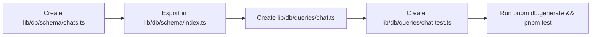

# Implementation Plan 006: Chat Database Schema & Query Encapsulation

**Parent Epic**: [`specs/epics/chat-interface-foundation.md`](file:///workspaces/secure-ai-learning-support/specs/epics/chat-interface-foundation.md)

---

## 1. Context & Architecture Overview

The goal of this step is to build the database schema and query encapsulation layer for real-time LLM chat interface within **AI Learning Support**, establishing the reusable message and persistence foundations required for downstream AI features and future AI agents.

This step strictly adheres to the **Single Next.js Application Architecture** ([`ADR 001`](file:///workspaces/secure-ai-learning-support/specs/adrs/001-single-app-architecture.md)), **PostgreSQL + Drizzle ORM** ([`ADR 002`](file:///workspaces/secure-ai-learning-support/specs/adrs/002-postgresql-pgvector-drizzle.md)), **Vercel AI SDK Integration & BYOK Strategy** ([`ADR 004`](file:///workspaces/secure-ai-learning-support/specs/adrs/004-vercel-ai-sdk-byok.md)), and **Supabase Auth** ([`ADR 005`](file:///workspaces/secure-ai-learning-support/specs/adrs/005-supabase-auth-integration.md)).

### Framework & Major Library Pinned Versions
- **Next.js**: `^16.3.0` (App Router, Server Actions, Next.js 16 `proxy.ts` session middleware)
- **React**: `^19.2.8` (React 19 Server & Client Components)
- **Vercel AI SDK**: `ai@^7.0.58`, `@ai-sdk/google@^4.0.39`, `@ai-sdk/openai@^4.0.36`
- **Database & ORM**: `drizzle-orm@^0.45.2`, `drizzle-kit@^0.31.10`, `postgres@^3.4.9`, `pg@^8.22.0`
- **Authentication**: `@supabase/ssr@^0.12.4`, `@supabase/supabase-js@^2.112.2`

### Directory Layer Categorization

```text
secure-ai-learning-support/
└── lib/
    └── db/
        ├── queries/chat.ts        # Encapsulated Drizzle queries for chats & messages
        └── schema/chats.ts        # Drizzle schema for chats & messages tables
```

---

## 2. External Reference Codebase Mapping (`/workspaces/chatbot`)

Consult Vercel's official Chatbot reference codebase at [`/workspaces/chatbot`](file:///workspaces/chatbot) when implementing components and functions:

| Subsystem / Feature | Reference File in `../chatbot` | Target Path in `secure-ai-learning-support` | Implementation Notes |
| :--- | :--- | :--- | :--- |
| **Drizzle Schema** | [`lib/db/schema.ts`](file:///workspaces/chatbot/lib/db/schema.ts) | [`lib/db/schema/chats.ts`](file:///workspaces/secure-ai-learning-support/lib/db/schema/chats.ts) | Replace NextAuth `user` FK with `authUsers.id` per [`ADR 005`](file:///workspaces/secure-ai-learning-support/specs/adrs/005-supabase-auth-integration.md). Retain `parts` JSONB format for messages. |
| **DB Queries** | [`lib/db/queries.ts`](file:///workspaces/chatbot/lib/db/queries.ts) | [`lib/db/queries/chat.ts`](file:///workspaces/secure-ai-learning-support/lib/db/queries/chat.ts) | Adapt `saveChat`, `getChatById`, `getChatsByUserId`, `saveMessages`, `getMessagesByChatId`, `deleteChatById`, `updateChatTitleById`. |

---

## 3. Step Specification & Definition of Done

### Step 1: Database Schema & Query Encapsulation (`lib/db/schema/chats.ts` & `lib/db/queries/chat.ts`)

- **Objective**: Create the relational database tables for `chats` and `messages` in Drizzle ORM, linked to Supabase Auth (`auth.users.id`). Implement type-safe query functions in `lib/db/queries/chat.ts` and export schema in `lib/db/schema/index.ts`. Generate migrations via `pnpm db:generate`.
- **Key Packages**: `drizzle-orm`, `drizzle-kit`, `postgres`, `pg`, `zod`
- **Required Reading**:
  - Internal: [`rules/single-app-architecture.md`](file:///workspaces/secure-ai-learning-support/rules/single-app-architecture.md), [`specs/adrs/002-postgresql-pgvector-drizzle.md`](file:///workspaces/secure-ai-learning-support/specs/adrs/002-postgresql-pgvector-drizzle.md), [`specs/adrs/005-supabase-auth-integration.md`](file:///workspaces/secure-ai-learning-support/specs/adrs/005-supabase-auth-integration.md), [`lib/db/schema/profiles.ts`](file:///workspaces/secure-ai-learning-support/lib/db/schema/profiles.ts)
  - External Reference: [`/workspaces/chatbot/lib/db/schema.ts`](file:///workspaces/chatbot/lib/db/schema.ts), [`/workspaces/chatbot/lib/db/queries.ts`](file:///workspaces/chatbot/lib/db/queries.ts), [Drizzle PostgreSQL Docs](https://orm.drizzle.team/docs/sql-schema-declaration)
- **Sources**: Verified Drizzle `pgSchema('auth').table('users')` pattern from [`lib/db/schema/profiles.ts`](file:///workspaces/secure-ai-learning-support/lib/db/schema/profiles.ts#L4-L6).



- **Definition of Done (DoD)**:
  1. **Schema Definition**: `lib/db/schema/chats.ts` exports `chats` and `messages` tables. `chats.userId` has a foreign key referencing `authUsers.id` with `onDelete: 'cascade'`. `messages.chatId` has a foreign key referencing `chats.id` with `onDelete: 'cascade'`. `messages.parts` is defined as `jsonb('parts')`.
  2. **Query Functions**: `lib/db/queries/chat.ts` exports:
     - `saveChat({ id, userId, title })`
     - `getChatById({ id })`
     - `getChatsByUserId({ userId })`
     - `deleteChatById({ id, userId })`
     - `saveMessages({ messages })`
     - `getMessagesByChatId({ chatId })`
     - `updateChatTitleById({ chatId, title })`
  3. **Migration Artifact**: Running `pnpm db:generate` successfully outputs a new Drizzle SQL migration file in `lib/db/migrations/` without schema errors.
  4. **Unit Test Pass**: Running `pnpm test lib/db/queries/chat.test.ts` executes unit tests covering all query functions (CRUD on chats and messages) with 100% test pass rate.
  5. **Type Safety & Code Quality**: Running `pnpm check` outputs zero linter warnings and zero TypeScript errors.

---

## 4. Security & Data Isolation Architecture

To ensure strict multi-tenant data isolation and prevent unauthorized access to user chat threads:

1. **Proxy Layer Guard**: `proxy.ts` rejects unauthenticated HTTP requests to `/chat*` before reaching App Router page components or API route handlers.
2. **Server-Side Authorization**: `app/api/chat/route.ts` and App Router page components (`app/chat/[id]/page.tsx`) call `@supabase/ssr` `createClient()` to resolve `user.id` from session cookies.
3. **Database Query Boundaries**: All Drizzle ORM query functions in `lib/db/queries/chat.ts` (`getChatById`, `getChatsByUserId`, `deleteChatById`) enforce `where(and(eq(chats.id, chatId), eq(chats.userId, userId)))`. An authenticated user cannot read, stream, or delete another user's chat thread even if they guess or modify the `chatId` URL parameter.
4. **PostgreSQL Foreign Keys**: `chats.userId` references `auth.users.id` with `onDelete: 'cascade'`. Deleting a user automatically purges all associated chat threads and messages at the database level.
