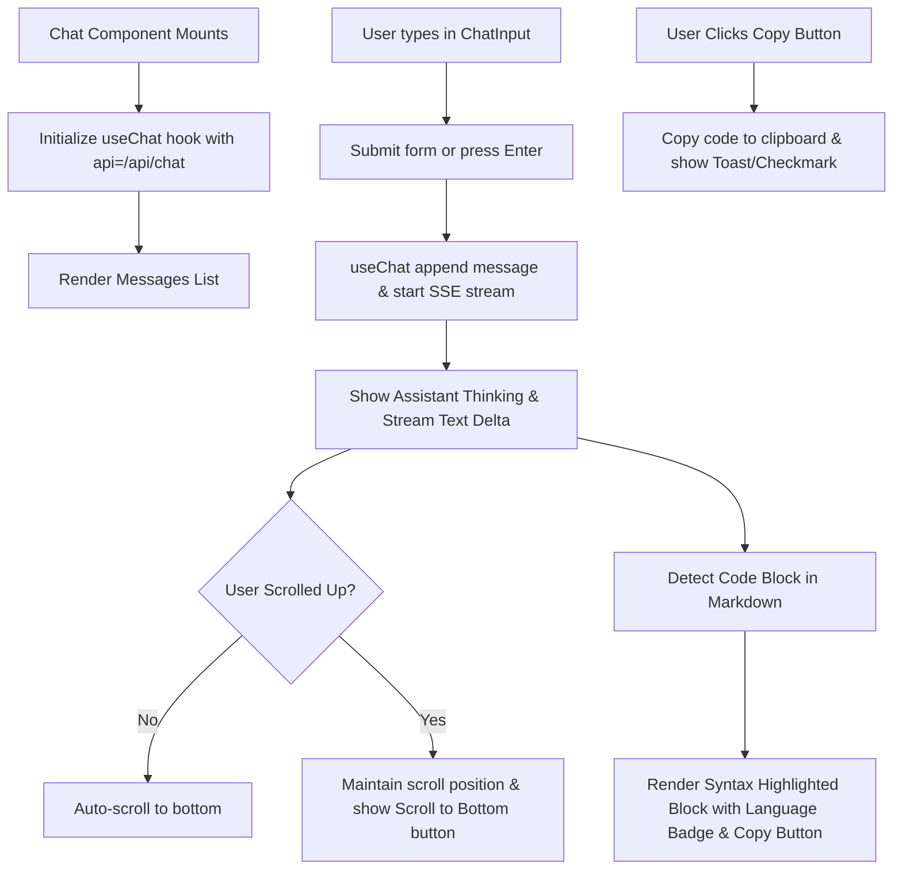

# Implementation Plan 008: Interactive Chat UI & Code Syntax Highlighting

**Parent Epic**: [`specs/epics/chat-interface-foundation.md`](file:///workspaces/secure-ai-learning-support/specs/epics/chat-interface-foundation.md)

---

## 1. Context & Architecture Overview

The goal of this step is to build the modular React UI components for the chat viewport (`chat.tsx`, `chat-messages.tsx`, `chat-message.tsx`, `chat-input.tsx`) within **AI Learning Support**, establishing rich message rendering, code syntax highlighting, auto-scrolling, and streaming interaction controls.

This step strictly adheres to the **Single Next.js Application Architecture** ([`ADR 001`](file:///workspaces/secure-ai-learning-support/specs/adrs/001-single-app-architecture.md)), **Vercel AI SDK Integration & BYOK Strategy** ([`ADR 004`](file:///workspaces/secure-ai-learning-support/specs/adrs/004-vercel-ai-sdk-byok.md)), and project styling guidelines (`rules/styling.md`).

### Framework & Major Library Pinned Versions
- **Next.js**: `^16.3.0` (App Router, Server Actions)
- **React**: `^19.2.8` (React 19 Server & Client Components)
- **Vercel AI SDK**: `ai@^7.0.58`, `@ai-sdk/react@^1.1.25`
- **Styling & UI Components**: `tailwindcss@^4.3.3`, `radix-ui@^1.6.7`, `lucide-react@^1.30.0`, `clsx`, `tailwind-merge`
- **Markdown & Syntax**: `react-markdown`, `remark-gfm`, `shiki` (or `rehype-highlight`)

### Directory Layer Categorization

```text
secure-ai-learning-support/
└── components/
    └── chat/                      # Reusable chat React components
        ├── chat.tsx               # Main chat container wrapper (client component)
        ├── chat-header.tsx        # Top navigation header (model display, thread title, new chat)
        ├── chat-input.tsx         # Auto-resizing textarea with stop/send controls
        ├── chat-message.tsx       # Message bubble with markdown & code syntax copy
        ├── chat-messages.tsx      # Messages viewport list with auto-scroll logic
        └── data-stream-handler.tsx # Client component consuming custom data stream events
```

---

## 2. External Reference Codebase Mapping (`/workspaces/chatbot`)

Consult Vercel's official Chatbot reference codebase at [`/workspaces/chatbot`](file:///workspaces/chatbot) when implementing components:

| Subsystem / Feature | Reference File in `../chatbot` | Target Path in `secure-ai-learning-support` | Implementation Notes |
| :--- | :--- | :--- | :--- |
| **Messages Viewport** | [`components/chat/messages.tsx`](file:///workspaces/chatbot/components/chat/messages.tsx) | [`components/chat/chat-messages.tsx`](file:///workspaces/secure-ai-learning-support/components/chat/chat-messages.tsx) | Message list viewport with auto-scroll handling. |
| **Message Bubble & Code** | [`components/chat/message.tsx`](file:///workspaces/chatbot/components/chat/message.tsx) | [`components/chat/chat-message.tsx`](file:///workspaces/secure-ai-learning-support/components/chat/chat-message.tsx) | Render message parts, markdown, and code blocks with copy buttons. |
| **Multimodal Input Box** | [`components/chat/multimodal-input.tsx`](file:///workspaces/chatbot/components/chat/multimodal-input.tsx) | [`components/chat/chat-input.tsx`](file:///workspaces/secure-ai-learning-support/components/chat/chat-input.tsx) | Auto-resizing textarea, submit on Enter (Shift+Enter for newline), cancel button. |
| **Data Stream Handler** | [`components/chat/data-stream-handler.tsx`](file:///workspaces/chatbot/components/chat/data-stream-handler.tsx) | [`components/chat/data-stream-handler.tsx`](file:///workspaces/secure-ai-learning-support/components/chat/data-stream-handler.tsx) | Consume custom stream events. |

---

## 3. Step Specification & Definition of Done

### Step 3: Interactive Chat UI & Code Syntax Highlighting (`components/chat/`)

- **Objective**: Build the modular React UI components for the chat viewport (`chat.tsx`, `chat-messages.tsx`, `chat-message.tsx`, `chat-input.tsx`). Implement streaming response rendering, markdown parsing, syntax-highlighted code blocks with a "Copy code" button, auto-scrolling with manual override, and a stop generation button.
- **Key Packages**: `@ai-sdk/react`, `radix-ui`, `lucide-react`, `clsx`, `tailwind-merge`, `react-markdown`, `remark-gfm`, `shiki` (or `rehype-highlight`)
- **Required Reading**:
  - Internal: `shadcn` skill ([`SKILL.md`](file:///workspaces/secure-ai-learning-support/.agents/skills/shadcn/SKILL.md)), `next-dev-loop` skill ([`SKILL.md`](file:///workspaces/secure-ai-learning-support/.agents/skills/next-dev-loop/SKILL.md)), [`rules/styling.md`](file:///workspaces/secure-ai-learning-support/rules/styling.md)
  - External Reference: [`/workspaces/chatbot/components/chat/messages.tsx`](file:///workspaces/chatbot/components/chat/messages.tsx), [`/workspaces/chatbot/components/chat/message.tsx`](file:///workspaces/chatbot/components/chat/message.tsx), [`/workspaces/chatbot/components/chat/multimodal-input.tsx`](file:///workspaces/chatbot/components/chat/multimodal-input.tsx), [`/workspaces/chatbot/components/chat/data-stream-handler.tsx`](file:///workspaces/chatbot/components/chat/data-stream-handler.tsx)



- **Definition of Done (DoD)**:
  1. **Component Specs**:
     - `components/chat/chat-header.tsx`: Displays the current thread title (or "New Chat"), the active model name, and a "New Chat" button. Renders at the top of the chat viewport.
     - `components/chat/chat-messages.tsx`: Renders message history with smooth auto-scroll to bottom. Shows a floating "Scroll to bottom" button when user scrolls up.
     - `components/chat/chat-message.tsx`: Renders markdown text via `react-markdown` with `remark-gfm`. Code blocks are syntax-highlighted via `shiki` (or `rehype-highlight`) and display a language header badge and an active "Copy code" button that copies raw code to clipboard and shows a visual checkmark.
     - `components/chat/chat-input.tsx`: Textarea auto-expands up to 6 lines. Submits on `Enter` (without `Shift`). Displays a "Stop" button during active streaming that invokes `stop()`.
     - `components/chat/data-stream-handler.tsx`: Client component that consumes custom data stream events (e.g., `chat-title`) from the AI SDK data stream and updates relevant UI state (e.g., sidebar thread title). Follows the pattern from [`/workspaces/chatbot/components/chat/data-stream-handler.tsx`](file:///workspaces/chatbot/components/chat/data-stream-handler.tsx).
  2. **Visual & Interactive Verification (`next-dev-loop`)**:
     - Start dev server (`pnpm dev`).
     - Using `agent-browser` in `next-dev-loop`, navigate to `/chat`, submit a prompt generating code (e.g. "Write a Python quicksort function"), and verify:
       - Streaming response text appears smoothly.
       - Code block renders with Python syntax highlighting and copy button.
       - Clicking "Copy code" successfully populates clipboard.
       - Clicking "Stop" cancels ongoing generation immediately.
  3. **Type & Lint Check**: `pnpm check` passes cleanly.

---

## 4. Security & Data Isolation Architecture

To ensure strict multi-tenant data isolation and prevent unauthorized access to user chat threads:

1. **Proxy Layer Guard**: `proxy.ts` rejects unauthenticated HTTP requests to `/chat*` before reaching App Router page components or API route handlers.
2. **Server-Side Authorization**: `app/api/chat/route.ts` and App Router page components (`app/chat/[id]/page.tsx`) call `@supabase/ssr` `createClient()` to resolve `user.id` from session cookies.
3. **Database Query Boundaries**: All Drizzle ORM query functions in `lib/db/queries/chat.ts` (`getChatById`, `getChatsByUserId`, `deleteChatById`) enforce `where(and(eq(chats.id, chatId), eq(chats.userId, userId)))`. An authenticated user cannot read, stream, or delete another user's chat thread even if they guess or modify the `chatId` URL parameter.
4. **PostgreSQL Foreign Keys**: `chats.userId` references `auth.users.id` with `onDelete: 'cascade'`. Deleting a user automatically purges all associated chat threads and messages at the database level.
