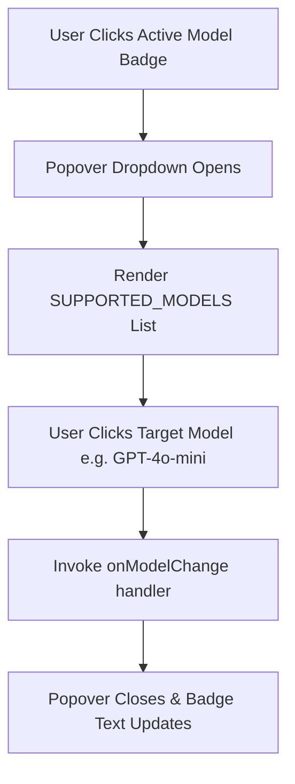

# Implementation Plan 010: Model Selection Component & Provider Configuration

**Parent Epic**: [`specs/epics/002a-chat-ui-refinements-model-selection.md`](file:///workspaces/secure-ai-learning-support/specs/epics/002a-chat-ui-refinements-model-selection.md)

---

## 1. Context & Architecture Overview

This step implements the foundation for interactive multi-LLM switching in **AI Learning Support**. It defines the supported LLM providers and models in `lib/ai/providers.ts` and builds the reusable interactive `ModelSelector` popover component (`components/chat/model-selector.tsx`).

This step strictly adheres to the **Single Next.js Application Architecture** ([`ADR 001`](file:///workspaces/secure-ai-learning-support/specs/adrs/001-single-app-architecture.md)), **Vercel AI SDK Integration & BYOK Strategy** ([`ADR 004`](file:///workspaces/secure-ai-learning-support/specs/adrs/004-vercel-ai-sdk-byok.md)), and project styling guidelines (`rules/styling.md`).

### Framework & Major Library Pinned Versions
- **Next.js**: `^16.3.0` (App Router, Server Components)
- **React**: `^19.2.8` (React 19 Server & Client Components)
- **Vercel AI SDK**: `ai@^7.0.58`, `@ai-sdk/google@^4.0.39`, `@ai-sdk/openai@^4.0.36`
- **Styling & UI Components**: `tailwindcss@^4.3.3`, `radix-ui@^1.6.7` (Popover / DropdownMenu), `lucide-react@^1.30.0`

### Directory Layer Categorization

```text
secure-ai-learning-support/
├── lib/
│   └── ai/
│       ├── providers.ts          # Export SUPPORTED_MODELS list & getLanguageModel helper
│       └── providers.test.ts     # Unit tests for provider resolution & fallbacks
└── components/
    └── chat/
        └── model-selector.tsx    # Popover/dropdown component for LLM selection
```

---

## 2. External Reference Codebase Mapping (`/workspaces/chatbot`)

Consult Vercel's official Chatbot reference codebase at [`/workspaces/chatbot`](file:///workspaces/chatbot) when implementing provider configurations and popover components:

| Subsystem / Feature | Reference File in `../chatbot` | Target Path in `secure-ai-learning-support` | Implementation Notes |
| :--- | :--- | :--- | :--- |
| **Model Registry & Fallbacks** | [`lib/ai/models.ts`](file:///workspaces/chatbot/lib/ai/models.ts) | [`lib/ai/providers.ts`](file:///workspaces/secure-ai-learning-support/lib/ai/providers.ts) | Define supported models array, default model ID, and provider instance resolver helper function. |
| **Model Selector Popover** | [`components/chat/visibility-selector.tsx`](file:///workspaces/chatbot/components/chat/visibility-selector.tsx) | [`components/chat/model-selector.tsx`](file:///workspaces/secure-ai-learning-support/components/chat/model-selector.tsx) | Popover component listing available models with active checkmarks and provider badges. |

---

## 3. Step Specification & Definition of Done

### Step 1: Model Selection Component & Provider Configuration (`lib/ai/providers.ts` & `components/chat/model-selector.tsx`)

- **Objective**: Export a clean list of supported models (`SUPPORTED_MODELS`) and a flexible `getLanguageModel` factory helper in `lib/ai/providers.ts`. Build the `ModelSelector` popover dropdown component in `components/chat/model-selector.tsx` using Radix UI Popover / DropdownMenu.
- **Key Packages**: `ai`, `@ai-sdk/google`, `@ai-sdk/openai`, `radix-ui`, `lucide-react`
- **Required Required Reading**:
  - Skills: `ai-sdk` skill ([`SKILL.md`](file:///workspaces/secure-ai-learning-support/.agents/skills/ai-sdk/SKILL.md)), `shadcn` skill ([`SKILL.md`](file:///workspaces/secure-ai-learning-support/.agents/skills/shadcn/SKILL.md))
  - Architecture ADRs: [`004-vercel-ai-sdk-byok.md`](file:///workspaces/secure-ai-learning-support/specs/adrs/004-vercel-ai-sdk-byok.md), [`rules/styling.md`](file:///workspaces/secure-ai-learning-support/rules/styling.md)
  - External Reference: [`/workspaces/chatbot/lib/ai/models.ts`](file:///workspaces/chatbot/lib/ai/models.ts)



- **Detailed Implementation Instructions**:
  1. **Provider Registry (`lib/ai/providers.ts`)**:
     - Export `ModelOption` interface:
       ```ts
       export interface ModelOption {
         id: string;
         name: string;
         provider: 'google' | 'openai';
         description: string;
         badge?: string;
       }
       ```
     - Export `DEFAULT_MODEL_ID = 'gemini-2.5-flash'`.
     - Export `SUPPORTED_MODELS: ModelOption[]` containing Google Gemini models (`gemini-2.5-flash`, `gemini-1.5-pro`) and OpenAI models (`gpt-4o-mini`, `gpt-4o`).
     - Refactor `getLanguageModel({ modelId }: { modelId?: string })` helper:
       - Lookup `modelId` in `SUPPORTED_MODELS`. If found, return provider instance (`google('gemini-2.5-flash')` or `openai('gpt-4o-mini')`).
       - If `modelId` is invalid, missing, or unrecognized, fall back gracefully to `DEFAULT_MODEL_ID` and log a warning.
  2. **Model Selector Component (`components/chat/model-selector.tsx`)**:
     - Client component (`"use client"`).
     - Props interface:
       ```ts
       export interface ModelSelectorProps {
         selectedModelId: string;
         onModelChange: (modelId: string) => void;
         className?: string;
       }
       ```
     - Render trigger button showing current active model name, provider icon badge (e.g. Sparkles for Google, Bot/Cpu for OpenAI), and `ChevronDown`.
     - Popover dropdown content lists all `SUPPORTED_MODELS` grouped or styled cleanly:
       - Displays model name, provider label, and description text.
       - Shows `Check` icon next to the currently selected model.
       - Hover and focus states adhere to `rules/styling.md` (no forbidden dark purple/violet fonts or colored glowing borders).
  3. **Unit Testing (`lib/ai/providers.test.ts`)**:
     - Test that `getLanguageModel({ modelId: 'gpt-4o-mini' })` returns OpenAI provider instance.
     - Test that `getLanguageModel({ modelId: 'invalid-model' })` falls back to `DEFAULT_MODEL_ID` without throwing runtime errors.

- **Definition of Done (DoD)**:
  1. `lib/ai/providers.ts` exports `SUPPORTED_MODELS` array with Google & OpenAI model definitions and robust `getLanguageModel` fallback resolver.
  2. `components/chat/model-selector.tsx` renders Popover dropdown displaying active model and selection checkmarks.
  3. `pnpm check && pnpm test lib/ai/providers.test.ts` passes 100% cleanly.

---

## 4. Security & Data Isolation Architecture

1. **Model Parameter Sanitization**: `getLanguageModel` validates arbitrary string inputs against a strict `SUPPORTED_MODELS` allowlist to prevent arbitrary model loading or injection vulnerabilities.
2. **API Key Security**: Server-side provider keys (`GOOGLE_GENERATIVE_AI_API_KEY`, `OPENAI_API_KEY`) remain strictly within server environment variables and are never exposed to the client side.
