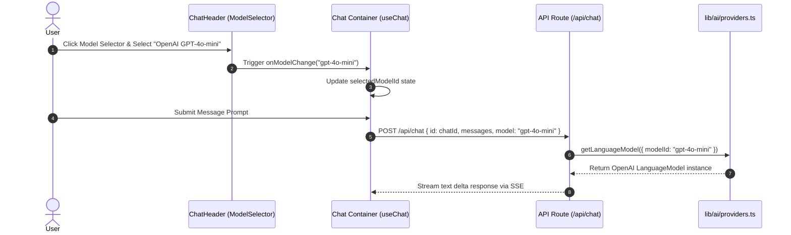

# Implementation Plan 011: Chat Header Refactoring & Model Payload Plumbing

**Parent Epic**: [`specs/epics/002a-chat-ui-refinements-model-selection.md`](file:///workspaces/secure-ai-learning-support/specs/epics/002a-chat-ui-refinements-model-selection.md)

---

## 1. Context & Architecture Overview

This step integrates the `ModelSelector` into `ChatHeader` (`components/chat/chat-header.tsx`), removes the redundant top-right "New Chat" button, manages `selectedModelId` state within the `Chat` container (`components/chat/chat.tsx`), and connects the selected model parameter to the streaming API route handler (`app/api/chat/route.ts`).

This step strictly adheres to the **Single Next.js Application Architecture** ([`ADR 001`](file:///workspaces/secure-ai-learning-support/specs/adrs/001-single-app-architecture.md)), **Vercel AI SDK Integration & BYOK Strategy** ([`ADR 004`](file:///workspaces/secure-ai-learning-support/specs/adrs/004-vercel-ai-sdk-byok.md)), and project styling guidelines (`rules/styling.md`).

### Framework & Major Library Pinned Versions
- **Next.js**: `^16.3.0` (App Router, API Routes)
- **React**: `^19.2.8` (React 19 Server & Client Components)
- **Vercel AI SDK**: `ai@^7.0.58`, `@ai-sdk/react@^1.1.25`
- **Styling & UI Components**: `tailwindcss@^4.3.3`, `lucide-react@^1.30.0`

### Directory Layer Categorization

```text
secure-ai-learning-support/
├── app/
│   └── api/
│       └── chat/
│           └── route.ts          # API route handler accepting model parameter in JSON body
└── components/
    └── chat/
        ├── chat-header.tsx       # Updated header with ModelSelector, right New Chat button removed
        └── chat.tsx              # Container managing selectedModelId state & passing to useChat & ChatHeader
```

---

## 2. External Reference Codebase Mapping (`/workspaces/chatbot`)

Consult Vercel's official Chatbot reference codebase at [`/workspaces/chatbot`](file:///workspaces/chatbot) when refactoring the chat header and plumbing model payloads:

| Subsystem / Feature | Reference File in `../chatbot` | Target Path in `secure-ai-learning-support` | Implementation Notes |
| :--- | :--- | :--- | :--- |
| **Header Layout Integration** | [`components/chat/chat-header.tsx`](file:///workspaces/chatbot/components/chat/chat-header.tsx) | [`components/chat/chat-header.tsx`](file:///workspaces/secure-ai-learning-support/components/chat/chat-header.tsx) | Embed model popover selector in header, ensure responsive alignment. |
| **Chat Container State** | [`components/chat/chat.tsx`](file:///workspaces/chatbot/components/chat/chat.tsx) | [`components/chat/chat.tsx`](file:///workspaces/secure-ai-learning-support/components/chat/chat.tsx) | Maintain selected model state, pass model in `useChat` request body payload. |
| **API Route Handler** | [`app/api/chat/route.ts`](file:///workspaces/chatbot/app/api/chat/route.ts) | [`app/api/chat/route.ts`](file:///workspaces/secure-ai-learning-support/app/api/chat/route.ts) | Extract model parameter from JSON payload, invoke `getLanguageModel({ modelId })`. |

---

## 3. Step Specification & Definition of Done

### Step 2: Chat Header Refactoring & Model Payload Plumbing (`components/chat/chat-header.tsx`, `components/chat/chat.tsx`, `app/api/chat/route.ts`)

- **Objective**: Refactor `ChatHeader` to embed `ModelSelector` and eliminate the redundant right-hand "New Chat" button (keeping the sidebar top button as the single trigger). Update `Chat` container to hold `selectedModelId` state and transmit it in `POST /api/chat` calls. Update `app/api/chat/route.ts` to parse the `model` identifier and load the corresponding LLM instance.
- **Key Packages**: `@ai-sdk/react`, `lucide-react`
- **Required Reading**:
  - Skills: `ai-sdk` skill ([`SKILL.md`](file:///workspaces/secure-ai-learning-support/.agents/skills/ai-sdk/SKILL.md)), `next-dev-loop` skill ([`SKILL.md`](file:///workspaces/secure-ai-learning-support/.agents/skills/next-dev-loop/SKILL.md))
  - External Reference: [`/workspaces/chatbot/components/chat/chat-header.tsx`](file:///workspaces/chatbot/components/chat/chat-header.tsx)



- **Detailed Implementation Instructions**:
  1. **Refactor `ChatHeader` (`components/chat/chat-header.tsx`)**:
     - Accept props: `selectedModelId: string` and `onModelChange: (modelId: string) => void`.
     - Remove the right-hand "New Chat" button (`SquarePen` / `Plus` icon button) from the header toolbar layout.
     - Place `<ModelSelector selectedModelId={selectedModelId} onModelChange={onModelChange} />` inside the left/center navigation area of `ChatHeader` (adjacent to sidebar toggle button).
  2. **Update `Chat` Container (`components/chat/chat.tsx`)**:
     - Declare state `const [selectedModelId, setSelectedModelId] = useState<string>(DEFAULT_MODEL_ID)`.
     - Pass `body: { id: chatId, model: selectedModelId }` into `useChat` options, ensuring every message submission sends the active `selectedModelId` to the server.
     - Pass `selectedModelId` and `setSelectedModelId` down to `<ChatHeader />`.
  3. **Update API Route Handler (`app/api/chat/route.ts`)**:
     - Destructure `model` from `await req.json()`.
     - Resolve the language model instance via `getLanguageModel({ modelId: model })`.
     - Pass the model instance to `streamText({ model: languageModel, ... })`.
     - Ensure fallback gracefully handles missing or invalid model strings.

- **Definition of Done (DoD)**:
  1. `ChatHeader` renders `ModelSelector`; right-hand "New Chat" button is deleted.
  2. Changing model in `ModelSelector` updates `selectedModelId` in `Chat` container and transmits `{ model: selectedModelId }` payload to `POST /api/chat`.
  3. API route handler parses `model` parameter and streams responses using the requested LLM.
  4. Interactive runtime verification via `pnpm dev` confirms streaming response succeeds with selected model.

---

## 4. Security & Data Isolation Architecture

1. **Server Validation**: The model string sent in the POST request body is validated against the server-side model allowlist in `lib/ai/providers.ts`.
2. **Session Context Isolation**: User auth session validation in `app/api/chat/route.ts` remains intact, ensuring multi-tenant message thread protection regardless of model choice.
