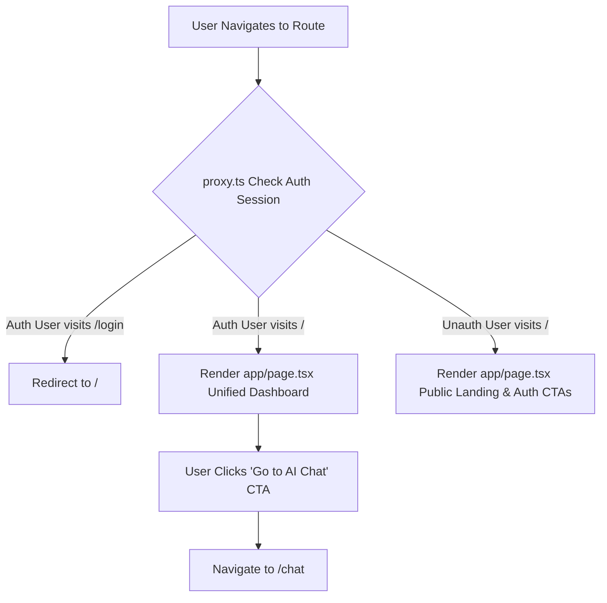

# Implementation Plan 012: Top Navigation Alignment & Unified Dashboard

**Parent Epic**: [`specs/epics/002a-chat-ui-refinements-model-selection.md`](file:///workspaces/secure-ai-learning-support/specs/epics/002a-chat-ui-refinements-model-selection.md)

---

## 1. Context & Architecture Overview

This step streamlines the application's top navigation header (`components/header.tsx`) and unifies routing by deprecating the empty `/dashboard` page, elevating root `/` (`app/page.tsx`) to serve as the unified Dashboard for authenticated users, and updating `proxy.ts` auth session redirect rules.

This step strictly adheres to the **Single Next.js Application Architecture** ([`ADR 001`](file:///workspaces/secure-ai-learning-support/specs/adrs/001-single-app-architecture.md)), **Supabase Auth Integration** ([`ADR 005`](file:///workspaces/secure-ai-learning-support/specs/adrs/005-supabase-auth-integration.md)), and project styling guidelines (`rules/styling.md`).

### Framework & Major Library Pinned Versions
- **Next.js**: `^16.3.0` (App Router, Server Components, `proxy.ts` session route guard)
- **React**: `^19.2.8` (React 19 Server & Client Components)
- **Authentication**: `@supabase/ssr@^0.12.4`
- **Styling & UI Components**: `tailwindcss@^4.3.3`, `lucide-react@^1.30.0`

### Directory Layer Categorization

```text
secure-ai-learning-support/
├── proxy.ts                              # Next.js 16 proxy route guard (update auth redirect from /dashboard to /)
├── app/
│   ├── page.tsx                          # Refactored root Dashboard page with "Go to AI Chat" CTA
│   └── (delete app/dashboard/)           # Deprecated empty route directory removed
└── components/
    └── header.tsx                        # Removed max-w-7xl constraint, added "Chat" nav link for auth users
```

---

## 2. External Reference Codebase Mapping (`/workspaces/chatbot`)

| Subsystem / Feature | Target Path in `secure-ai-learning-support` | Implementation Notes |
| :--- | :--- | :--- |
| **Full-Width Top Header Container** | [`components/header.tsx`](file:///workspaces/secure-ai-learning-support/components/header.tsx) | Replace `max-w-7xl` constraint with `w-full px-4 sm:px-6` so header aligns edge-to-edge with the chat viewport below. |
| **Unified Root Route** | [`app/page.tsx`](file:///workspaces/secure-ai-learning-support/app/page.tsx) | Serve as unified Dashboard for authenticated users ("Go to AI Chat" CTA) and landing view for guest visitors. |
| **Route Guard Auth Redirects** | [`proxy.ts`](file:///workspaces/secure-ai-learning-support/proxy.ts) | Update post-login/session refresh redirect logic to point to `/` instead of deprecated `/dashboard`. |

---

## 3. Step Specification & Definition of Done

### Step 3: Top Navigation Alignment & Unified Dashboard (`components/header.tsx`, `app/page.tsx`, `proxy.ts`)

- **Objective**: Remove the `max-w-7xl` container restriction from `components/header.tsx` to align top header width with full-bleed viewports. Add a prominent "Chat" navigation link for logged-in users. Deprecate `app/dashboard/`, elevate `app/page.tsx` into a unified Dashboard featuring a primary **"Go to AI Chat"** action button, and update `proxy.ts` auth redirect target to `/`.
- **Key Packages**: `next`, `@supabase/ssr`, `lucide-react`
- **Required Reading**:
  - Architecture ADRs: [`001-single-app-architecture.md`](file:///workspaces/secure-ai-learning-support/specs/adrs/001-single-app-architecture.md), [`005-supabase-auth-integration.md`](file:///workspaces/secure-ai-learning-support/specs/adrs/005-supabase-auth-integration.md)
  - Codebase Files: [`proxy.ts`](file:///workspaces/secure-ai-learning-support/proxy.ts), [`components/header.tsx`](file:///workspaces/secure-ai-learning-support/components/header.tsx), [`app/page.tsx`](file:///workspaces/secure-ai-learning-support/app/page.tsx)



- **Detailed Implementation Instructions**:
  1. **Top Header Alignment (`components/header.tsx`)**:
     - Remove `max-w-7xl` container constraint. Use `w-full px-4 sm:px-6` so the top navigation bar aligns seamlessly with full-width chat sidebars and content containers below.
     - Add a prominent "Chat" navigation link in the header for authenticated users, allowing direct 1-click access to `/chat` from any page.
  2. **Deprecate `/dashboard` Route**:
     - Delete the `app/dashboard/` folder and `app/dashboard/page.tsx`.
     - Search the codebase for references to `/dashboard` (e.g. in auth callback actions, login forms, header links) and update them to point to `/` or `/chat`.
  3. **Unified Root Dashboard (`app/page.tsx`)**:
     - Server Component querying Supabase auth session via `createClient()`.
     - **Authenticated View**: Render unified Dashboard featuring user welcome card, platform quick stats, recent activity summary, and a primary CTA button **"Go to AI Chat"** linking directly to `/chat`.
     - **Unauthenticated View**: Render clean platform landing overview highlighting key features with primary "Sign In" / "Sign Up" action CTAs.
  4. **Update Proxy Route Guard (`proxy.ts`)**:
     - Update auth redirect behavior so authenticated users visiting `/login` or `/signup` redirect to `/` (instead of `/dashboard`).

- **Definition of Done (DoD)**:
  1. Header uses `w-full px-4 sm:px-6` (no `max-w-7xl`), aligning seamlessly with full-width viewports.
  2. Authenticated header displays direct "Chat" link.
  3. `app/dashboard/` directory is completely deleted.
  4. Root `/` renders unified Dashboard for authenticated users with "Go to AI Chat" CTA button.
  5. `proxy.ts` updates auth redirects to `/`.
  6. `pnpm check` passes cleanly without missing route or type errors.

---

## 4. Security & Data Isolation Architecture

1. **Proxy Layer Route Guard**: `proxy.ts` intercepts protected route accesses and ensures clean session validation via `@supabase/ssr`.
2. **Server-Side Session Check**: `app/page.tsx` checks auth session on the server side before rendering user dashboard metrics or user profile information.
