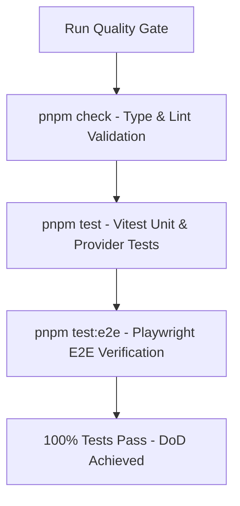

# Implementation Plan 013: Verification & E2E Test Suite Updates

**Parent Epic**: [`specs/epics/002a-chat-ui-refinements-model-selection.md`](file:///workspaces/secure-ai-learning-support/specs/epics/002a-chat-ui-refinements-model-selection.md)

---

## 1. Context & Architecture Overview

This step updates and expands the Playwright E2E test suite (`tests/e2e/`) and Vitest unit tests to verify model selector popover interactivity, elimination of top-right header button redundancy, unified root `/` dashboard navigation, and overall system stability.

This step strictly adheres to the **Testing Strategy & E2E Guidelines** ([`rules/testing.md`](file:///workspaces/secure-ai-learning-support/rules/testing.md)) and uses the **Verifier** subagent and **test-writer** skill ([`SKILL.md`](file:///workspaces/secure-ai-learning-support/.agents/skills/test-writer/SKILL.md)).

### Framework & Major Library Pinned Versions
- **Playwright**: `@playwright/test^1.58.0`
- **Vitest**: `vitest^3.2.0`
- **Next.js**: `^16.3.0`

### Directory Layer Categorization

```text
secure-ai-learning-support/
└── tests/
    └── e2e/
        ├── chat-model-selection.spec.ts # E2E tests for ModelSelector popover & chat header
        └── dashboard.spec.ts            # E2E tests for unified / dashboard & auth redirects
```

---

## 2. External Reference Codebase Mapping (`/workspaces/chatbot`)

| Subsystem / Feature | Target Path in `secure-ai-learning-support` | Implementation Notes |
| :--- | :--- | :--- |
| **Model Selection E2E Test** | [`tests/e2e/chat-model-selection.spec.ts`](file:///workspaces/secure-ai-learning-support/tests/e2e/chat-model-selection.spec.ts) | Playwright test covering model dropdown opening, option selection, active model state updating, and sending payload. |
| **Unified Dashboard E2E Test** | [`tests/e2e/dashboard.spec.ts`](file:///workspaces/secure-ai-learning-support/tests/e2e/dashboard.spec.ts) | Playwright test covering root `/` dashboard CTA, top header "Chat" link navigation, and proxy auth redirects. |

---

## 3. Step Specification & Definition of Done

### Step 4: Verification & E2E Test Suite Updates (`tests/e2e/`)

- **Objective**: Implement comprehensive Playwright E2E tests and Vitest unit tests verifying interactive model switching, top navigation alignment, removal of duplicate New Chat button, and root `/` dashboard CTA navigation. Execute full repository verification gates (`pnpm check`, `pnpm test`, `pnpm test:e2e`).
- **Key Packages**: `@playwright/test`, `vitest`
- **Required Reading**:
  - Skills: `test-writer` skill ([`SKILL.md`](file:///workspaces/secure-ai-learning-support/.agents/skills/test-writer/SKILL.md))
  - Rules: [`rules/testing.md`](file:///workspaces/secure-ai-learning-support/rules/testing.md), [`rules/verification.md`](file:///workspaces/secure-ai-learning-support/rules/verification.md)



- **Detailed Implementation Instructions**:
  1. **Model Selection & Header E2E Test (`tests/e2e/chat-model-selection.spec.ts`)**:
     - Log in authenticated test user and navigate to `/chat`.
     - Verify `ChatHeader` renders the active model button badge and does NOT render a top-right "New Chat" button.
     - Click active model button, verify popover dropdown opens showing list of `SUPPORTED_MODELS`.
     - Click "OpenAI GPT-4o-mini", verify popover closes and model badge text updates to "OpenAI GPT-4o Mini".
     - Send a prompt message, verify message streams successfully.
     - Click sidebar top "New Chat" button (`SquarePen`), verify new clean chat thread initializes.
  2. **Unified Dashboard & Routing E2E Test (`tests/e2e/dashboard.spec.ts`)**:
     - Test unauthenticated visit to `/`: verify public landing page displays with Sign In / Sign Up CTAs.
     - Log in test user and navigate to `/`: verify unified Dashboard renders welcome heading and **"Go to AI Chat"** primary CTA button.
     - Click "Go to AI Chat", verify smooth navigation to `/chat`.
     - Verify header displays top "Chat" nav link for logged-in user.
     - Navigate to `/login` as logged-in user: verify `proxy.ts` redirects to `/`.
  3. **Full Suite Execution & Verification**:
     - Run `pnpm check` (TypeScript compilation & ESLint).
     - Run `pnpm test` (Vitest unit test suite).
     - Run `pnpm test:e2e` (Playwright E2E test suite).

- **Definition of Done (DoD)**:
  1. Playwright E2E tests verify model selector popover interactivity, sidebar New Chat trigger, and `/` dashboard navigation.
  2. `pnpm check` returns zero type errors or lint warnings.
  3. `pnpm test` and `pnpm test:e2e` pass 100%.

---

## 4. Security & Data Isolation Architecture

1. **Test Isolation**: E2E tests use dedicated test user credentials and clean database setup routines to prevent test state cross-contamination.
2. **Auth Guard Testing**: E2E suite explicitly verifies that unauthenticated access to `/chat` and protected endpoints is blocked and redirected correctly.
