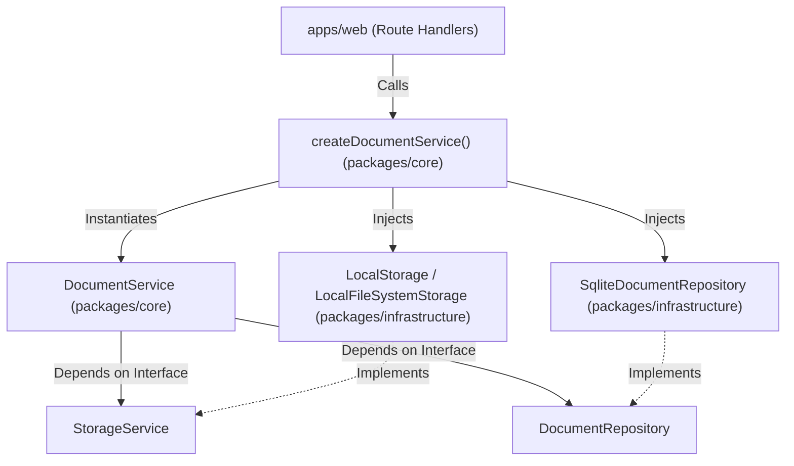

# Implementation Plan: Database Repository Pattern & Core Service Factory

- **Status**: Draft
- **Target Branch**: `plan-db-repository-factory`
- **PRD Reference**: N/A
- **ADR Reference**: N/A
- **Affected Domain / Packages**: `packages/infrastructure`, `packages/core`, `apps/web`

---

## 1. Executive Summary & Scope Boundaries

### Executive Summary
Refactor database access in `@ai-learning-support/infrastructure` and `@ai-learning-support/core` to introduce the **Repository Pattern** and a **Core Service Factory**. This decouples core business logic from direct SQLite/Drizzle drivers, enforces Rule 8 and Rule 9 of [rules/project-rules.md](file:///workspaces/secure-ai-learning-support/rules/project-rules.md), enables dual-mode operation (Local SQLite vs. Remote Supabase), and removes raw infrastructure instantiation from `apps/web` Next.js route handlers.

### In-Scope
- [ ] Define `DocumentRepository` interface contract in `packages/infrastructure`.
- [ ] Implement `SqliteDocumentRepository` in `packages/infrastructure` using Drizzle SQLite.
- [ ] Refactor `DocumentService` in `packages/core` to accept `DocumentRepository` via Dependency Injection instead of importing raw `db` / `documents`.
- [ ] Implement `createDocumentService()` factory in `packages/core` to inspect environment configuration and instantiate storage/repository implementations.
- [ ] Refactor `apps/web/app/api/documents/route.ts` and `upload/route.ts` to consume `createDocumentService()` instead of directly instantiating `LocalFileSystemStorage`.

### Non-Goals (Out of Scope)
- Implementing the remote Supabase client or `SupabaseDocumentRepository` (this plan establishes the pluggable contract for it).
- Modifying database schemas or table definitions.

---

## 2. Architectural Invariants & Rule Compliance Check

Verify compliance with active project invariants in [rules/project-rules.md](file:///workspaces/secure-ai-learning-support/rules/project-rules.md) and monorepo structure in [specs/architecture-index.md](file:///workspaces/secure-ai-learning-support/specs/architecture-index.md):

- [x] **Unidirectional Orchestration**: Orchestration logic resides in `packages/core/src/services/`. UI API routes in `apps/web/` are thin handlers that rely on core service factories.
- [x] **Adapter Pattern**: Storage and database operations operate strictly behind `StorageService` and `DocumentRepository` interfaces.
- [x] **No Infrastructure in Core/Features**: Core services process domain data without importing raw database clients or disk side-effects directly.



---

## 3. File Impact Map

| Action | File Path | Responsibility / Description |
| :--- | :--- | :--- |
| `Create` | `packages/infrastructure/src/db/repositories/document-repository.ts` | Abstract `DocumentRepository` interface contract |
| `Create` | `packages/infrastructure/src/db/repositories/sqlite-document-repository.ts` | Concrete SQLite implementation of `DocumentRepository` using Drizzle |
| `Create` | `packages/infrastructure/src/db/repositories/sqlite-document-repository.test.ts` | Unit & integration tests for `SqliteDocumentRepository` |
| `Modify` | `packages/infrastructure/src/index.ts` | Export `DocumentRepository` interface and `SqliteDocumentRepository` |
| `Modify` | `packages/core/src/services/document/document-service.ts` | Refactor `DocumentService` to accept `DocumentRepository` in constructor |
| `Modify` | `packages/core/src/services/document/document-service.test.ts` | Update tests to inject mock `DocumentRepository` |
| `Create` | `packages/core/src/factory.ts` | Implement `createDocumentService()` factory |
| `Create` | `packages/core/src/factory.test.ts` | Unit test suite for `createDocumentService()` |
| `Modify` | `packages/core/src/index.ts` | Export factory function `createDocumentService` |
| `Modify` | `apps/web/app/api/documents/route.ts` | Refactor route handler to use `createDocumentService()` |
| `Modify` | `apps/web/app/api/documents/upload/route.ts` | Refactor route handler to use `createDocumentService()` |

---

## 4. Ordered Atomic Task Breakdown

### Task 1: Define `DocumentRepository` Interface Contract

- **Goal & Rationale**: Create the database repository contract so core domain logic and features interact with database entities through an abstract interface rather than raw database drivers.
- **Target Files**:
  - `packages/infrastructure/src/db/repositories/document-repository.ts` (Source)
  - `packages/infrastructure/src/index.ts` (Exports)
- **Interface & Data Contracts**:
  ```typescript
  import type { DocumentEntity } from '@ai-learning-support/shared';

  export type CreateDocumentInput = Omit<DocumentEntity, 'createdAt' | 'updatedAt'>;

  export interface DocumentRepository {
    create(input: CreateDocumentInput): Promise<DocumentEntity>;
    findById(id: string): Promise<DocumentEntity | null>;
    listByUserId(userId: string): Promise<DocumentEntity[]>;
    delete(id: string): Promise<void>;
  }
  ```
- **TDD Steps**:
  1. Define type definitions and interface export in `packages/infrastructure/src/db/repositories/document-repository.ts`.
  2. Export `DocumentRepository` from `packages/infrastructure/src/index.ts`.
  3. Run typecheck: `pnpm --filter @ai-learning-support/infrastructure run typecheck` (Expect PASS).
- **Acceptance Criteria**:
  - [ ] `DocumentRepository` interface is cleanly defined and exported from `@ai-learning-support/infrastructure`.
  - [ ] Zero raw database dependencies in the interface file.
- **Git Commit Command**: `git commit -m "feat(infra): define DocumentRepository contract interface"`

---

### Task 2: Implement `SqliteDocumentRepository` in Infrastructure

- **Goal & Rationale**: Implement `DocumentRepository` using Drizzle ORM and SQLite (`better-sqlite3`), isolating all Drizzle query execution inside `packages/infrastructure`.
- **Target Files**:
  - `packages/infrastructure/src/db/repositories/sqlite-document-repository.ts` (Source)
  - `packages/infrastructure/src/db/repositories/sqlite-document-repository.test.ts` (Test)
  - `packages/infrastructure/src/index.ts` (Exports)
- **Interface & Data Contracts**:
  ```typescript
  import { db } from '../db.js';
  import { documents } from '../schema/documents.js';
  import type { CreateDocumentInput, DocumentRepository } from './document-repository.js';

  export class SqliteDocumentRepository implements DocumentRepository {
    async create(input: CreateDocumentInput): Promise<DocumentEntity>;
    async findById(id: string): Promise<DocumentEntity | null>;
    async listByUserId(userId: string): Promise<DocumentEntity[]>;
    async delete(id: string): Promise<void>;
  }
  ```
- **TDD Steps**:
  1. Create `sqlite-document-repository.test.ts` testing `create`, `findById`, `listByUserId`, and `delete` against test DB.
  2. Run test command: `DATABASE_PATH=../../.data/app.infra.test.db pnpm vitest related packages/infrastructure/src/db/repositories/sqlite-document-repository.test.ts --run` (Expect FAIL).
  3. Implement `SqliteDocumentRepository` in `sqlite-document-repository.ts`.
  4. Export `SqliteDocumentRepository` in `packages/infrastructure/src/index.ts`.
  5. Re-run test command (Expect PASS).
- **Acceptance Criteria**:
  - [ ] All 4 repository methods (`create`, `findById`, `listByUserId`, `delete`) execute successfully against SQLite.
  - [ ] Test suite passes with 100% coverage on repository operations.
- **Git Commit Command**: `git commit -m "feat(infra): implement SqliteDocumentRepository using Drizzle SQLite"`

---

### Task 3: Refactor `DocumentService` in Core to Use `DocumentRepository`

- **Goal & Rationale**: Remove raw `db` import and Drizzle SQL queries from `DocumentService`, injecting `DocumentRepository` into constructor.
- **Target Files**:
  - `packages/core/src/services/document/document-service.ts` (Source)
  - `packages/core/src/services/document/document-service.test.ts` (Test)
- **Interface & Data Contracts**:
  ```typescript
  import type { DocumentRepository, StorageService } from '@ai-learning-support/infrastructure';

  export class DocumentService {
    constructor(
      private storageService: StorageService,
      private documentRepo: DocumentRepository,
    ) {}

    async uploadDocument(userId: string, filename: string, fileBuffer: Buffer): Promise<DocumentEntity>;
    async listDocuments(userId: string): Promise<DocumentEntity[]>;
  }
  ```
- **TDD Steps**:
  1. Update `document-service.test.ts` to instantiate a Mock `DocumentRepository` instead of using global `db`.
  2. Run test command: `pnpm vitest related packages/core/src/services/document/document-service.test.ts --run` (Expect FAIL).
  3. Refactor `document-service.ts` to replace `db.insert` and `db.select` calls with `this.documentRepo.create(...)` and `this.documentRepo.listByUserId(...)`.
  4. Remove `db` and `documents` imports from `document-service.ts`.
  5. Re-run test command (Expect PASS).
- **Acceptance Criteria**:
  - [ ] `document-service.ts` contains zero direct imports of `db` or `drizzle-orm`.
  - [ ] All unit tests pass cleanly using injected repository mock.
- **Git Commit Command**: `git commit -m "refactor(core): decouple DocumentService from db driver using DocumentRepository"`

---

### Task 4: Implement `createDocumentService()` Factory in Core

- **Goal & Rationale**: Provide a single entry-point factory function in `@ai-learning-support/core` that instantiates storage adapters and database repositories based on environment configuration (`APP_MODE`).
- **Target Files**:
  - `packages/core/src/factory.ts` (Source)
  - `packages/core/src/factory.test.ts` (Test)
  - `packages/core/src/index.ts` (Exports)
- **Interface & Data Contracts**:
  ```typescript
  import { DocumentService } from './services/document/document-service.js';

  export function createDocumentService(): DocumentService;
  ```
- **TDD Steps**:
  1. Create `factory.test.ts` asserting that `createDocumentService()` returns a properly wired `DocumentService` instance.
  2. Run test command: `pnpm vitest related packages/core/src/factory.test.ts --run` (Expect FAIL).
  3. Implement `factory.ts` instantiating `LocalFileSystemStorage` and `SqliteDocumentRepository` when `process.env.APP_MODE` is `'local'` (or default).
  4. Export `createDocumentService` in `packages/core/src/index.ts`.
  5. Re-run test command (Expect PASS).
- **Acceptance Criteria**:
  - [ ] `createDocumentService()` successfully constructs and returns `DocumentService`.
  - [ ] Public export boundary in `@ai-learning-support/core` exposes `createDocumentService`.
- **Git Commit Command**: `git commit -m "feat(core): implement createDocumentService factory"`

---

### Task 5: Refactor Web App API Route Handlers

- **Goal & Rationale**: Clean up Next.js API route handlers in `apps/web`, replacing manual infrastructure instantiation (`new LocalFileSystemStorage()`) with `createDocumentService()`.
- **Target Files**:
  - `apps/web/app/api/documents/route.ts` (Source)
  - `apps/web/app/api/documents/upload/route.ts` (Source)
- **Interface & Data Contracts**:
  ```typescript
  import { createDocumentService } from "@ai-learning-support/core";

  export async function GET() {
    const documentService = createDocumentService();
    const documentsList = await documentService.listDocuments(MOCK_USER_ID);
    return NextResponse.json(documentsList);
  }
  ```
- **TDD Steps**:
  1. Update `apps/web/app/api/documents/route.ts` to import `createDocumentService` and remove `new LocalFileSystemStorage()`.
  2. Update `apps/web/app/api/documents/upload/route.ts` to import `createDocumentService` and remove `new LocalFileSystemStorage()`.
  3. Run full project check: `pnpm check` (Expect PASS).
- **Acceptance Criteria**:
  - [ ] `apps/web` contains zero direct instantiations of `LocalFileSystemStorage`.
  - [ ] Route handlers are concise, readable, and decoupled from infrastructure details.
- **Git Commit Command**: `refactor(web): consume createDocumentService factory in document API routes`

---

## 5. Risk Assessment & Fallback Plan

| Risk | Impact | Likelihood | Mitigation Strategy |
| :--- | :--- | :--- | :--- |
| Integration tests fail due to missing environment variable | Medium | Low | Default `createDocumentService()` to local mode (`LocalFileSystemStorage` + `SqliteDocumentRepository`) if `APP_MODE` is unset. |
| Existing integration test expects direct `db` access | Low | Low | Keep `db` exported from `@ai-learning-support/infrastructure` for low-level DB migrations or integration assertions. |

---

## 6. Definition of Done & Verification Pipeline

- [ ] All 5 atomic tasks executed in TDD order with green tests.
- [ ] Monorepo build and check succeeds with zero type or lint errors: `pnpm check`
- [ ] Architectural rules in [rules/project-rules.md](file:///workspaces/secure-ai-learning-support/rules/project-rules.md) fully satisfied.
