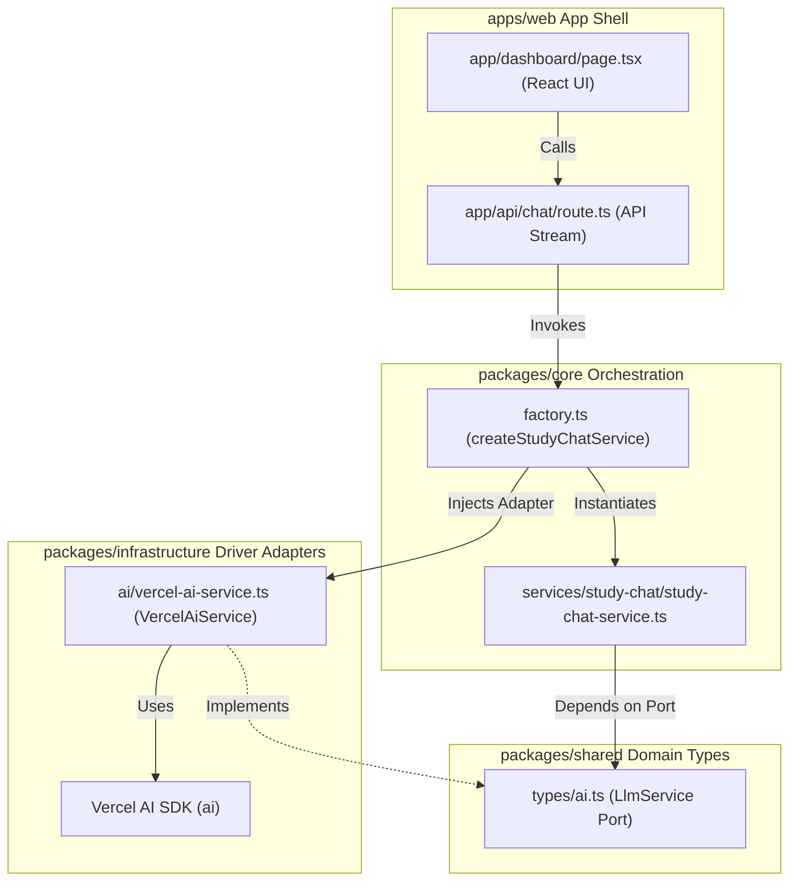

# Implementation Plan 03: LLM Chat Playground & Sidebar Document Integration

- **Status**: Draft
- **Target Branch**: `plan-llm-chat-playground`
- **PRD Reference**: [PRD 08: Developer LLM Chat Playground & Sidebar Document Integration](file:///workspaces/secure-ai-learning-support/specs/prds/08-llm-chat-playground.md)
- **ADR Reference**: [ADR 004: LLM Provider Abstraction & Dev Environment Setup](file:///workspaces/secure-ai-learning-support/specs/adrs/004-llm-provider-abstraction.md)
- **Affected Domain / Packages**: `packages/shared`, `packages/infrastructure`, `packages/core`, `apps/web`

---

## 1. Executive Summary & Scope Boundaries

### Executive Summary
Introduce an end-to-end streaming chat playground in the Next.js workspace dashboard layout. This includes implementing a multi-provider LLM interface via the Vercel AI SDK in `packages/infrastructure`, exposing it through a core `StudyChatService` orchestrator in `packages/core`, and creating a Server-Sent Events (SSE) API endpoint. The dashboard UI will be reorganized into a split layout containing a left sidebar for document uploads/listing and a main pane for the general-purpose streaming chat interface.

### In-Scope
- [ ] Add Vercel AI SDK and provider package dependencies (`ai`, `@ai-sdk/google`, `@ai-sdk/openai`, `@ai-sdk/react`).
- [ ] Define the `LlmService` Port in `packages/shared/src/types/ai.ts`.
- [ ] Implement the `VercelAiService` Adapter in `packages/infrastructure/src/ai/vercel-ai-service.ts` supporting Google Gemini and OpenAI-compatible configurations.
- [ ] Create `StudyChatService` core orchestrator and add it to `packages/core/src/factory.ts`.
- [ ] Implement Next.js `/api/chat` POST stream handler with an in-memory rate limiter (10 requests/min per IP) and a GET status config endpoint.
- [ ] Restructure the frontend layout in `apps/web/app/dashboard/page.tsx` to move file uploads/list to a collapsible left sidebar (width: `320px` to `360px`).
- [ ] Implement the chat message streaming UI, quick-start templates, blinking loading cursor, input validation ($\le$ 8,000 chars), and error banners.

### Non-Goals (Out of Scope)
- Grounding the LLM playground context in sidebar document chunks (RAG is out of scope for this MVP phase).
- Storing chat threads in the SQLite database (threads are strictly React in-memory states cleared on page reload).
- Enforcing study-active recall gating rules during general-purpose chat sessions.

---

## 2. Architectural Invariants & Rule Compliance Check

Verify compliance with active project invariants in [rules/project-rules.md](file:///workspaces/secure-ai-learning-support/rules/project-rules.md) and monorepo structure in [specs/architecture-index.md](file:///workspaces/secure-ai-learning-support/specs/architecture-index.md):

- [x] **Unidirectional Orchestration**: UI routes in `apps/web` are thin and call factories inside `packages/core`. All business/orchestration logic lives in `@core/src/services/`.
- [x] **Adapter Pattern**: High-level core orchestrators depend on `LlmService` from `@shared/types`, allowing the underlying SDK logic to be swapped out without modifications to domain code.
- [x] **Secrets Isolation**: API credentials (`GEMINI_API_KEY`, `OPENAI_API_KEY`, `CUSTOM_LLM_API_KEY`) remain strictly on the server and are never sent to the client.
- [x] **Co-located Testing**: Every new file is matched with a co-located `.test.ts` / `.test.tsx` file running via Vitest.



---

## 3. File Impact Map

| Action | File Path | Responsibility / Description |
| :--- | :--- | :--- |
| `Modify` | `packages/infrastructure/package.json` | Add `ai`, `@ai-sdk/google`, `@ai-sdk/openai` packages |
| `Modify` | `apps/web/package.json` | Add `@ai-sdk/react`, `ai` dependencies |
| `Create` | `packages/shared/src/types/ai.ts` | Define LLM domain types, message types, and the `LlmService` Port |
| `Create` | `packages/shared/src/types/ai.test.ts` | Unit test to verify compile-time contract of types |
| `Modify` | `packages/shared/src/index.ts` | Export new types from `packages/shared` |
| `Create` | `packages/infrastructure/src/ai/vercel-ai-service.ts` | Implement `LlmService` using the Vercel AI SDK wrapper |
| `Create` | `packages/infrastructure/src/ai/vercel-ai-service.test.ts` | Unit tests for initialization and mock streaming response behavior |
| `Modify` | `packages/infrastructure/src/index.ts` | Export the new `VercelAiService` |
| `Create` | `packages/core/src/services/study-chat/study-chat-service.ts` | Implement core orchestrator to handle prompts and system inputs |
| `Create` | `packages/core/src/services/study-chat/study-chat-service.test.ts` | Unit tests with mock LLM service asserting system prompts injection |
| `Modify` | `packages/core/src/factory.ts` | Expose `createStudyChatService` helper to instantiate with environment providers |
| `Modify` | `packages/core/src/index.ts` | Export the `StudyChatService` and its factory |
| `Create` | `apps/web/app/api/chat/route.ts` | Next.js API endpoints for streaming and configurations status |
| `Create` | `apps/web/app/api/chat/route.test.ts` | API route integration tests asserting rate limiting and environment fallbacks |
| `Modify` | `apps/web/app/dashboard/page.tsx` | Layout restyle (sidebar vs chat area), streaming thread logic, and state management |
| `Modify` | `apps/web/app/dashboard/dashboard.css` | Restyle definitions, collapsible sidebar styles, quick cards, and chat bubbles styling |

---

## 4. Ordered Atomic Task Breakdown

### Task 1: Declare Package Dependencies for Vercel AI SDK

- **Goal & Rationale**: Install necessary package dependencies (`ai`, `@ai-sdk/google`, and `@ai-sdk/openai` in `packages/infrastructure`; `ai` and `@ai-sdk/react` in `apps/web`) to support standard LLM integrations.
- **Target Files**:
  - `packages/infrastructure/package.json`
  - `apps/web/package.json`
- **Interfaces & Configuration**:
  Add dependency specifications matching standard lock versions. Example:
  ```json
  "ai": "^4.0.0",
  "@ai-sdk/google": "^1.0.0",
  "@ai-sdk/openai": "^1.0.0"
  ```
- **Verification Steps**:
  1. Append configurations to packages' `package.json` files.
  2. Execute installation: `pnpm install` (from the workspace root).
  3. Validate using the monorepo checker: `pnpm check` (Expect compilation success).
- **Acceptance Criteria**:
  - [ ] Dependencies added to package configuration files.
  - [ ] `pnpm install` completes successfully without dependency resolution conflicts.
  - [ ] Type checking passes.
- **Git Commit Command**: `feat(web,infra): add Vercel AI SDK package dependencies`

---

### Task 2: Define `LlmService` Port in `@shared`

- **Goal & Rationale**: Define generic domain-level types and `LlmService` interface port inside the `@shared` package so that features remain independent of specific provider SDKs.
- **Target Files**:
  - `packages/shared/src/types/ai.ts` (Source)
  - `packages/shared/src/types/ai.test.ts` (Test)
  - `packages/shared/src/index.ts` (Exports)
- **Interface & Data Contracts**:
  ```typescript
  export interface LlmMessage {
    readonly role: 'system' | 'user' | 'assistant';
    readonly content: string;
  }

  export interface LlmStreamOptions {
    readonly systemInstruction?: string;
    readonly temperature?: number;
  }

  export interface LlmService {
    stream(messages: LlmMessage[], options?: LlmStreamOptions): Promise<AsyncIterable<string>>;
    isConfigured(): boolean;
    getProviderName(): string;
  }
  ```
- **TDD Steps**:
  1. Create a compilation test in `ai.test.ts` checking that a mock class conforming to `LlmService` compiles cleanly.
  2. Run vitest on the shared package: `pnpm vitest run packages/shared/src/types/ai.test.ts` (Expect FAIL).
  3. Write type definitions in `ai.ts`. Export them from `packages/shared/src/index.ts`.
  4. Run vitest test (Expect PASS).
- **Acceptance Criteria**:
  - [ ] `LlmMessage`, `LlmStreamOptions`, and `LlmService` are defined and exported.
  - [ ] Shared types are pure TypeScript contracts with no import statements referencing outside packages.
- **Git Commit Command**: `feat(shared): define LLM Service port contract`

---

### Task 3: Implement `VercelAiService` Adapter in `@infrastructure`

- **Goal & Rationale**: Implement `LlmService` inside infrastructure utilizing Vercel's AI SDK. Read env vars (`LLM_PROVIDER`, `GEMINI_API_KEY`, etc.) to dynamically switch clients.
- **Target Files**:
  - `packages/infrastructure/src/ai/vercel-ai-service.ts` (Source)
  - `packages/infrastructure/src/ai/vercel-ai-service.test.ts` (Test)
  - `packages/infrastructure/src/index.ts` (Exports)
- **Interface & Data Contracts**:
  ```typescript
  import { LlmService, LlmMessage, LlmStreamOptions } from '@ai-learning-support/shared';

  export class VercelAiService implements LlmService {
    constructor() {}
    async stream(messages: LlmMessage[], options?: LlmStreamOptions): Promise<AsyncIterable<string>>;
    isConfigured(): boolean;
    getProviderName(): string;
  }
  ```
- **TDD Steps**:
  1. Write tests in `vercel-ai-service.test.ts` asserting:
     - `isConfigured` returns `true` or `false` accurately based on process env keys.
     - `stream` throws an descriptive Error if providers are configured but keys are missing.
     - Mock `streamText` function from `ai` to verify text chunks are yielded properly by the `AsyncIterable`.
  2. Run test: `pnpm vitest related packages/infrastructure/src/ai/vercel-ai-service.test.ts --run` (Expect FAIL).
  3. Write implementation in `vercel-ai-service.ts` initializing google or openai clients.
  4. Export service in `packages/infrastructure/src/index.ts`.
  5. Run test command (Expect PASS).
- **Acceptance Criteria**:
  - [ ] Supports `LLM_PROVIDER='google'` (Gemini model) and `LLM_PROVIDER='openai'` (OpenAI model or custom OpenAI-compatible endpoint).
  - [ ] Respects `CUSTOM_LLM_BASE_URL` and `CUSTOM_LLM_API_KEY` for OpenAI-compatible providers.
  - [ ] Correctly wraps `streamText` results into a clean `AsyncIterable<string>`.
- **Git Commit Command**: `feat(infra): implement VercelAiService adapter`

---

### Task 4: Create `StudyChatService` Orchestrator in `@core`

- **Goal & Rationale**: Add the `StudyChatService` orchestrator to manage LLM system instructions for study guidance, decoupled from routing.
- **Target Files**:
  - `packages/core/src/services/study-chat/study-chat-service.ts` (Source)
  - `packages/core/src/services/study-chat/study-chat-service.test.ts` (Test)
  - `packages/core/src/factory.ts` (Factory updates)
  - `packages/core/src/index.ts` (Exports updates)
- **Interface & Data Contracts**:
  ```typescript
  import { LlmService, LlmMessage } from '@ai-learning-support/shared';

  export class StudyChatService {
    constructor(private readonly llmService: LlmService) {}
    async stream(messages: LlmMessage[]): Promise<AsyncIterable<string>>;
    isConfigured(): boolean;
    getProviderName(): string;
  }
  ```
- **TDD Steps**:
  1. Create `study-chat-service.test.ts` with a mock implementation of `LlmService`. Assert that calling `stream` calls the mock's `stream` function with the messages list and includes a defined study system instruction.
  2. Run test: `pnpm vitest related packages/core/src/services/study-chat/study-chat-service.test.ts --run` (Expect FAIL).
  3. Implement `StudyChatService` class and export it.
  4. Add factory function `createStudyChatService()` inside `factory.ts` which instantiates `VercelAiService` and passes it to `StudyChatService`.
  5. Run test command (Expect PASS).
- **Acceptance Criteria**:
  - [ ] System prompts configure the LLM to behave as a helpful study guide.
  - [ ] Factory registers and instantiates the orchestrator cleanly under the virtual core layer.
- **Git Commit Command**: `feat(core): implement StudyChatService orchestrator and factory`

---

### Task 5: Implement Next.js `/api/chat` Route Handlers

- **Goal & Rationale**: Create server-side API endpoints (`GET` for checking status, `POST` for handling text streaming) with in-memory IP rate limiting to secure keys and control loops.
- **Target Files**:
  - `apps/web/app/api/chat/route.ts` (Source)
  - `apps/web/app/api/chat/route.test.ts` (Test)
- **Interface & Data Contracts**:
  - `GET /api/chat`: Returns HTTP 200 `{ configured: boolean, provider: string }`.
  - `POST /api/chat`: Expects JSON `{ messages: LlmMessage[] }`. Responds with Server-Sent Events stream or plain text stream. Limits requests to 10/minute per client IP.
- **TDD Steps**:
  1. Create `route.test.ts` verifying config JSON checks, stream responses, and throwing HTTP 429 after 10 requests.
  2. Run test: `DATABASE_PATH=../../.data/app.web.test.db pnpm vitest related apps/web/app/api/chat/route.test.ts --run` (Expect FAIL).
  3. Create route handlers in `route.ts`. Parse client IP and configure a simple in-memory request-tracking cache.
  4. Run test command (Expect PASS).
- **Acceptance Criteria**:
  - [ ] HTTP GET and POST operations function properly.
  - [ ] In-memory cache successfully limits calls to 10/minute per IP with a standard `429` error.
- **Git Commit Command**: `feat(web): implement /api/chat route with rate limiting`

---

### Task 6: Restructure Dashboard Layout with Left Sidebar

- **Goal & Rationale**: Migrate the document management controls (file upload dropzone and ingestion list) to a sidebar layout, freeing the center pane for Q&A chat.
- **Target Files**:
  - `apps/web/app/dashboard/page.tsx`
  - `apps/web/app/dashboard/dashboard.css`
- **Verification Steps**:
  1. Wrap the existing dropzone and tables into a sidebar grid element inside `page.tsx`.
  2. Update styles in `dashboard.css` to render a split screen layout with a fixed sidebar width (`320px` to `360px`) and smooth responsive breakpoints.
  3. Run local dev server (`pnpm --filter web dev`) and check visual layouts in browsers. Verify document uploads and status animations remain functional.
- **Acceptance Criteria**:
  - [ ] Ingestion features are isolated inside the sidebar.
  - [ ] Clean modern responsive layout matching PRD 08 layout splits.
- **Git Commit Command**: `refactor(web): migrate dashboard layout to dual-pane sidebar`

---

### Task 7: Implement Chat Playground UI inside Dashboard

- **Goal & Rationale**: Integrate the streaming chat interface in the main panel, connecting it to `/api/chat` via `@ai-sdk/react` in-app state controls.
- **Target Files**:
  - `apps/web/app/dashboard/page.tsx`
  - `apps/web/app/dashboard/dashboard.css`
- **Verification Steps**:
  1. Implement client UI structure: message bubbles container, quick start suggestion cards, and anchored text textarea.
  2. Call `useChat` inside the component. Check GET status configuration endpoint at mount; if unconfigured, display warning banner and disable textarea.
  3. Check input lengths on change: restrict sends if empty or $> 8,000$ characters. Make `Enter` submit and `Shift+Enter` create a newline.
  4. Style chat layout in `dashboard.css`, adding blinking loading text cursors and modern styling.
  5. Run dev environment and verify visual interactions: stream chunks typing correctly, prompt cards working, and thread-flushing.
- **Acceptance Criteria**:
  - [ ] Assistant responses render smoothly with character-by-character typing animations.
  - [ ] "Clear Chat" flushes current thread.
  - [ ] Alert banner displayed if backend credentials are missing.
- **Git Commit Command**: `feat(web): integrate streaming chat playground into dashboard`

---

## 5. Risk Assessment & Fallback Plan

| Risk | Impact | Likelihood | Mitigation Strategy |
| :--- | :--- | :--- | :--- |
| **API Response Buffering** | Medium | Medium | Use standard `Content-Type: text/event-stream` response headers and flush streams immediately. |
| **API Key Missing Alert loop** | Low | Low | Perform a single status fetch on mount to check environment viability. |
| **Rate Limiter Cache Memory Leak** | Low | Low | Store simple timestamps per IP in a global Map and run window cleanup on every tick or request validation. |

---

## 6. Definition of Done & Verification Pipeline

Before marking this plan as complete or submitting PR, verify against active project rules:

- [ ] All atomic tasks executed in TDD order with green tests.
- [ ] Targeted test run succeeds: `pnpm vitest related <affected-files> --run`
- [ ] Monorepo check succeeds with zero type or lint errors: `pnpm check`
- [ ] Coding style & typing rules respected per [rules/coding-style.md](file:///workspaces/secure-ai-learning-support/rules/coding-style.md).
- [ ] Architectural invariants & feature isolation preserved per [rules/project-rules.md](file:///workspaces/secure-ai-learning-support/rules/project-rules.md) and [specs/architecture-index.md](file:///workspaces/secure-ai-learning-support/specs/architecture-index.md).
- [ ] Git branch naming & commit history adhere to [rules/git-workflow.md](file:///workspaces/secure-ai-learning-support/rules/git-workflow.md).
