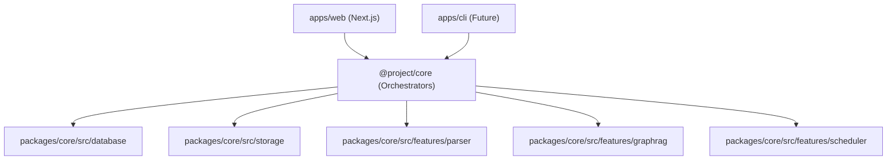
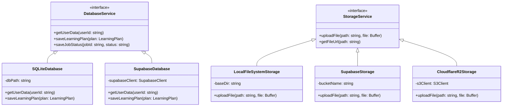
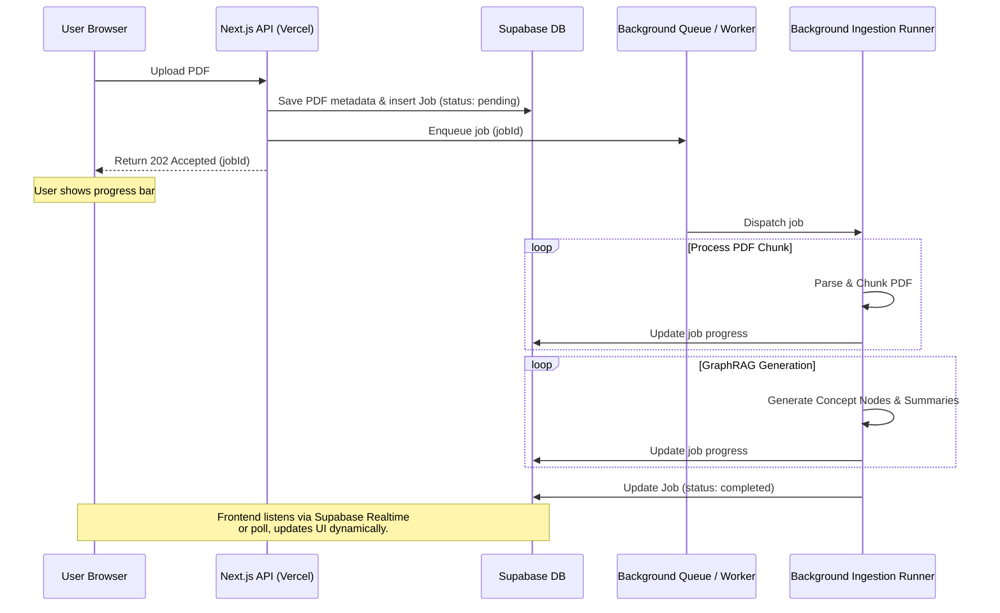

# AI Learning Support — System Architecture Document

---

## 1. Document Control

### 1.1 Metadata
| Attribute | Value |
| :--- | :--- |
| **Document Type** | Technical Design Document (TDD) / Architecture Spec |
| **Version** | 1.0.0 |
| **Status** | Draft |
| **Last Updated** | 2026-06-05 |

---

## 2. Directory Structure (Monorepo)

To decouple product logic from the UI framework and allow multiple packages (e.g., core, web app, CLI), we use a TypeScript monorepo managed via **pnpm workspaces** (or npm workspaces).

```text
├── apps/
│   └── web/                   # Next.js web application (Frontend UI & API routes)
│       ├── app/               # Next.js App Router (pages, layouts)
│       │   ├── api/           # API routes calling @project/core services (thin wrappers)
│       │   └── dashboard/     # Guided Study Dashboard
│       └── components/        # React/UI components
├── packages/
│   ├── core/                  # Core Application Package (Framework agnostic)
│   │   ├── src/
│   │   │   ├── database/      # Database client, schemas (Drizzle), and migrations
│   │   │   ├── storage/       # File storage adapters (Local filesystem, Supabase, R2)
│   │   │   ├── types/         # Shared domain models and TypeScript definitions
│   │   │   ├── features/      # Independent, decoupled feature modules (logical packages)
│   │   │   │   ├── parser/    # PDF extraction & text processing
│   │   │   │   ├── graphrag/  # Concept graph generation & retrieval
│   │   │   │   └── scheduler/ # Spaced repetition scheduling logic (FSRS)
│   │   │   └── services/      # High-level orchestrators (coordinates features & adapters)
│   │   └── package.json
│   └── tsconfig/              # Shared TypeScript configurations
├── package.json
└── pnpm-workspace.yaml
```

### 2.1 Architectural Rules & Dependency Flow

To maintain absolute modularity and allow future apps to inherit all capabilities with zero duplication, code must strictly adhere to the following dependency flow rules.



#### **Rule 1: Unidirectional Orchestration (How to orchestrate)**
* **DO:** Keep all coordination, database calls, external API fetches, and file storage read/writes inside the high-level orchestrators (e.g., `packages/core/src/services/*`).
* **DO NOT:** Put API endpoints, HTTP-specific handlers, or route parameters inside the core orchestrator. The app shell (Next.js API routes) is a thin wrapper that parses inputs, runs the orchestrator, and responds.

#### **Rule 2: Feature Isolation (No Cross-Imports)**
* **DO:** Make features in `features/` self-contained and modular. Each feature should expose a clean public API via an `index.ts` file in its root.
* **DO NOT:** Cross-import files between features (e.g., `features/graphrag` importing from `features/scheduler`). If they need to communicate, it must be coordinated by an orchestrator service in the `services/` directory.

#### **Rule 3: No Infrastructure in Features (How to keep features testable)**
* **DO:** Design feature modules as **pure data processors** (data-in, data-out). If a feature needs external inputs, pass them as arguments or functions (callbacks / dependency injection).
* **DO NOT:** Import database schemas, clients (`drizzle` instance), or storage drivers inside features. Features should not perform side-effects like writing directly to disk or DB.

#### **Rule 4: Shared Entities**
* **DO:** Place common types, shared domain definitions, and cross-cutting interfaces in `packages/core/src/types/`. Features and database tables can import freely from this directory to align data structures.

---

## 3. Pluggable Adapter Pattern

The core application must run in two modes: **Local Mode** (zero-dependency, file-system based, single user) and **Cloud Mode** (hosted, Supabase integrated, multi-tenant). To maintain a single codebase, we define clean TypeScript interfaces for database and storage operations.



### 3.1 Database: Drizzle ORM
- We use **Drizzle ORM** for database mapping.
- Drizzle allows us to write queries once. Depending on the environment variables (`LOCAL_MODE=true` or `false`), the core engine initializes either a:
  - **SQLite Client** pointing to a local file (`.data/app.db`).
  - **PostgreSQL Client** pointing to the cloud Supabase DB.
- In **Cloud Mode**, we leverage the native **pgvector** extension on Supabase PostgreSQL for cost-effective, high-performance vector search of our GraphRAG concept node embeddings.

### 3.2 Storage Adapter
- Uploaded PDFs are stored using a `StorageService` interface.
- **Local:** Writes directly to the local disk (`.data/storage/`).
- **Cloud MVP:** Uploads to Supabase S3-compatible Buckets ($0 setup up to 1 GB).
- **Cloud Scale-Up (Migration Target):** Migrates to **Cloudflare R2** once storage needs exceed Supabase free limits to avoid egress/bandwidth charges and access flat $0.015/GB/month pricing.

---

## 4. Background Ingestion & Agent Execution

Since PDF text extraction and GraphRAG compilation can exceed 10 seconds, execution must be asynchronous on any hosted version.



### 4.1 Queue & Worker Hosting Options
To maintain a $0 developer testing budget while keeping the deployment path open:
- **Local Mode & MVP Phase (Current):** For zero dependencies, the local/development Next.js server triggers an in-memory background promise or simple local worker thread that processes the PDF in the background without requiring a distributed queue. This runs entirely on the host machine for free.
- **Cloud Scale-Up Options (Future):**
  - **Railway VPS:** Deploy a standard Node.js server container (running BullMQ or Inngest) to handle background queue tasks continuously. This bypasses Vercel function timeouts and provides complete Node.js library compatibility.
  - **AWS Lambda / SST:** Scale-to-zero serverless functions with a 15-minute timeout limit. Highly cost-effective (huge free tier) but requires more DevOps setup.

### 4.2 Cost Management
- **Bring Your Own Key (BYOK):** Under Settings, users can input their own Gemini or OpenAI API keys. The app's workers use the provided credentials, ensuring zero LLM API expenses for the developer.

