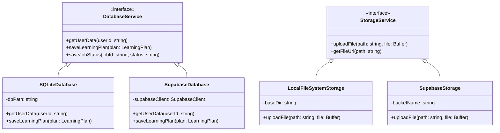
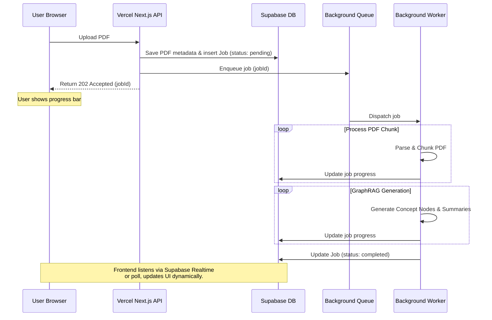

# AI Learning Support — System Architecture Document

---

## 1. Document Control

### 1.1 Metadata
| Attribute | Value |
| :--- | :--- |
| **Document Type** | Technical Design Document (TDD) / Architecture Spec |
| **Version** | 1.0.0 |
| **Status** | Draft |
| **Last Updated** | 2026-06-05 |

---

## 2. Directory Structure (Monorepo)

To decouple product logic from the UI framework and allow multiple packages (e.g., core, web app, CLI), we use a TypeScript monorepo managed via **pnpm workspaces** (or npm workspaces).

```text
├── apps/
│   └── web/                   # Next.js web application (Frontend UI & API routes)
│       ├── app/               # Next.js App Router (pages, layouts)
│       │   ├── api/           # API routes calling @project/core services
│       │   └── dashboard/     # Guided Study Dashboard
│       └── components/        # React/UI components
├── packages/
│   ├── core/                  # Core Business Logic (Framework agnostic)
│   │   ├── src/
│   │   │   ├── database/      # Database adapters and migrations
│   │   │   ├── storage/       # File storage adapters
│   │   │   ├── parser/        # PDF extraction & text processing
│   │   │   ├── graphrag/      # Concept graph generation & retrieval
│   │   │   ├── fsrs/          # Spaced repetition scheduling logic
│   │   │   └── services/      # High-level orchestrators
│   │   └── package.json
│   └── tsconfig/              # Shared TypeScript configurations
├── package.json
└── pnpm-workspace.yaml
```

---

## 3. Pluggable Adapter Pattern

The core application must run in two modes: **Local Mode** (zero-dependency, file-system based, single user) and **Cloud Mode** (hosted, Supabase integrated, multi-tenant). To maintain a single codebase, we define clean TypeScript interfaces for database and storage operations.



### 3.1 Database: Drizzle ORM
- We use **Drizzle ORM** for database mapping.
- Drizzle allows us to write queries once. Depending on the environment variables (`LOCAL_MODE=true` or `false`), the core engine initializes either a:
  - **SQLite Client** pointing to a local file (`.data/app.db`).
  - **PostgreSQL Client** pointing to the cloud Supabase DB.

### 3.2 Storage Adapter
- Uploaded PDFs are stored using a `StorageService` interface.
- **Local:** Writes directly to the local disk (`.data/storage/`).
- **Cloud:** Uploads to Supabase S3-compatible Buckets.

---

## 4. Background Ingestion & Agent Execution

Since PDF text extraction and GraphRAG compilation can exceed 10 seconds, execution must be asynchronous on the hosted version.



### 4.1 Queue & Worker Options
- **Hosted Mode:** We run a lightweight background queue runner using **Inngest** or a dedicated Node.js worker hosted on a VPS (like Railway or Render).
- **Local Mode:** For zero dependencies, the local Next.js server triggers an in-memory background promise or simple local worker thread that processes the PDF in the background without requiring a distributed queue.

---

## 5. Engineering Guidelines

To match high-performance industry standards:

1. **Strict TypeScript:** `strict: true` enabled in all `tsconfig.json` configurations.
2. **Formatting & Quality:**
   - **Prettier** for consistent code formatting.
   - **ESLint** with standard React/TypeScript rules.
3. **Automated Testing:**
   - Core mathematical and logical modules (specifically the FSRS spaced repetition algorithm and PDF parsing engine) must have unit tests written using **Vitest**.
4. **CI/CD:**
   - GitHub Actions configured to run lint checks, type compiler checks, and tests on every pull request.
